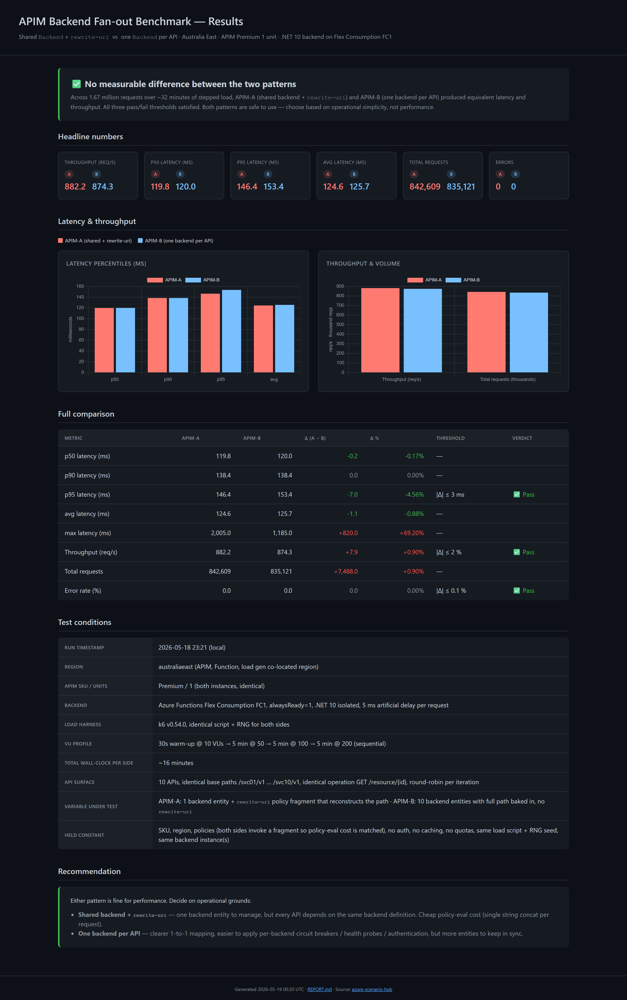

# Azure Scenario Hub 🚀

A collection of ready-to-deploy Azure architecture scenarios. Infrastructure-as-code templates for common patterns, designed for rapid deployment and learning.

> **Note**: These scenarios are designed for experimentation, learning, and lab environments. For production deployments, consider using [Azure Verified Modules](https://aka.ms/avm) and follow your organization's security and compliance requirements.

## 🎯 What is this?

A collection of Azure infrastructure templates for experimentation and learning. Each scenario provides complete working code for common architectural patterns, eliminating the need to build from scratch.

### Use cases:
- **Application Development** - Deploy infrastructure quickly to focus on application logic
- **Architecture Validation** - Test designs with working reference implementations  
- **Learning Azure** - Hands-on examples of Azure service integrations
- **Rapid Prototyping** - Pre-built infrastructure for PoCs and experiments

## ⭐ Featured Scenario

<table>
<tr>
<td width="55%" valign="top">

### [APIM Backend Fan-out Benchmark](./src/apim-backend-fanout-benchmark/)

Head-to-head benchmark of **shared-`Backend` + `rewrite-uri`** vs **one-`Backend`-per-API** on APIM Premium.

**Result after 1.67M requests:** No measurable difference. **882 vs 874 req/s, 146 vs 153 ms p95, 0 errors** on both sides. Pick the pattern based on operational simplicity, not performance.

- 2× APIM Premium · .NET 10 mock backend on Flex Consumption FC1
- k6 stepped load: 50 → 100 → 200 VUs over ~32 min
- App Insights `BackendTime` / `ClientTime` KQL
- Interactive HTML dashboard + auto-generated Markdown report
- Includes the methodology trap that nearly made me publish the wrong answer

</td>
<td width="45%" valign="top">
<a href="./src/apim-backend-fanout-benchmark/"></a>
</td>
</tr>
</table>

## 🏗️ Available Scenarios

### Networking & Security

| Scenario | Description | Status | Key Features |
|----------|-------------|--------|--------------|
| [Event Grid with Private Endpoints](./src/eventgrid-private-endpoints-scenario/) | Secure event-driven architecture with Event Grid behind private endpoints | ✅ Ready | Zero public exposure, Logic Apps integration |
| [Event Grid Confidential Compute](./src/eventgrid-confidential-compute/) | Event Grid System Topic with Azure Confidential Compute enabled for enhanced data protection | ✅ Ready | Hardware-based encryption, preview feature, Korea Central & UAE North only |
| [Function App with Key Vault Private Endpoint](./src/function-app-private-endpoints-access-keyvault-scenario/) | Serverless functions accessing secrets securely via private network | ✅ Ready | Managed Identity, VNet integration, no internet traffic |
| [Private Container Apps Environment](./src/private-container-apps-environment-scenario/) | Microservices platform with complete network isolation | 🚧 Coming Soon | Internal load balancing, private ingress |
| [Public Container Apps Environment](./src/public-container-apps-environment-scenario/) | Container hosting with public accessibility | 🚧 Coming Soon | Auto-scaling, public endpoints |
| [AKS Static Egress Gateway](./src/aks-unique-egress-ip-per-namespace/) | Unique static egress IP per Kubernetes namespace, replicating OpenShift's EgressIP | ✅ Ready | Static Egress Gateway, per-namespace public/private IPs, gateway node pool, live dashboard |
| [AKS Namespace Create](./src/aks-namespace-create/) | Automated AKS namespace provisioning with Terraform and test manifests | 🚧 Coming Soon | Namespace bootstrap, RBAC scaffolding, test workloads |
| [App Service Easy Auth — Query String Round-Trip](./src/app-service-easy-auth/) | Proves App Service Easy Auth preserves arbitrary custom query string params (`nhi`, `login_hint`, `view`, …) across the full Microsoft Entra ID sign-in redirect — with **zero auth code in the app** | ✅ Ready | Easy Auth v2 + Entra ID, hybrid OAuth flow (`code+id_token` / `form_post`), `login_hint` auto-forwarded to Entra, claims via `x-ms-client-principal`, Mermaid sequence diagram, captured-traffic validation, Node 20 sample app |

### Integration, API Management & Messaging

| Scenario | Description | Status | Key Features |
|----------|-------------|--------|--------------|
| [APIM Backend Fan-out Benchmark](./src/apim-backend-fanout-benchmark/) | Head-to-head benchmark of **shared-backend + `rewrite-uri`** vs **one-backend-per-API** on APIM Premium. **Result: no measurable difference** — 882 vs 874 req/s, 146 vs 153 ms p95 over 1.67M requests | ✅ Ready | 2× APIM Premium, .NET 10 mock backend on Flex Consumption FC1, k6 stepped load (50→100→200 VUs), interactive HTML dashboard, App Insights `BackendTime`/`ClientTime` KQL, auto-generated Markdown report |
| [APIM Monitoring](./src/apim-monitoring-scenario/) | APIM Developer SKU with 6 mock APIs, Application Insights, Log Analytics, and an Azure Workbook dashboard — no backend services required | ✅ Ready | Full request/response capture, 6 mock APIs (caching, rate limiting, JWT, etc.), KQL queries, Azure Workbook |
| [Azure Integration Services Load Test](./src/azure-integration-services-load-test/) | Load testing scenario for microservices architecture with Function Apps and Service Bus Premium | ✅ Ready | 5 independent functions, Service Bus topics, private endpoints, comprehensive load testing tools |

### Data Processing

| Scenario | Description | Status | Key Features |
|----------|-------------|--------|--------------|
| [Azure Function - Unzip Large Files](./src/azure-function-unzip-large-files/) | Stream-process large password-protected ZIP files (up to 10GB+) in serverless Functions | ✅ Ready | Streaming architecture, constant memory usage, handles files larger than available RAM, staged blob uploads |

### AI

| Scenario | Description | Status | Key Features |
|----------|-------------|--------|--------------|
| [Azure Communication Services with Voice Live API](./src/azure-communication-services-integrate-voice-live-api/) | Real-time conversational AI over phone calls with ACS Call Automation and Azure OpenAI Voice Live API | ✅ Ready | Phone call automation, real-time audio streaming, voice AI interactions, dual implementation ([.NET](./src/azure-communication-services-integrate-voice-live-api/dotnet/README.md) & [Python](./src/azure-communication-services-integrate-voice-live-api/python/README.md)) |
| [AI Gateway (APIM in front of Foundry)](./src/ai-gateway/) | API Management as an AI Gateway fronting an existing Azure AI Foundry account. Two customer-facing regional APIs (`/aue`, `/global`) over a shared backend pool, per-app token chargeback, per-product TPM throttling, response cache, and a runnable Polyglot Notebook walkthrough | ✅ Ready | Two regional APIs over one backend pool with circuit breakers, managed-identity backend auth, per-product TPM throttling, response cache, edge request validation, mock fallback, structured tracing, `azure-openai-emit-token-metric` chargeback, KQL queries, demo notebook |
| [Governed Agents (MAF × Agent Governance Toolkit)](./src/micrsoft-agent-framewokr-agt-integration/) | Wrap **Microsoft Agent Framework** agents/workflows with the **Agent Governance Toolkit** so one agent-level policy intercepts every outbound prompt and tool call — including **governing tool-call argument values** (numeric ceilings, forbidden values, data-residency sets) with no per-tool code. Runs fully offline (no API keys). Dual implementation: [Python](./src/micrsoft-agent-framewokr-agt-integration/README.md) (notebook + 7 demo scripts) and [.NET/C#](./src/micrsoft-agent-framewokr-agt-integration/dotnet/README.md) (class library + console app) | ✅ Ready | Agent-level tool-**argument** boundary governance, prompt + tool-call middleware, default-deny capability sandbox, governed multi-agent workflow, prompt-hardening audit, tamper-evident hash-chained audit log, deterministic scripted model |

### App Hosting

| Scenario | Description | Status | Key Features |
|----------|-------------|--------|--------------|
| [Simple App Service with Sample App](./src/simple-app-service-with-sample-app/) | Lightweight App Service hosting a Python sample application | ✅ Ready | Zero-to-deployed in minutes, configurable SKU, VNet integration option |

### More scenarios coming soon! 
Have a specific scenario request? [Open an issue](https://github.com/Ricky-G/azure-scenario-hub/issues) to suggest it.

## 🚀 Get Started in 3 Steps

### 1. Clone this repo
```bash
git clone https://github.com/Ricky-G/azure-scenario-hub.git
cd azure-scenario-hub
```

### 2. Pick a scenario
Browse the `src/` directory and choose the architecture you need.

### 3. Deploy!
Each scenario includes deployment instructions with tested commands. Most deployments complete in under 5 minutes.

## 📋 What You'll Need

- **Azure Subscription** - [Get a free one here](https://azure.microsoft.com/free/)
- **Azure CLI** - [Install guide](https://learn.microsoft.com/cli/azure/install-azure-cli)
- **5 minutes** - Standard deployment time

## 🛠️ Tech Stack

All scenarios are built with Infrastructure as Code:
- **Bicep** - Azure's native IaC language (primary)
- **Terraform** - Multi-cloud IaC (coming to more scenarios)
- **ARM Templates** - Available for all Bicep scenarios

## 📂 What's in Each Scenario?

```
scenario-name/
├── README.md              # Quick start guide
├── bicep/                 # Infrastructure code
│   ├── main.bicep        # One-click deployment
│   └── modules/          # Reusable components
├── terraform/            # Alternative IaC option
└── docs/                 # Architecture diagrams
```

## 💡 Pro Tips

- **Development First** - These scenarios prioritize ease of use and learning
- **Customize Freely** - Use these as starting templates for your needs
- **Cost Conscious** - Each scenario notes estimated costs
- **Clean Up** - Every scenario includes cleanup commands to avoid charges

## 🤝 Contributing

To contribute a new Azure scenario:

1. Fork this repository
2. Create your scenario following the established structure
3. Test deployment in a clean Azure subscription
4. Submit a pull request

Check the [Contributing Guide](CONTRIBUTING.md) for detailed requirements.

## 📞 Need Help?

- **Questions?** [Open an issue](https://github.com/Ricky-G/azure-scenario-hub/issues)
- **Bug reports** - Submit detailed reproduction steps
- **General discussion** - Use [discussions](https://github.com/Ricky-G/azure-scenario-hub/discussions)

## 📝 License

MIT License - feel free to use these scenarios however you like!

## 🔒 Security

- Scenarios use security best practices but are optimized for learning
- Always review and harden configurations before production use
- Found a security issue? See [SECURITY.md](SECURITY.md)

---

<p align="center">
  Made with ❤️ for the Azure community<br/>
  <strong>Star ⭐ this repo if you find it helpful!</strong>
</p>