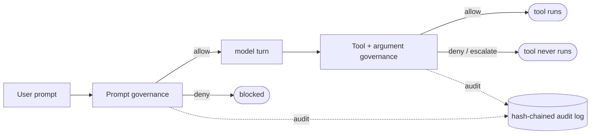

# Microsoft Agent Framework × Agent Governance Toolkit

Wrap **Microsoft Agent Framework (MAF)** agents and workflows with the **Microsoft Agent
Governance Toolkit (AGT)** so that **every outbound prompt and every outbound tool call is
intercepted and evaluated by a real, deterministic AGT policy** — before anything reaches a
model or executes a tool.

This integration ships in **two languages with identical behaviour and identical policies**, so
you can hand the same scenario to a Python team and a .NET team:

| Implementation | What's inside | Start here |
|---|---|---|
| 🐍 **[Python](./python/README.md)** | `agt_maf` package, 7 demo scripts, a Jupyter notebook, offline self-check | [`python/README.md`](./python/README.md) |
| 🟣 **[.NET / C#](./dotnet/README.md)** | `AgtMaf` class library, console app with 8 commands, offline self-check | [`dotnet/README.md`](./dotnet/README.md) |

Both run **fully offline** with a deterministic scripted model — no API keys, no network — and the
**exact same** governance layer works unchanged in front of a live model.

> **Why this matters.** Prompt-level safety ("please follow the rules") is a *request* to a
> stochastic system. AGT instead intercepts each action in deterministic application code:
> actions the policy denies are not "unlikely", they are **structurally impossible**.

---

## ⭐ The hero capability: govern tool-call **arguments** at the agent level

The most-asked MAF-governance question:

> *"Can I inject policy at an **agent level** that governs tool-call **arguments**? From what I
> can tell, agent policy only lets you disable tools at the tool level, and I'd have to write
> per-tool governance to go to the next level."*

**Yes — and you do not need per-tool governance.** Attach **one** function middleware at the agent
level. It fires on *every* tool call, receives the tool name **and the argument values**, evaluates
them against a single AGT policy, and — by simply not running the call — prevents an out-of-bounds
invocation. The tools stay plain; the boundaries live as data in a policy file:

```yaml
# the same boundary, expressed in each runtime's policy dialect
- name: escalate-large-budget-transfer   # numeric ceiling   -> human approval
  condition: "tool_name == 'transfer_budget' and amount > 50000"
- name: deny-external-budget-transfer     # forbidden value   -> hard deny
  condition: "tool_name == 'transfer_budget' and to == 'external'"
- name: deny-excessive-scale              # numeric ceiling   -> hard deny
  condition: "tool_name == 'scale_resource' and replicas > 20"
```

Run it:

```bash
# Python
python demos/demo_00_tool_argument_boundaries.py
# .NET
dotnet run --project AgtMaf.Demos -- args
```

The same `transfer_budget` tool is **allowed**, **escalated**, or **denied** purely from its
argument values. Full walkthroughs live in each implementation's README.

---

## What gets governed

Both implementations demonstrate the same six layers of governance:

| Layer | What AGT does |
|---|---|
| **Prompt governance** | Every prompt is statically analysed (PII, secrets, injection) and blocked deterministically before the model is called |
| **Tool capability sandbox** | A default-deny allowlist controls *which* tools may run |
| **Argument-boundary governance** ⭐ | One agent-level middleware inspects each tool call's *argument values* (numeric ceilings, forbidden values, data-residency sets) |
| **Multi-agent workflows** | One governance layer + one audit chain spans a sequential workflow |
| **Prompt-hardening audit** | The agent's own instructions are graded for defensive coverage (Python; documented gap in .NET) |
| **Tamper-evident audit trail** | Every decision is recorded in a hash-chained log; editing any record breaks the chain |

---

## Architecture at a glance



AGT plugs into MAF's **native middleware pipeline** — no forks, no monkey-patching. The tools carry
no governance code; the rules live entirely in policy files you can edit without touching code.

---

## Choose your path

- **New here?** Read this page, then pick [Python](./python/README.md) or [.NET](./dotnet/README.md).
- **Just want the hero feature?** Jump to the `args` / `demo_00` walkthrough in either README.
- **Want the broader governance catalog?** See the [Agent Governance Toolkit hub](../README.md).

> These templates are optimised for learning and experimentation, **not** production. For
> production-grade Azure infrastructure, see [Azure Verified Modules](https://aka.ms/avm).
