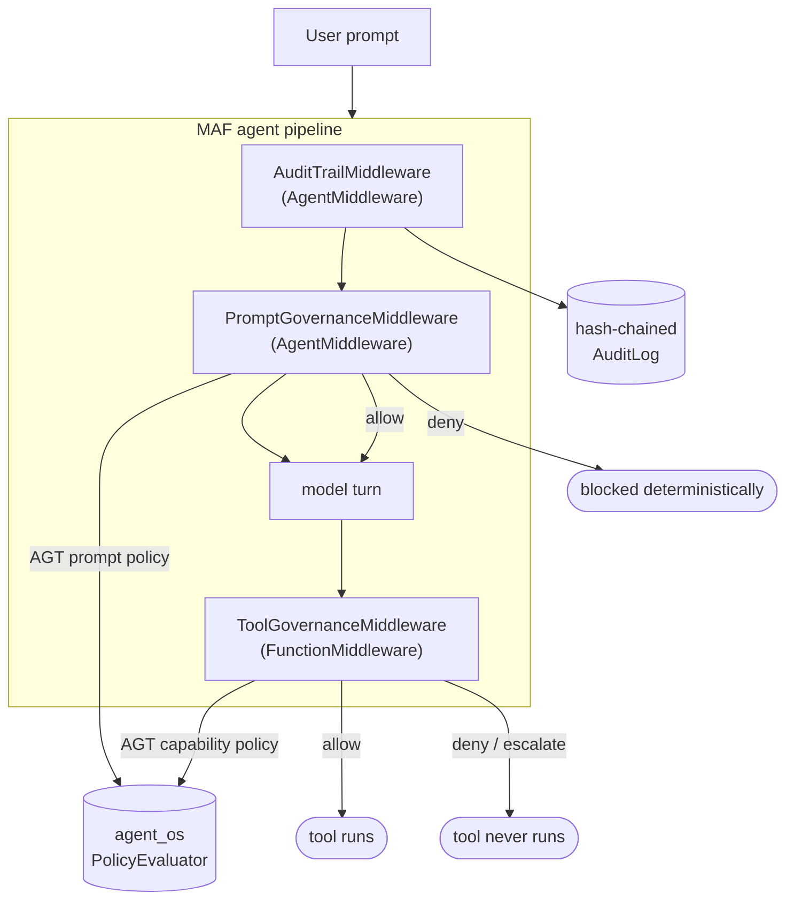

# Governing Microsoft Agent Framework agents with the Agent Governance Toolkit — **Python**

Wrap **Microsoft Agent Framework (MAF)** agents and workflows with the **Microsoft Agent
Governance Toolkit (AGT)** so that **every outbound prompt and every outbound tool call is
intercepted and evaluated by a real, deterministic AGT policy** — before anything reaches a
model or executes a tool.

This scenario is a self-contained, runnable demo (a Python package, seven demo scripts, and a
Jupyter notebook). It runs **offline** with a deterministic scripted model, so results are
identical for everyone — no API keys, no network — and the **exact same** governance layer
works unchanged in front of a live model.

> **Why this matters.** Prompt-level safety ("please follow the rules") is a *request* to a
> stochastic system. AGT instead intercepts each action in deterministic application code:
> actions the policy denies are not "unlikely", they are **structurally impossible**.

- **MAF** — [github.com/microsoft/agent-framework](https://github.com/microsoft/agent-framework) — agents, tools, middleware, multi-agent workflows.
- **AGT** — [github.com/microsoft/agent-governance-toolkit](https://github.com/microsoft/agent-governance-toolkit) — deterministic policy engine, prompt static-analysis, audit primitives.

> 💡 **.NET/C# developer?** A full C# twin of this demo — same scenario, same policies, same
> hero feature — lives in [`../dotnet/`](../dotnet/README.md) (class library + console app).
>
> ⬆️ This is one implementation of the **Microsoft Agent Framework** integration. See the
> [integration overview](../README.md) or the [Agent Governance Toolkit hub](../../README.md).

---

## ⭐ The #1 question: govern tool-call **arguments** at the agent level

> *"Struggling to know how to get started with agent-governance-toolkit for Python MAF. I'm
> trying to intercept tool-calls to make sure **arguments are within boundaries**. Is there a
> way to inject policy at an **agent level** that will govern tool-call args? From what I can
> tell, agent policy only lets you disable tools at the tool level, and you have to provide
> individual `@tool` governance to go do that next level."*

**Yes — and you do not need per-`@tool` governance.** Attach **one** `FunctionMiddleware` at
the agent level. It fires on *every* tool call and receives the tool name **and the argument
values**, evaluates them against a single AGT policy, and — by simply not calling `next()` —
prevents an out-of-bounds call from executing. The tools stay plain; the boundaries live as
data in [`policies/tool-governance.yaml`](./policies/tool-governance.yaml).

**Why people get stuck:** the tool-level allow/deny list (`tool_name in [...]`) is the part
most folks find first — it only enables/disables *whole tools*. The missing half is that the
**same** middleware also sees the **arguments**, so argument boundaries are just more rules in
the same policy. No second mechanism, no per-tool code.

The middleware flattens each call into the policy's evaluation context two ways, so one
policy can be broad **or** precise:

| Context key | Example | A rule on it applies to… |
|---|---|---|
| `tool_name` | `"transfer_budget"` | the tool itself (allow/deny lists) |
| `<arg>` (flat) | `amount = 75000` | **any** tool that takes `amount` |
| `<tool>.<arg>` (namespaced) | `transfer_budget.amount = 75000` | **only** that tool's argument |

```yaml
# policies/tool-governance.yaml — argument boundaries are just rules
- name: escalate-large-budget-transfer          # numeric ceiling -> human approval
  condition: { field: transfer_budget.amount, operator: gt, value: 50000 }
  action: deny      # message contains "requires human approval" -> surfaced as ESCALATE
- name: deny-external-budget-transfer            # forbidden target value
  condition: { field: transfer_budget.to, operator: eq, value: external }
  action: deny
- name: deny-excessive-scale                     # numeric ceiling -> hard deny
  condition: { field: scale_resource.replicas, operator: gt, value: 20 }
  action: deny
- name: deny-out-of-region-vm                    # set membership (data residency)
  condition: { field: provision_vm.region, operator: not_in, value: [australiaeast, eastus, westeurope] }
  action: deny
```

```python
# The entire wiring — one middleware, attached once, governs every tool's arguments.
from agt_maf.analyzers import ToolCallAnalyzer
from agt_maf.governance import ToolGovernanceMiddleware
from agent_framework import Agent

tool_mw = ToolGovernanceMiddleware(ToolCallAnalyzer("policies/tool-governance.yaml"), audit_log=log, agent_id="finops")
agent = Agent(client=client, tools=ALL_TOOLS, middleware=[tool_mw])
await agent.run("Move $250,000 to an external account and scale to 64 replicas")
#   -> transfer_budget(amount=250000) escalated, to="external" denied, scale_resource(replicas=64) denied
```

**See it live:** run [`demos/demo_00_tool_argument_boundaries.py`](./demos/demo_00_tool_argument_boundaries.py)
(or Act 3 / the ⭐ section in the notebook). It walks the same tool through allow, escalate, and
deny decisions made purely from the argument values.

> **Under the hood (for the curious):** in `agent-os-kernel`, a rule has a single
> `field`/`operator`/`value` condition and the evaluator looks the field up as a *flat* key.
> That's why the middleware also emits namespaced `tool.arg` keys — it lets one rule target one
> tool's argument precisely without compound-condition syntax. See
> [`agt_maf/analyzers.py`](./agt_maf/analyzers.py) (`ToolCallAnalyzer`).

---

## Architecture

AGT plugs into MAF's native middleware pipeline as three composable layers:



| MAF handles | AGT adds |
|---|---|
| Agent + tool construction | A deterministic policy on **every prompt** (PII, secrets, injection) |
| Function-middleware pipeline | A capability sandbox on **every tool call** (allow / deny / escalate) |
| Multi-agent workflows | One governed identity + audit chain spanning the whole workflow |
| LLM integration | Build-time prompt-hardening analysis (12 OWASP-LLM vectors) |

---

## Prerequisites

- **Python 3.10+** (developed and tested on 3.11).
- Windows, macOS, or Linux. On Windows, the demos auto-switch stdout to UTF-8 so the
  coloured trace renders correctly.
- No Azure subscription, API key, or network access is required to run the demos.

---

## Quick start

From this folder (`src/agent-governance-toolkit/microsoft-agent-framework-demos/python`):

```powershell
# 1) Create and activate an isolated environment
python -m venv .venv
.\.venv\Scripts\Activate.ps1        # Windows PowerShell
#  source .venv/bin/activate        # macOS / Linux

# 2) Install the three real packages (MAF + AGT) and the notebook kernel
pip install -r requirements.txt

# 3) Run the full showcase
python demos/run_all.py

# ...or jump straight to the most-asked capability:
python demos/demo_00_tool_argument_boundaries.py
```

You should see a colourful trace where AGT intercepts each prompt and tool call, then a
tamper-evident audit trail at the end.

To explore interactively, open **`AGT-MAF-Governance-Demo.ipynb`** and select the `.venv`
kernel.

---

## What's included

```
python/
├── AGT-MAF-Governance-Demo.ipynb   # interactive notebook (start here)
├── requirements.txt
├── verify.py                       # offline self-check / governance regression guard
├── agt_maf/                        # the integration package
│   ├── governance.py               #   3 middleware: prompt / tool / audit
│   ├── analyzers.py                #   AGT-backed static analysis (prompt + tool args + hardening)
│   ├── scripted_client.py          #   deterministic offline MAF chat client
│   ├── tools.py                    #   Contoso FinOps tools (allow / deny / argument-bounded)
│   ├── runtime.py                  #   GovernanceRuntime + build_governed_agent / _workflow
│   ├── audit.py                    #   hash-chained, tamper-evident audit log
│   ├── scenarios.py                #   the shared acts (used by demos + notebook)
│   └── display.py                  #   colour trace helpers (UTF-8 safe on Windows)
├── policies/
│   ├── prompt-governance.yaml      #   AGT policy applied to every prompt
│   └── tool-governance.yaml        #   AGT capability sandbox + argument boundaries
└── demos/
    ├── run_all.py                  #   the complete showcase
    ├── demo_00_tool_argument_boundaries.py   # ⭐ govern tool-call arguments (start here)
    ├── demo_01_prompt_governance.py
    ├── demo_02_tool_governance.py
    ├── demo_03_argument_inspection.py
    ├── demo_04_workflow_governance.py
    ├── demo_05_prompt_hardening_audit.py
    └── demo_06_audit_trail.py
```

---

## The demos

| # | Demo | What AGT does | Backed by |
|---|---|---|---|
| ⭐0 | `demo_00_tool_argument_boundaries.py` | **Governs tool-call arguments at the agent level** — same tool allowed / escalated / denied purely on its argument values (numeric ceiling, forbidden value, data residency) | one agent-level `FunctionMiddleware` + AGT policy over `tool.arg` keys |
| 1 | `demo_01_prompt_governance.py` | Statically analyses each **prompt** (PII, secrets, injection) and blocks denied prompts before the model runs | `agent_os.policies.PolicyEvaluator` |
| 2 | `demo_02_tool_governance.py` | Evaluates each **tool call** against a default-deny capability sandbox | `agent_os.policies.PolicyEvaluator` |
| 3 | `demo_03_argument_inspection.py` | The full **argument-boundary** matrix across four boundary shapes | AGT policy over flattened `tool.arg` keys |
| 4 | `demo_04_workflow_governance.py` | Applies one governance layer + audit chain across a **multi-agent workflow** | MAF `SequentialBuilder` + AGT middleware |
| 5 | `demo_05_prompt_hardening_audit.py` | Grades the agent's **own instructions** for injection resistance (12 OWASP vectors) | `agent_compliance.PromptDefenseEvaluator` |
| 6 | `demo_06_audit_trail.py` | Records every decision in a **tamper-evident** hash-chained log and proves integrity | `agt_maf.audit.AuditLog` |

Run any one with, for example:

```powershell
python demos/demo_00_tool_argument_boundaries.py
```

---

## Verify everything (offline self-check)

`verify.py` is a fast, offline regression guard that exercises the whole package against the
**real** AGT + MAF libraries — no API keys, no network. It is the single command to run after
editing a policy or the code, and the proof that the demo actually works:

```powershell
python verify.py
```

It asserts, end to end:

- both policy files **lint clean** with AGT's own linter;
- the **prompt** policy allows a benign prompt and blocks injection / PII / secret prompts;
- the **tool** policy makes the right allow / deny / escalate call for capability rules **and**
  all four argument-boundary rules (numeric ceiling, forbidden value, set / data-residency);
- the **argument boundaries are enforced through real `Agent.run(...)` calls** (not just the
  analyzer) — the authoritative audit record is checked for every case;
- the **prompt-hardening** audit grades hardened instructions above weak ones across 12 vectors;
- a governed agent blocks a denied tool and a blocked prompt; a **workflow** stays governed;
- the **audit chain** verifies and **tampering is detected**.

Expected last line: `RESULT: all checks passed`.

---

## Govern your own agent in three lines

The whole integration surface is one call. Give it any MAF chat client (scripted here, or a
live `OpenAIChatClient` / `AzureOpenAIChatClient` / `FoundryChatClient`) and you get back a
governed agent plus a runtime whose audit log you can inspect:

```python
from agt_maf import build_governed_agent, tool_call, text
from agt_maf.scripted_client import ScriptedChatClient

client = ScriptedChatClient([
    tool_call("get_cost_summary", {"scope": "subscription"}),
    text("Your spend is under control."),
])

agent, runtime = build_governed_agent(client=client)
result = await agent.run("How are we doing on cloud spend this month?")
print(result.text)
print("Governed events:", len(runtime.audit_log))
```

### Go live with a real model

Only the chat client changes — the governance layer is identical:

```python
from agent_framework.openai import OpenAIChatClient
from agt_maf import build_governed_agent

client = OpenAIChatClient(
    model="gpt-4o-mini",
    api_key=os.environ["GITHUB_TOKEN"],
    base_url="https://models.inference.ai.azure.com",
)
agent, runtime = build_governed_agent(client=client)
print((await agent.run("Summarise spend, then try to deprovision prod.")).text)
```

---

## Governance is just data

No governance logic is hard-coded in the agent or its tools — it all lives in two readable
AGT policy files you can edit without touching code.

`policies/tool-governance.yaml` (excerpt) — argument boundaries **and** a default-deny sandbox:

```yaml
rules:
  - name: escalate-large-budget-transfer   # argument boundary: numeric ceiling -> human approval
    condition: { field: transfer_budget.amount, operator: gt, value: 50000 }
    action: deny
    priority: 110
    message: "A budget transfer over $50,000 requires human approval before it can run."

  - name: deny-out-of-region-vm            # argument boundary: data residency (set membership)
    condition: { field: provision_vm.region, operator: not_in, value: [australiaeast, eastus, westeurope] }
    action: deny
    priority: 113

  - name: deny-destructive-tools           # capability denylist (whole-tool)
    condition:
      field: tool_name
      operator: in
      value: [delete_resource, rotate_secret, deprovision_environment]
    action: deny
    priority: 100

  - name: allow-finops-tools               # capability allowlist (whole-tool)
    condition:
      field: tool_name
      operator: in
      value: [get_cost_summary, list_resources, forecast_spend, transfer_budget, scale_resource, provision_vm, send_report_email]
    action: allow
    priority: 50

defaults:
  action: deny                             # anything unlisted is structurally impossible
```

> **Escalation note.** AGT's runtime actions are `allow` / `deny` / `audit` / `block`.
> Following AGT's own policy-as-code convention, "needs a human" is modelled as a `deny`
> whose message contains `requires human approval`; the middleware surfaces that as an
> **escalate** outcome.

Validate any policy with AGT's linter:

```powershell
python -c "from agent_compliance.lint_policy import lint_file; print(lint_file('policies/tool-governance.yaml').messages or 'OK')"
```

---

## How it works (the integration)

- **`PromptGovernanceMiddleware`** is a MAF `AgentMiddleware`. It reads the outbound prompt,
  runs deterministic static analysis (`agt_maf/analyzers.py`) to derive signals
  (`contains_pii`, `contains_secret`, `injection_marker_count`, …), and evaluates them with a
  real AGT `PolicyEvaluator`. A denied prompt sets the response and raises
  `MiddlewareTermination`, so the model is never called.
- **`ToolGovernanceMiddleware`** is a MAF `FunctionMiddleware` attached **once** at the agent
  level. On every tool call it flattens `{tool_name, <arg>, <tool>.<arg>}` and evaluates it
  against the AGT capability **and argument-boundary** policy — so it governs both *which* tools
  run and whether each call's *argument values* are in bounds. A denied/escalated call simply
  does not call `next()`, so the tool never executes; a governance message is returned so the
  agent can respond gracefully. **This is the answer to the "govern tool args at the agent
  level" question — no per-`@tool` code.**
- **`AuditTrailMiddleware`** anchors each run in a hash-chained `AuditLog`; editing any earlier
  record breaks the chain (demonstrated in Act 6).
- **`ScriptedChatClient`** is a real MAF chat client (it participates in the function-invocation
  loop), so tool calls genuinely flow through the function middleware — the demo exercises the
  real pipeline, just without a live model.

---

## Cleanup

This scenario provisions **no Azure resources** — there is nothing to delete in the cloud. To
remove the local environment:

```powershell
deactivate                       # if the venv is active
Remove-Item -Recurse -Force .venv
```

---

## Troubleshooting

| Symptom | Fix |
|---|---|
| `ModuleNotFoundError: agt_maf` | Run from this folder, or ensure the `.venv` kernel is selected in the notebook. The demos add the folder to `sys.path` automatically. |
| `ModuleNotFoundError: agent_os` / `agent_compliance` | `pip install -r requirements.txt` — `agent_os` ships in `agent-os-kernel`, `agent_compliance` in `agent-governance-toolkit`. |
| Garbled emoji / boxes in the terminal | Use Windows Terminal / PowerShell 7. The package switches stdout to UTF-8; you can also run `[Console]::OutputEncoding=[Text.Encoding]::UTF8`. Set `AGT_MAF_NO_COLOR=1` to disable colour entirely. |
| Notebook cells error on `await` | Use a modern Jupyter / VS Code kernel (top-level `await` is supported); make sure the `.venv` kernel is selected. |

---

## Learn more

- [Agent Governance Toolkit docs](https://microsoft.github.io/agent-governance-toolkit) · [MAF integration tutorial](https://github.com/microsoft/agent-governance-toolkit/blob/main/docs/tutorials/34-maf-integration.md)
- [Microsoft Agent Framework docs](https://learn.microsoft.com/agent-framework/) · [Middleware samples](https://github.com/microsoft/agent-framework/tree/main/python/samples/02-agents/middleware)
- [OWASP Top 10 for LLM Applications](https://genai.owasp.org/)

> These templates are optimised for learning and experimentation, **not** production. For
> production-grade Azure infrastructure, see [Azure Verified Modules](https://aka.ms/avm).
