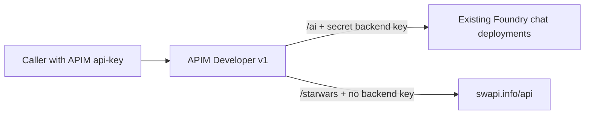

# AI Gateway POC

One API Management Developer **v1** gateway for multiple OpenAPI backends. The initial [API contracts](apis/) expose Azure OpenAI chat and the public [Star Wars API](https://swapi.info/api/). Both require an APIM subscription key in the `api-key` header. The [service policy](policies/service.xml) applies per-API, per-subscription rate limits and removes client credentials before forwarding. No real backend keys are stored in Bicep or deployment outputs.



APIM provisions one product, one active demo subscription with generated keys, and the secret named values listed in `backendSecrets` in the parameter file. [openai.xml](policies/openai.xml) attaches only to the OpenAI API and sets its backend key; [starwars.xml](policies/starwars.xml) attaches only to the Star Wars API and adds an `x-upstream-api` response header. Both inherit the service policy using `<base />`. A caller's APIM key is never sent to either backend.

The OpenAI API is a minimal **text-chat** contract, not a universal Foundry spec. The URL uses the **deployment name**, not necessarily the model name. Chat models that support `"stream": true` can return SSE: the shared policy forwards chunks without buffering. Use a streaming client to read those events; the `Invoke-RestMethod` example below waits for the complete response.

## Deploy

Requirements: Azure CLI with Bicep, PowerShell 7 for the commands below, and permission to create a resource group and APIM. The Star Wars API needs public internet access. To call the optional Foundry backend, its Azure OpenAI inference endpoint must be reachable and support local API-key authentication; an APIM administrator must set its secret named value. No Foundry RBAC assignment is required. APIM Developer is a paid, nonproduction tier and can take 30-60 minutes to provision. Select the intended subscription with `az account set` if needed.

Edit [main.bicepparam](bicep/main.bicepparam), especially `apimPublisherEmail` and the `backendUrl` values in `apiDefinitions`. Set `createApimResourceGroup = false` when `apimResourceGroupName` already exists and you do not want its tags updated. From `src/ai-gateway`, deploy with:

```powershell
az deployment sub create --name ai-gateway-poc --location swedencentral `
  --parameters ./bicep/main.bicepparam
```

For a different region, set both `--location` in the command (deployment metadata) and `apimLocation` in the parameter file (APIM location). The `openAiApiVersion` variable in that file replaces the placeholder in the OpenAI contract; callers still send a supported `?api-version=`. Read the non-secret gateway URL with `az deployment sub show --name ai-gateway-poc --query properties.outputs.gatewayUrl.value -o tsv`.

To enable the Foundry API after deployment, in the Azure portal open the APIM service, select **APIs > Named values > foundry-api-key**, and replace `REPLACE_WITH_FOUNDRY_API_KEY` with an **Azure OpenAI API key for the OpenAI `backendUrl`**. Save it as a **Secret**. Never put the real key in Bicep, the parameter file, or a command line. The placeholder cannot authenticate to Foundry. Named values in `backendSecrets` are create-only, so redeployment preserves portal-entered keys. A Foundry project URL or unrelated project key will not work with the Azure OpenAI chat route.

## Add An API

Put the OpenAPI 3 contract under [apis/](apis/), then add one entry to `apiDefinitions` in [main.bicepparam](bicep/main.bicepparam). For a public backend with no special policy:

```bicep
{
  name: 'catalog'
  displayName: 'Catalog API'
  path: 'catalog'
  backendUrl: 'https://api.example.com/v1'
  spec: loadTextContent('../apis/catalog.yaml')
  policy: ''
}
```

The public route becomes `/catalog` plus the paths in the contract; `backendUrl` is the upstream base URL. Names and paths must be unique. To add custom behavior, place an XML file under [policies/](policies/) and set `policy: loadTextContent('../policies/catalog.xml')`; include `<base />` to inherit the shared credential stripping, throttling, and forwarding policy. **Do not reuse the Foundry policy for other backends:** it injects the Foundry key. For a backend requiring a key, add a unique `name` and harmless `placeholder` under `backendSecrets` in the parameter file, then use `{{name}}` in that API's policy to set the backend's required header; enter the real secret in APIM after deployment. Other auth schemes need their own API policy. A file alone is not auto-published: the explicit parameter-file entry is the reviewable API-to-backend-to-policy mapping. Bicep's `loadTextContent` paths must be literals and each file must be under 131,072 characters.

## Test

The generated APIM subscription key is kept in a shell variable, not printed. Verify both public Star Wars routes first:

```powershell
$outputs = az deployment sub show --name ai-gateway-poc --query properties.outputs -o json | ConvertFrom-Json
$rg = $outputs.resourceGroupName.value
$apim = $outputs.apimName.value
$gateway = $outputs.gatewayUrl.value
$subscriptionId = az account show --query id -o tsv
$secretsUri = "https://management.azure.com/subscriptions/$subscriptionId/resourceGroups/$rg/providers/Microsoft.ApiManagement/service/$apim/subscriptions/gateway-demo/listSecrets?api-version=2024-05-01"
$key = az rest --method post --uri $secretsUri --query primaryKey -o tsv
$headers = @{'api-key' = $key}

Invoke-RestMethod -Uri "$gateway/starwars/people/1" -Headers $headers
Invoke-RestMethod -Uri "$gateway/starwars/planets/1" -Headers $headers
```

After setting the Foundry named value, use a chat deployment name on that account:

```powershell
$gateway = az deployment sub show --name ai-gateway-poc --query properties.outputs.gatewayUrl.value -o tsv
$apiVersion = az deployment sub show --name ai-gateway-poc --query properties.outputs.defaultOpenAiApiVersion.value -o tsv
$chatDeploymentName = 'gpt-4.1-mini'
$body = '{"messages":[{"role":"user","content":"Reply with exactly OK."}],"max_completion_tokens":24}'
$url = "$gateway/ai/openai/deployments/$chatDeploymentName/chat/completions?api-version=$apiVersion"

Invoke-RestMethod -Uri $url -Method Post -Headers $headers `
  -ContentType 'application/json' -Body $body
```

Missing or invalid **APIM** keys return 401 on either API; a valid key passed as `?subscription-key=` is rejected with 400. Exceeding `requestsPerMinutePerSubscription` within 60 seconds returns 429, counted separately for each API. APIM strips the caller key for every backend and inserts its secret key only for the Foundry route.

## Cost And Cleanup

Budget roughly **USD $50-150/month** for a continuously running Developer instance, plus model token usage; check [current regional pricing](https://azure.microsoft.com/pricing/details/api-management/) before deployment. This is a public, key-protected demo, **not production infrastructure**. For production, use [Azure Verified Modules](https://aka.ms/avm) and add private connectivity, Entra client authentication, secret rotation, monitoring, quotas, resilience, and organizational security/compliance controls.

The commands below use the deployment outputs and preserve an existing resource group:

```powershell
$outputs = az deployment sub show --name ai-gateway-poc --query properties.outputs -o json | ConvertFrom-Json
$rg = $outputs.resourceGroupName.value
$apim = $outputs.apimName.value
az apim delete --name $apim --resource-group $rg --yes
# Only if this POC created the resource group:
az group delete --name $rg --yes
```

If Foundry rejects a valid APIM request with 401/403, check that its account accepts API keys (`disableLocalAuth` must be `false`), then check the named value and backend URL. The example account `ai-foundary-sweden-central` currently has `disableLocalAuth: true`; the key-based OpenAI route cannot call it unless its owner enables key auth or you choose a different key-enabled account. Do not weaken that account's policy just to run this demo. For a 404, check the API's public path, the OpenAPI operation path, and the backend base URL. Earlier managed-identity deployments do not remove their old Foundry role assignments automatically; remove those separately after verifying key-based access.