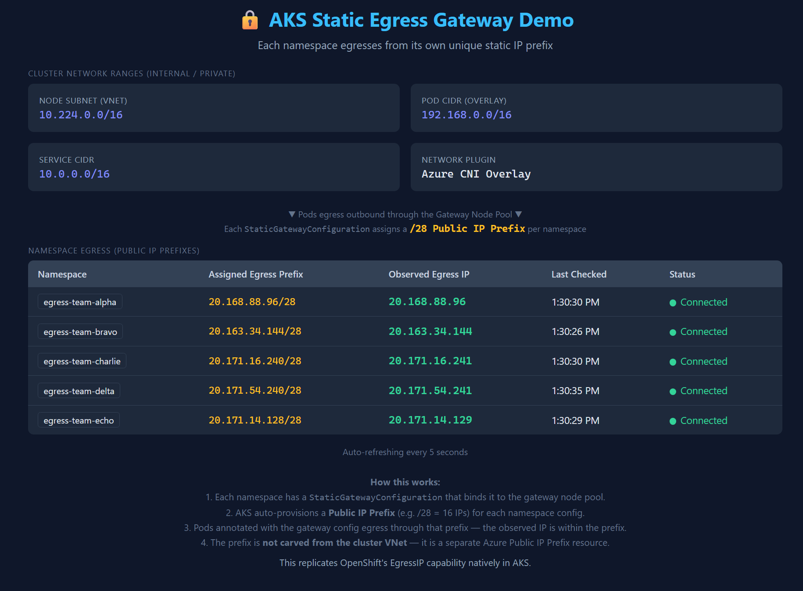

# AKS Static Egress Gateway — Unique Egress IP per Namespace

Demonstrate how AKS Static Egress Gateway assigns a unique static egress IP to each Kubernetes namespace, replicating OpenShift's EgressIP capability.

> **Looking for Private Cluster guidance?** See [Private Cluster Egress Guide](./docs/private-cluster-egress-guide.md) for using private IPs instead of public.

## 📸 Dashboard Preview



*The dashboard shows each namespace egressing from a unique public IP, with the assigned prefix and cluster network context.*

## 🏗️ Architecture

```
┌───────────────────────────────────────────────────────────────────┐
│  AKS Cluster (Azure CNI Overlay, Static Egress Gateway enabled)  │
│                                                                   │
│  ┌──────────────────┐  ┌──────────────────┐  ┌────────────────┐  │
│  │ egress-team-alpha │  │ egress-team-bravo│  │  ...3 more...  │  │
│  │  egress-checker   │  │  egress-checker  │  │ egress-checker │  │
│  │  → IP: 20.x.x.96 │  │  → IP: 20.x.x.144│ │ → unique IPs  │  │
│  └────────┬─────────┘  └────────┬─────────┘  └───────┬────────┘  │
│           │                      │                     │          │
│           └──────────────────────┼─────────────────────┘          │
│                                  ▼                                │
│                    ┌──────────────────────┐                       │
│                    │  Gateway Node Pool   │                       │
│                    │  (2 nodes, /28 PIPs) │                       │
│                    └──────────┬───────────┘                       │
│                               │                                   │
│  ┌────────────────────────────┼───┐                               │
│  │    Dashboard (namespace)   │   │                               │
│  │    Polls all 5 checkers    │   │                               │
│  │    port-forward → Browser  │   │                               │
│  └────────────────────────────┘   │                               │
└───────────────────────────────────────────────────────────────────┘
```

### How It Works

1. **Gateway Node Pool** — A dedicated pool of 2 nodes in `Gateway` mode is created with a `/28` public IP prefix size.
2. **StaticGatewayConfiguration** — One CRD per namespace binds that namespace to the gateway pool. AKS auto-provisions an **Azure Public IP Prefix** (/28 = 16 IPs) for each config.
3. **Pod Annotation** — Workloads opt in via `kubernetes.azure.com/static-gateway-configuration: egress-config`. Only annotated pods route through the gateway.
4. **Egress Path** — Annotated pods' outbound traffic is tunnelled (via eBPF/WireGuard) to the gateway nodes and exits with the namespace's assigned public IP.
5. **Result** — Each namespace gets a **stable, unique egress IP prefix** that external services can allowlist.

> **Key insight**: The egress IP prefixes are **separate Azure Public IP Prefix resources** — they are NOT carved from the cluster's internal VNet CIDR. The internal node subnet (`10.224.0.0/16`), pod CIDR (`192.168.0.0/16`), and service CIDR (`10.0.0.0/16`) are completely separate.

### Public vs Private Egress

| Mode | `provisionPublicIps` | Egress IPs from | Use case |
|---|---|---|---|
| **Public** (this demo) | `true` (default) | Auto-created Azure Public IP Prefix | Egress to internet / external APIs |
| **Public BYOIP** | `true` + `publicIpPrefixId` | Your pre-created Public IP Prefix | Controlled/known public IPs |
| **Private** | `false` | Gateway node private VNet IPs | Private cluster → on-prem / peered VNets |

For private cluster details, see [Private Cluster Egress Guide](./docs/private-cluster-egress-guide.md).

### What Gets Deployed

- 1× AKS Cluster (public, Azure CNI Overlay, Static Egress Gateway enabled)
- 1× Gateway Node Pool (2 nodes, /28 public IP prefix)
- 1× Azure Container Registry (Basic SKU)
- 5× Namespaces with `StaticGatewayConfiguration` (each gets a unique egress IP)
- 5× Egress Checker workloads (one per namespace)
- 1x Dashboard web app (ClusterIP service, access via port-forward)

## 📋 Prerequisites

- **Azure Subscription** — [Get a free one](https://azure.microsoft.com/free/)
- **Azure CLI** ≥ 2.61 — [Install guide](https://learn.microsoft.com/cli/azure/install-azure-cli)
- **aks-preview CLI extension** — `az extension add --name aks-preview`
- **kubectl** — `az aks install-cli`
- **Bash or PowerShell**

> Docker is **not** required — images are built in ACR using `az acr build`.
> The `aks-preview` extension is required to enable Static Egress Gateway and create gateway node pools.

## 🚀 Quick Start

### Option A: PowerShell

```powershell
cd src/aks-unique-egress-ip-per-namespace

.\deploy-infra.ps1 -ResourceGroupName "rg-aks-egress-demo" -Location "westus3" -NamePrefix "egressdemo"

# Access the dashboard:
kubectl port-forward svc/dashboard -n dashboard 8080:80
# Open http://localhost:8080
```

### Option B: Bash

```bash
cd src/aks-unique-egress-ip-per-namespace

chmod +x deploy-infra.sh
./deploy-infra.sh "rg-aks-egress-demo" "westus3" "egressdemo"

# Access the dashboard:
kubectl port-forward svc/dashboard -n dashboard 8080:80
# Open http://localhost:8080
```

## 🎛️ Parameters

| Parameter | Type | Default | Description |
|---|---|---|---|
| `location` | string | `eastus` | Azure region for all resources |
| `namePrefix` | string | `egressdemo` | Short prefix for resource names (3-12 chars) |
| `kubernetesVersion` | string | `1.34` | Kubernetes version |
| `systemNodeCount` | int | `2` | System node pool node count |
| `systemNodeVmSize` | string | `Standard_D2s_v5` | System node pool VM SKU |

> Gateway node pool is created via Azure CLI (2 nodes, `/28` prefix, `Standard_D2s_v5`).

## 🧪 Validating the Demo

1. Run `kubectl port-forward svc/dashboard -n dashboard 8080:80`
2. Open `http://localhost:8080` in your browser
3. Observe 5 rows — each namespace shows a **different** egress IP
4. Verify with kubectl:
   ```bash
   kubectl describe staticgatewayconfiguration egress-config -n egress-team-alpha
   ```

## 💰 Estimated Cost

| Resource | SKU | Approx. Monthly Cost |
|---|---|---|
| AKS System Pool (2× D2s_v5) | Pay-as-you-go | ~$140 |
| Gateway Pool (2× D2s_v5) | Pay-as-you-go | ~$140 |
| ACR Basic | Basic | ~$5 |
| Public IPs (/28 prefix) | Standard | ~$45 |
| **Total** | | **~$330/month** |

> Destroy immediately after demo to minimize cost.

## 🧹 Cleanup

```bash
az group delete --name rg-aks-egress-demo --yes --no-wait
```

## 🔧 Troubleshooting

| Problem | Solution |
|---|---|
| Gateway config stuck in "Provisioning" | `kubectl describe sgc egress-config -n <namespace>` — check events |
| Egress IP shows cluster NAT IP | Verify pod has annotation `kubernetes.azure.com/static-gateway-configuration: egress-config` |
| Dashboard can't reach egress-checkers | Verify ClusterIP services exist: `kubectl get svc -A` |
| Feature not available | Register preview: `az feature register --namespace Microsoft.ContainerService --name StaticEgressGatewayPreview` |
| ACR image pull fails | Verify AcrPull role: `az role assignment list --scope /subscriptions/.../registries/<acr>` |

## 📚 References

- [AKS Static Egress Gateway docs](https://learn.microsoft.com/en-us/azure/aks/configure-static-egress-gateway)
- [OpenShift EgressIP (migration context)](https://docs.openshift.com/container-platform/latest/networking/ovn_kubernetes_network_provider/configuring-egress-ips-ovn.html)
- [Azure CNI Overlay](https://learn.microsoft.com/en-us/azure/aks/azure-cni-overlay)
