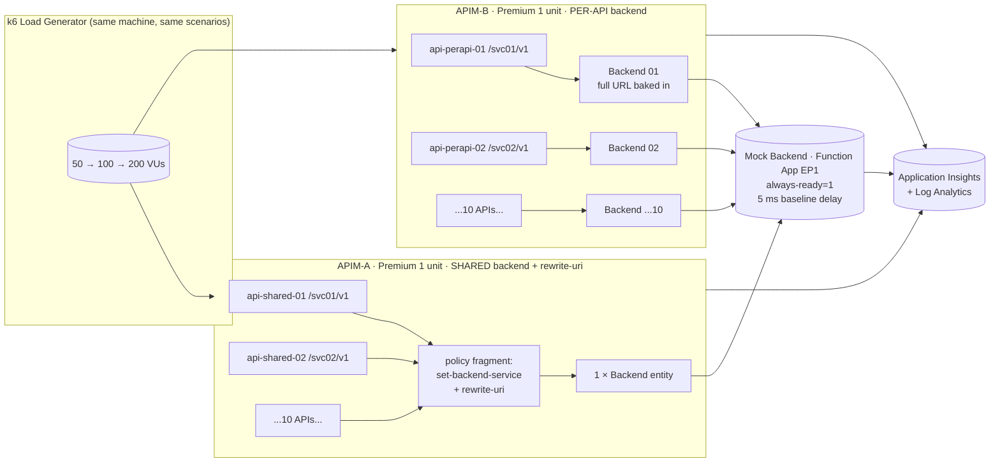

# Architecture

## Goal

Quantify whether the **shared-backend + `rewrite-uri`** pattern (one APIM `Backend` entity reused by many APIs) costs anything measurable versus the **one-`Backend`-per-API** pattern, when everything else is held constant.

## Topology

## Components

### Mock backend — Azure Function App (.NET 8 isolated)
- **Premium plan EP1** with `alwaysReady = 1` and `minimumElasticInstanceCount = 1` so cold starts cannot pollute results.
- `GET /api/time` — returns `{ serverTime, instanceId }`.
- `GET /api/echo/{*path}` — echoes captured path, query, method, selected headers. Adds a fixed `await Task.Delay(5)` so the backend has a stable, non-zero baseline that makes APIM overhead visible.
- App Insights instrumented; emits a custom dimension `instanceId` so the harness can confirm both APIMs hit the same backend instance(s).

### APIM-A — shared-backend pattern (the customer's design)
- **1** `Microsoft.ApiManagement/service/backends` named `shared-mock-backend`, URL: `https://<func>.azurewebsites.net/api/echo`. The trailing `/api/echo` is what causes the customer-reported path-stripping behaviour that `rewrite-uri` then has to reconstruct.
- **10 APIs**: `api-shared-01` … `api-shared-10`, each with `GET /resource/{id}` under unique base paths `/svc01/v1` … `/svc10/v1`.
- API policy = policy fragment `shared-backend-rewrite`:
  - `set-backend-service backend-id="shared-mock-backend"`
  - `rewrite-uri template="/api/echo/{originalPath}"` reconstructing the full path so the backend sees `/api/echo/svc{n}/v1/resource/{id}`.

### APIM-B — per-API backend pattern (the comparison)
- **10** `backends` entities, each pointing at the **same** Function App but with the full path baked into the backend URL — e.g. `https://<func>.azurewebsites.net/api/echo/svc01/v1`.
- **10 APIs**: `api-perapi-01` … `api-perapi-10`, same operations and base paths as APIM-A.
- API policy = policy fragment `per-api-passthrough`:
  - `set-backend-service backend-id="mock-backend-{n}"` only — no `rewrite-uri`.

### Shared monitoring
- Single Log Analytics workspace + single App Insights instance referenced by **both** APIMs and the Function.
- APIM diagnostics on both at `sampling = 100%`, headers logged, **bodies disabled** to avoid skewing latency.

## Why this is a fair test

See [`methodology.md`](methodology.md). Short version: identical region, identical SKU/units, identical policies *except* the variable under test, identical load generator/script/seed, same backend instance.
