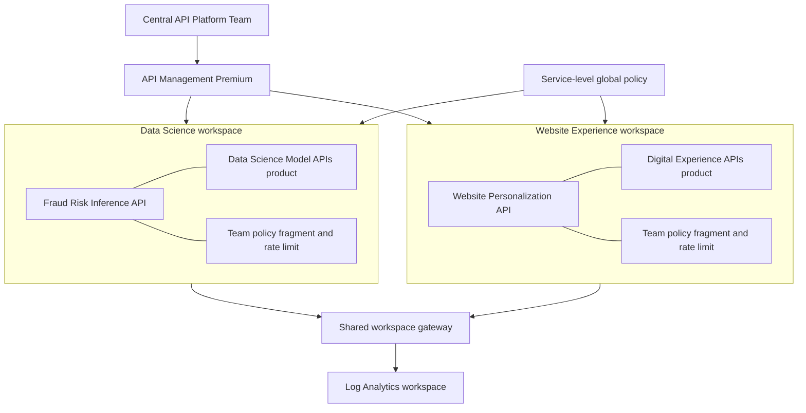

# APIM Federated Workspaces

Deploys two team-owned Azure API Management workspaces on one Premium service to demonstrate federated API management: central platform governance with decentralized API, product, policy, and runtime ownership.

> - **Scenario type:** Deployable architecture
> - **Category:** Integration, API Management & Messaging
> - **Status:** Ready
> - **Last validated:** July 2026 in West US

> [!IMPORTANT]
> This is a presenter-ready lab scenario, not a production baseline. For production, start from [Azure Verified Modules](https://aka.ms/avm) and add the network isolation, identity, availability, security, compliance, and operational controls required by your organization.

## Scenario

A central API platform team operates one API Management Premium service. The **Data Science Team** and **Website Experience Team** each receive a workspace where they independently manage APIs, products, named values, policy fragments, and policies. One shared workspace gateway provides the cost-conscious starting point, while dedicated gateways can provide separate runtime hostnames and capacity. Service-level policy and Log Analytics preserve central governance and observability in both models.



## What It Deploys

| Resource | Purpose |
|---|---|
| 2 APIM workspaces | Separate control-plane ownership for Data Science and Website Experience |
| 1 workspace gateway by default | Shared runtime for cost balance; switch to two dedicated gateways for stronger isolation |
| 2 policy-only APIs | Reliable demo endpoints with no external backend dependency |
| 2 published products | Independent productization by each workspace team |
| 2 named values and 2 policy fragments | Workspace-scoped configuration and reusable policy ownership |
| Workspace and service diagnostics | Team-scoped and platform-wide gateway logs in one Log Analytics workspace |
| Optional RBAC assignments | Required service-scoped and workspace-scoped roles for each team principal |
| Optional APIM Premium service | Disposable environment when an existing Premium service is not available |

The Data Science API allows five calls per minute per `X-Demo-Client`; the Website API allows twenty. Both return headers that make the policy chain visible:

- `X-Platform-Governance`: service-level policy inherited through `<base />`
- `X-Workspace-Owner`: workspace policy and named value
- `X-Team-Policy`: workspace-owned reusable policy fragment

## Prerequisites

- Azure CLI with an authenticated subscription: `az account show`
- PowerShell 7+ on Windows, or Bash with `jq` and `curl`
- `Owner` or `Contributor` on the deployment resource groups
- `User Access Administrator` or `Owner` when assigning optional team RBAC roles
- An existing API Management **Premium** or **Premium v2** service, or permission to create a disposable Premium service
- Workspace gateway capacity in the APIM primary region

The default disposable region is `westus`, where the scenario was last validated. Workspace gateway capacity changes over time; check [APIM region availability](https://learn.microsoft.com/azure/api-management/api-management-region-availability) before deploying.

## Quick Start

### Disposable end-to-end demo

This creates APIM Premium, two workspaces, and one shared workspace gateway. Provisioning can take up to three hours.

```powershell
cd src/apim-federated-workspaces
./deploy-infra.ps1 -CreateApimService -GatewayTopology Shared
./test-workspaces.ps1
```

```bash
cd src/apim-federated-workspaces
./deploy-infra.sh --create-apim --gateway-topology Shared
./test-workspaces.sh
```

### Use an existing Premium service

The deployment creates workspace gateways and monitoring in a separate scenario resource group. It does not replace the existing service-level global policy unless explicitly requested.

```powershell
./deploy-infra.ps1 `
  -ApimServiceName '<premium-apim-name>' `
  -ApimResourceGroupName '<apim-resource-group>' `
  -GatewayTopology Shared
```

> [!CAUTION]
> `-ConfigureGlobalPolicy` replaces the APIM service's current global policy. Use it only on a disposable service. Integrate `<base />` and the required enterprise controls manually on a customer-owned service.

### Delegate to Microsoft Entra teams

Pass group object IDs to create both role assignments required by APIM workspaces: **API Management Service Workspace API Developer** at service scope and **API Management Workspace Contributor** at the team's workspace scope.

```powershell
./deploy-infra.ps1 `
  -ApimServiceName '<premium-apim-name>' `
  -ApimResourceGroupName '<apim-resource-group>' `
  -DataScienceTeamPrincipalId '<data-science-group-object-id>' `
  -WebsiteTeamPrincipalId '<website-group-object-id>'
```

## Configuration

| PowerShell parameter | Default | Description |
|---|---|---|
| `ApimServiceName` | Generated with `-CreateApimService` | Existing or new APIM service name |
| `ApimResourceGroupName` | Scenario group for new APIM | Resource group containing an existing APIM service |
| `ScenarioResourceGroupName` | `rg-apim-federated-workspaces` | Workspace gateway and monitoring resource group |
| `Location` | `westus` | Used for a new APIM; existing APIM location is detected automatically |
| `GatewayTopology` | `Shared` | `Shared` creates one gateway serving both workspaces; `Dedicated` creates one per team |
| `CreateApimService` | `false` | Creates a disposable one-unit Premium service |
| `ConfigureGlobalPolicy` | `false` | Replaces the global policy; automatically enabled for disposable APIM |
| `DataScienceTeamPrincipalId` | Empty | Optional Entra group, user, or service principal object ID |
| `WebsiteTeamPrincipalId` | Empty | Optional Entra group, user, or service principal object ID |

## Validate

The test script proves:

1. Both workspaces, APIs, and products exist in their correct scopes.
2. The selected gateway topology has two workspace connections.
3. Both workspace API endpoints return the expected team payload in either gateway topology.
4. Global, workspace, named-value, and policy-fragment behavior appears in response headers.
5. The first five Data Science requests succeed and the gateway begins returning HTTP `429` within the next five calls. Distributed APIM counters can allow a small amount of overshoot.

```powershell
./test-workspaces.ps1
```

For the customer presentation, follow [DEMO-SCRIPT.md](DEMO-SCRIPT.md).

## Monitoring

Running `test-workspaces.ps1` or `test-workspaces.sh` generates traffic for both workspaces, including Data Science throttling evidence. Allow several minutes for ingestion, then open **API Management > Workspaces > a workspace > Monitoring > Logs** for a team-scoped view or query the Log Analytics workspace for the platform-wide view. The diagnostic settings use the `AzureDiagnostics` destination mode:

```kusto
AzureDiagnostics
| where TimeGenerated > ago(24h)
| where Category == 'GatewayLogs'
| where workspaceId_s in ('data-science', 'website-experience')
| where url_s has_any ('ai-insights', 'digital-experience')
| extend Team = case(
  workspaceId_s == 'data-science', 'Data Science',
  workspaceId_s == 'website-experience', 'Website Experience',
  'Other')
| extend StatusCode = toint(responseCode_d)
| summarize
  Requests=count(),
  Successful=countif(StatusCode >= 200 and StatusCode < 300),
  Throttled=countif(StatusCode == 429)
  by Team
| order by Team asc
```

See [DEMO-SCRIPT.md](DEMO-SCRIPT.md#7-show-federated-observability---3-minutes) for throttling, timeline, and request-detail queries.

Gateway logs can take several minutes to arrive. APIM request metrics are aggregated at service level and currently cannot be split by workspace; resource logs provide the workspace-aware operational view.

## Security And Secret Handling

- No credentials, subscription IDs, tenant IDs, API keys, certificates, or connection strings are stored in this scenario.
- Team principal parameters accept Microsoft Entra **object IDs**, not credentials.
- The policy-only demo APIs require no backend secrets. They are intentionally public lab endpoints and must not expose sensitive data.
- Deployment outputs are written to `.demo-state.json`, which is excluded by the scenario `.gitignore`. The file contains resource identifiers and URLs, not secrets, and cleanup removes it.
- The deployment script reads the active Azure CLI context at runtime. Do not hardcode account or tenant details into the templates or scripts.
- For production, replace public demo access with the required authentication, private networking, WAF, certificate, identity, and compliance controls.

## Gateway Topology Decision

| Topology | Benefit | Tradeoff |
|---|---|---|
| Shared, default | Lower cost and fewer resources | Teams share gateway capacity and configuration; one workload can affect another |
| Dedicated | Best runtime fault, scale, and hostname isolation | One billed gateway per workspace |

Use dedicated gateways for mission-critical or differently networked teams. Share gateways for lower-risk teams with compatible reliability and network requirements. A gateway can serve up to 30 workspaces by default.

## Estimated Cost

Workspace gateways are billed separately from the API Management service.

- Existing Premium APIM + `Shared`: one Premium workspace gateway unit plus Log Analytics ingestion
- Existing Premium APIM + `Dedicated`: two Premium workspace gateway units plus Log Analytics ingestion
- `-CreateApimService`: the above plus one APIM Premium unit

Rates vary by region and agreement. Check the [API Management pricing page](https://azure.microsoft.com/pricing/details/api-management/) before deployment and clean up immediately after the demo.

## Cleanup

```powershell
./cleanup.ps1
```

```bash
./cleanup.sh
```

For a disposable APIM, cleanup deletes the scenario resource group including the APIM service. For an existing APIM, it deletes only the two workspaces and the separate scenario resource group. Deletion can take an extended period.

## Current Workspace Constraints

At the last validation date, important constraints included:

- Workspaces do not support managed identities, credential manager, CA certificates, external cache, synthetic GraphQL APIs, or MCP servers.
- Workspace gateways do not support inbound private endpoints or custom hostnames.
- Workspace gateway network configuration is selected at creation and cannot be changed later.
- All APIM resource names remain unique across the service, even when resources are in different workspaces.
- Workspace resources cannot reference resources in another workspace.
- Developer portal consumers see published APIs and products, not the administrative workspace boundary.

Review the current [workspaces overview](https://learn.microsoft.com/azure/api-management/workspaces-overview) before production design.

## Troubleshooting

| Symptom | Resolution |
|---|---|
| Existing service rejected by deploy script | Premium or Premium v2 is required for this scenario's Premium workspace gateways |
| `NotAvailableForSubscription` or capacity error | Choose a currently supported workspace gateway region |
| `No resource pool available for I2v2` | Regional workspace gateway capacity is constrained; use `GatewayTopology Shared`, choose another supported region, or open an Azure support request |
| Gateway deployment appears stuck | Workspace gateway creation can take up to three hours; inspect the resource group's deployments |
| API returns `404` immediately after deployment | Run the test script and allow up to 20 minutes for gateway configuration propagation |
| Response header says `customer-managed-global-policy` | Expected when reusing APIM without replacing its global policy |
| Workspace logs are empty | Confirm both service and workspace diagnostic settings, then allow several minutes for ingestion |
| RBAC deployment fails | The deployer needs role-assignment permissions; omit principal IDs or obtain User Access Administrator |

## Repository Layout

```text
apim-federated-workspaces/
  README.md
  DEMO-SCRIPT.md
  deploy-infra.ps1 / deploy-infra.sh
  test-workspaces.ps1 / test-workspaces.sh
  cleanup.ps1 / cleanup.sh
  bicep/
    main.bicep
    modules/
      apim-service.bicep
      monitoring.bicep
      workspace-gateway.bicep
      workspaces.bicep
```

## References

- [Workspaces in Azure API Management](https://learn.microsoft.com/azure/api-management/workspaces-overview)
- [Set up a workspace](https://learn.microsoft.com/azure/api-management/how-to-create-workspace)
- [APIM workspace RBAC](https://learn.microsoft.com/azure/api-management/api-management-role-based-access-control)
- [Workspace gateway region availability](https://learn.microsoft.com/azure/api-management/api-management-region-availability)
