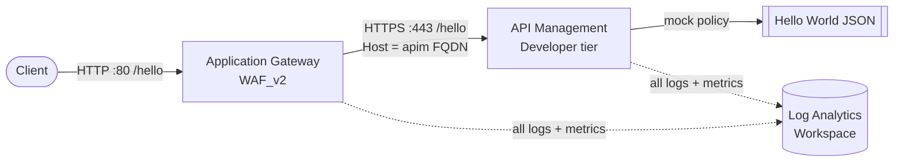

# Application Gateway + API Management with Comprehensive Diagnostics

Deploys an **Application Gateway (WAF_v2)** in front of **API Management** and turns on **every diagnostic setting available** for both resources, streaming all logs and metrics into a single **Log Analytics Workspace**. A self-contained *Hello World* API lets you call through the Application Gateway and watch the request flow appear in the diagnostic logs — ideal for demonstrating the full observability surface of both services.

This scenario doubles as a **worked example of how to configure diagnostic settings entirely in Bicep**: it shows how to enumerate every log category for Application Gateway and API Management and wire them to a Log Analytics Workspace with the `Microsoft.Insights/diagnosticSettings` resource — no portal clicks required. See [How diagnostics are configured in Bicep](#how-diagnostics-are-configured-in-bicep) below.

## Architecture



- The client hits the Application Gateway public IP on port 80.
- The Application Gateway forwards over HTTPS to the public APIM gateway, overriding the `Host` header to the APIM FQDN.
- APIM matches the `Hello World` API and returns a mock JSON response from a policy — **no backend service required**.
- Both the Application Gateway and APIM stream **all** diagnostic logs and metrics to the Log Analytics Workspace.

## Prerequisites

- [Azure CLI](https://learn.microsoft.com/cli/azure/install-azure-cli) 2.50 or later
- PowerShell 7+ (for `deploy-infra.ps1`) or Bash (for `deploy-infra.sh`)
- An Azure subscription with permission to create resource groups, networking, APIM, and Application Gateway
- Quota for one Application Gateway WAF_v2 instance and one APIM Developer unit in your chosen region

## Quick Start

**PowerShell:**

```powershell
cd src/app-gateway-apim-diagnostics
./deploy-infra.ps1 -PublisherEmail "you@contoso.com"
```

**Bash:**

```bash
cd src/app-gateway-apim-diagnostics
./deploy-infra.sh -e "you@contoso.com"
```

**Or deploy the Bicep directly:**

```bash
az group create --name rg-app-gateway-apim-diagnostics --location eastus2

az deployment group create \
  --resource-group rg-app-gateway-apim-diagnostics \
  --template-file bicep/main.bicep \
  --parameters bicep/main.parameters.json \
  --parameters publisherEmail="you@contoso.com"
```

> **Heads up:** API Management (Developer tier) takes **~30–45 minutes** to provision. The Application Gateway provisions in parallel and finishes much sooner; its backend reports healthy once APIM is ready.

## Parameters

| Parameter | Type | Default | Description |
|---|---|---|---|
| `location` | string | resource group location | Azure region for all resources |
| `namePrefix` | string | `agwdiag` | Prefix (3–8 chars) applied to all resource names |
| `publisherEmail` | string | `admin@example.com` | APIM publisher email (use a valid address) |
| `publisherName` | string | `Azure Scenario Hub` | APIM publisher organisation name |
| `apimSkuName` | string | `Developer` | APIM tier (`Developer`, `Basic`, `Standard`, `Premium`) |
| `apimCapacity` | int | `1` | Number of APIM scale units |

## What Gets Deployed

| Resource | SKU / Tier | Purpose |
|---|---|---|
| Log Analytics Workspace | PerGB2018, 30-day retention | Central sink for all diagnostic logs and metrics |
| Virtual Network | /16 with a /24 App Gateway subnet | Dedicated subnet required by Application Gateway v2 |
| Public IP | Standard, Static, DNS label | Public entry point for the Application Gateway |
| API Management | Developer, 1 unit | Hosts the `Hello World` API (public gateway) |
| Application Gateway | WAF_v2, 1 instance | Routes public traffic to APIM |
| WAF Policy | OWASP 3.2, Detection mode | Evaluates and logs requests without blocking the demo |

### Diagnostic settings (the focus of this scenario)

**Application Gateway** — diagnostic setting `appgw-all-diagnostics`:

| Category | Type | What it captures |
|---|---|---|
| `ApplicationGatewayAccessLog` | Log | Per-request access log: client IP, URI, response code, latency, bytes |
| `ApplicationGatewayPerformanceLog` | Log | Throughput / healthy-host counters (emitted by v1 SKUs) |
| `ApplicationGatewayFirewallLog` | Log | WAF rule matches (requires a WAF SKU — that's why this scenario uses WAF_v2) |
| `AllMetrics` | Metrics | Throughput, request count, healthy host count, response status, and more |

**API Management** — diagnostic setting `apim-all-diagnostics`:

| Category | Type | What it captures |
|---|---|---|
| `GatewayLogs` | Log | Every request that reaches the APIM gateway |
| `WebSocketConnectionLogs` | Log | WebSocket connection lifecycle events |
| `AllMetrics` | Metrics | Capacity, total requests, duration, and other APIM metrics |

> APIM also exposes a `DeveloperPortalAuditLogs` category on supported tiers. Add it as an extra entry in [bicep/modules/apim.bicep](bicep/modules/apim.bicep) if you want developer-portal audit events too.

## How diagnostics are configured in Bicep

The whole point of this scenario is to show how to turn on **all** diagnostics in code. The pattern is a `Microsoft.Insights/diagnosticSettings` resource scoped to the target resource, listing each log category and `AllMetrics`, pointed at the Log Analytics Workspace.

Application Gateway — see [bicep/modules/app-gateway.bicep](bicep/modules/app-gateway.bicep):

```bicep
resource appGwDiagnostics 'Microsoft.Insights/diagnosticSettings@2021-05-01-preview' = {
  name: 'appgw-all-diagnostics'
  scope: appGateway              // attaches the setting to the Application Gateway
  properties: {
    workspaceId: logAnalyticsWorkspaceId
    logs: [
      { category: 'ApplicationGatewayAccessLog', enabled: true }
      { category: 'ApplicationGatewayPerformanceLog', enabled: true }
      { category: 'ApplicationGatewayFirewallLog', enabled: true }   // requires a WAF SKU
    ]
    metrics: [
      { category: 'AllMetrics', enabled: true }
    ]
  }
}
```

API Management — see [bicep/modules/apim.bicep](bicep/modules/apim.bicep):

```bicep
resource apimDiagnostics 'Microsoft.Insights/diagnosticSettings@2021-05-01-preview' = {
  name: 'apim-all-diagnostics'
  scope: apimService            // attaches the setting to the APIM service
  properties: {
    workspaceId: logAnalyticsWorkspaceId
    logs: [
      { category: 'GatewayLogs', enabled: true }
      { category: 'WebSocketConnectionLogs', enabled: true }
    ]
    metrics: [
      { category: 'AllMetrics', enabled: true }
    ]
  }
}
```

Key points worth showing in a demo:
- Listing categories explicitly makes the available surface obvious. To capture everything in one line instead, swap the `logs` array for a single `{ categoryGroup: 'allLogs', enabled: true }` entry.
- The `scope` keyword is how a diagnostic setting attaches to any resource — the same pattern works for almost every Azure service.
- WAF_v2 is deliberate: the `ApplicationGatewayFirewallLog` category only produces data on a WAF SKU, so this template surfaces the *full* App Gateway diagnostic set.

## Post-Deployment Steps

Grab the demo URL from the deployment outputs and call it:

```bash
HELLO_URL=$(az deployment group show \
  --resource-group rg-app-gateway-apim-diagnostics \
  --name appgw-apim-diag-deploy \
  --query "properties.outputs.helloWorldUrlViaAppGateway.value" -o tsv)

curl "$HELLO_URL"
```

Expected response:

```json
{
  "message": "Hello, World!",
  "description": "Served by Azure API Management, fronted by Azure Application Gateway.",
  "requestedHost": "agwdiapim....azure-api.net",
  "forwardedFor": "<your client IP>",
  "timestamp": "2025-01-01T00:00:00Z"
}
```

Check the Application Gateway backend health (should be `Healthy` once APIM is up):

```bash
az network application-gateway show-backend-health \
  --resource-group rg-app-gateway-apim-diagnostics \
  --name agwdiag-appgw \
  --query "backendAddressPools[].backendHttpSettingsCollection[].servers[].health" -o tsv
```

### Explore the diagnostics in Log Analytics

It can take **5–15 minutes** for the first logs to appear. Run these KQL queries in **Log Analytics → Logs**:

```kusto
// Application Gateway access log - requests routed to APIM
AzureDiagnostics
| where ResourceType == "APPLICATIONGATEWAYS"
| where Category == "ApplicationGatewayAccessLog"
| project TimeGenerated, clientIP_s, requestUri_s, httpStatus_d, timeTaken_d, host_s
| order by TimeGenerated desc
```

```kusto
// WAF (firewall) log - rule evaluations in Detection mode
AzureDiagnostics
| where ResourceType == "APPLICATIONGATEWAYS"
| where Category == "ApplicationGatewayFirewallLog"
| project TimeGenerated, clientIp_s, requestUri_s, ruleId_s, Message, action_s
| order by TimeGenerated desc
```

```kusto
// APIM gateway log - the same request as seen by API Management
ApiManagementGatewayLogs
| project TimeGenerated, Method, Url, ResponseCode, BackendResponseCode, ApiId, OperationId, TotalTime
| order by TimeGenerated desc
```

```kusto
// All diagnostic categories currently flowing in (use this to show "what's possible")
union AzureDiagnostics, ApiManagementGatewayLogs, AzureMetrics
| where TimeGenerated > ago(1h)
| summarize Count = count() by Type, Category
| order by Type, Category
```

## Estimated Cost

Rough development-tier estimates (East US 2, subject to change):

| Resource | Approx. monthly |
|---|---|
| API Management — Developer | ~$50 |
| Application Gateway — WAF_v2 (1 instance + minimal traffic) | ~$250 |
| Public IP (Standard) | ~$4 |
| Log Analytics | Pay-per-GB ingested (a few cents for demo volumes) |

> This scenario is for **learning and demos, not production**. Application Gateway WAF_v2 is the largest cost driver — delete the resource group as soon as you're done.

## Cleanup

Delete everything in one command:

```bash
az group delete --name rg-app-gateway-apim-diagnostics --yes --no-wait
```

## Troubleshooting

| Symptom | Cause / Fix |
|---|---|
| `curl` returns `502 Bad Gateway` | APIM is still provisioning or the backend hasn't reported healthy yet. Wait a few minutes and retry; check backend health with the command above. |
| `curl` returns `404` | Ensure you're calling the `/hello` path. The route is `http://<fqdn>/hello`. |
| No logs in Log Analytics | Diagnostic data can take 5–15 minutes to land. Send a few requests, then re-run the KQL queries. |
| Firewall log is empty | Detection mode only logs when a managed rule matches. The access log and APIM gateway log populate from normal traffic. |
| Deployment fails on APIM name | The APIM name must be globally unique — it's derived from `namePrefix` + a hash of the resource group ID. Change `namePrefix` or the resource group and redeploy. |
| `quota exceeded` for Application Gateway or APIM | Pick a different region or request a quota increase. |

## Learn More

- [Application Gateway diagnostics](https://learn.microsoft.com/azure/application-gateway/application-gateway-diagnostics)
- [Monitor API Management](https://learn.microsoft.com/azure/api-management/api-management-howto-use-azure-monitor)
- [Integrate Application Gateway with API Management](https://learn.microsoft.com/azure/api-management/api-management-howto-integrate-internal-vnet-appgateway)
