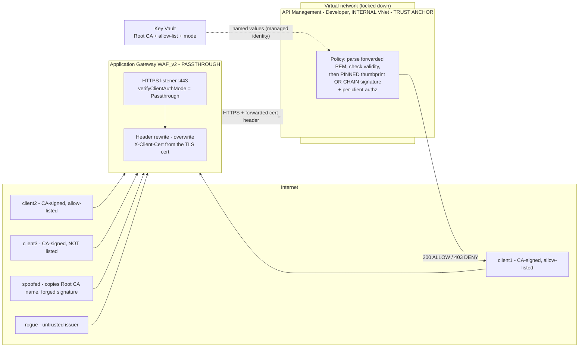
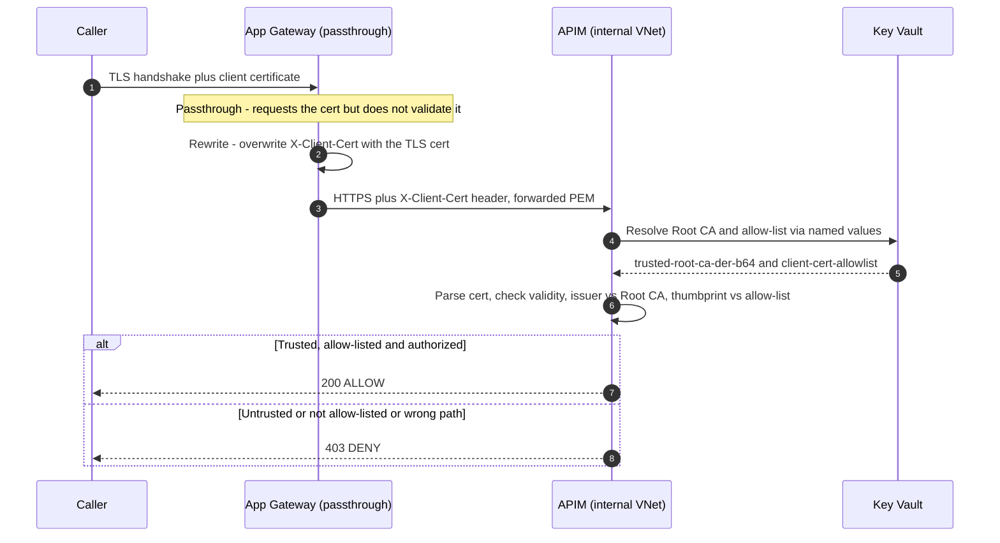

# Client‑Certificate Auth through Application Gateway **PASSTHROUGH** → API Management

A working, reproducible reference for doing **true client‑certificate (mTLS) validation in API Management** when Azure Application Gateway (WAF_v2) sits in front of it in **passthrough mode**. The gateway forwards the caller's client certificate; **APIM performs the actual certificate validation** — a real mTLS check at the API layer, not a spoofable header attribute.

It ships **two interchangeable validation models** — a **pinned‑thumbprint allow list** and a genuine **cryptographic chain‑of‑trust** signature check — so you can pick the trust model that fits your situation. Both are implemented in the same policy and proven live.

> **Scenario category:** Networking & Security
> **IaC:** Bicep · **Test clients:** OpenSSL / curl / PowerShell

> ✅ **Verified end‑to‑end on Azure.** We deployed this start‑to‑finish and validated every link, under **both** validation models — and re‑ran the whole matrix on an **API Management v2** tier to prove the pattern is tier‑agnostic.
> **Open the visual results report → [report/index.html](report/index.html)** (open it in a browser), or the [live GitHub Pages version](https://ricky-g.github.io/azure-scenario-hub/reports/app-gateway-mtls-passthrough-apim-validation/).
> Headline: App Gateway forwards the client certificate to APIM, and **APIM validates it against Key Vault‑sourced trust material** under whichever model you choose. A trusted client returns `200`; a certificate from an untrusted issuer returns `403`; a forged‑signature certificate that merely *copies* the Root CA's name is rejected by real cryptography; a client hitting another client's path returns `403 DENY_AUTHZ`. **16/16 checks passed across both models on API Management v1, and 11/11 on API Management v2.**

> 📊 **[Open the full interactive report → report/index.html](report/index.html)** — a styled walkthrough with a side‑by‑side of the two models, architecture + sequence diagrams, every scenario's expected‑vs‑actual, and the security verdict. (Clone and open it in a browser, or view it on GitHub Pages.)

---

## What this demonstrates

If you're trying to get **end‑to‑end mTLS** working where the client‑cert check must happen **in APIM** but a Layer‑7 App Gateway is in the path, this repo shows exactly how — and proves each link works with real command output:

1. **A caller presents a client certificate** to Application Gateway over TLS.
2. **App Gateway runs in passthrough mode** (`verifyClientAuthMode: Passthrough`) — it requests the client cert but does **not** validate it, and forwards it to the backend using mutual‑authentication **server variables** in a header‑rewrite rule.
3. **APIM performs the real mTLS validation** on the forwarded certificate: parses the PEM, checks the validity window, verifies the issuer against a Key Vault‑sourced Root CA, and pins the thumbprint against a per‑client allow‑list — then authorizes per client.
4. **Everything a header‑spoofer would try is blocked**: the rewrite *overwrites* the cert headers from the real TLS connection, and APIM is reachable **only** from the gateway (internal VNet), so nobody can inject a forged cert header or bypass the gateway.

The result: the client certificate is validated as a **cryptographic credential** (possession + trust) at APIM, not trusted as a plain header value.

## Two validation models — pick the one that fits

There are two legitimate ways to answer "*is this forwarded certificate one we trust?*", and this scenario implements **both** in the same policy. Select one at deploy time with the `certValidationMode` parameter (`pinned` or `chain`), or flip the `cert-validation-mode` Key Vault‑backed named value at runtime. Neither is universally "correct" — they trade **explicit control** against **operational overhead**.

| | **Pinned thumbprint** (`pinned`, default) | **Chain of trust** (`chain`) |
|---|---|---|
| **How trust is decided** | The certificate's SHA‑1 **thumbprint** must be on a Key Vault allow list (and its issuer must match the Root CA). | The Key Vault **Root CA public key must cryptographically verify** the certificate's signature (a real `RSA.VerifyData` over the TBSCertificate). |
| **Accepting a new client cert** | Only after you add its thumbprint to Key Vault. | Automatically — as soon as your CA issues it. |
| **Revoking one client** | Remove its thumbprint from the allow list. | Re‑issue the CA / use CRL/OCSP (not modelled here). |
| **Blast radius if the CA is over‑permissive** | Contained — only the exact pinned certs work. | Anything the CA signs is trusted. |
| **Operational overhead** | Per‑certificate maintenance. | None per certificate. |
| **Best when** | A small, known set of clients; you want an explicit allow list. | A private CA you control issues many / rotating client certs. |

**How the two models treat the edge‑case certificates** (the reason you can *see* the difference):

| Certificate | What it is | `pinned` | `chain` |
|---|---|---|---|
| `client1`, `client2` | CA‑signed **and** allow‑listed | ✅ `200` | ✅ `200` |
| **`client3`** | CA‑signed but **not** allow‑listed | ❌ `403 NOT_IN_ALLOWLIST` | ✅ `200` |
| **`spoofed`** | **Same issuer name** as the Root CA, but signed by a **different key** | ❌ `403 NOT_IN_ALLOWLIST` | ❌ `403 NOT_CA_SIGNED` |
| `rogue` | Signed by a completely different (untrusted) CA | ❌ `403 UNTRUSTED_ISSUER` | ❌ `403 NOT_CA_SIGNED` |
| *(none)* | No certificate forwarded | ❌ `403 NO_CERT_FORWARDED` | ❌ `403 NO_CERT_FORWARDED` |

> ### "Isn't chain mode just a name or thumbprint string compare?" — No.
> Chain mode performs a **genuine RSA signature verification** with the Key Vault Root CA's public key. The **`spoofed`** certificate is the proof: its issuer Distinguished Name is **byte‑for‑byte identical** to the real Root CA (`CN=mTLS POC Root CA`), yet it is rejected with `NOT_CA_SIGNED` and `chainOk=false` — because the Root CA's key never signed it. A string comparison would have been fooled; `RSA.VerifyData` is not. That is the difference between a certificate that *looks* trusted and one that provably *is*.
>
> **Sandbox note:** the APIM policy‑expression validator blocks both `X509Chain` and `System.Func` (both confirmed at deploy time), so chain mode parses the leaf DER **inline** to recover the `TBSCertificate` bytes and the signature, then verifies them with `rootCa.GetRSAPublicKey().VerifyData(...)`. See [`apim/api-policy.xml`](apim/api-policy.xml).

## Does this work on API Management **v2**? Yes — verified.

The main scenario deploys APIM on a **v1** tier (used because it supports **Internal VNet** mode). A fair question is whether the same pattern holds on the newer **v2** tiers, which carry a documented limitation:

> *"Certificate renegotiation isn't supported in the API Management v2 tiers … `context.Request.Certificate` only requests the certificate when `negotiateClientCertificate` is `True`."*

**That limitation does not apply here** — and we proved it on a real v2 instance. The reason is architectural: this scenario **never** reads `context.Request.Certificate` and never asks APIM to negotiate a client certificate at its own TLS layer. Application Gateway terminates the caller's TLS and **forwards the certificate in the `X-Client-Cert` header**; the policy validates *that*. The forwarded‑header path is identical on every APIM tier.

To demonstrate it rather than assert it, the repo includes a **standalone v2 proof** ([`validate-apim-v2.ps1`](validate-apim-v2.ps1) + [`bicep/apim-v2-proof.bicep`](bicep/apim-v2-proof.bicep)) that deploys a **public API Management v2** instance, points it at the **same Key Vault** trust material, applies the **same dual‑model policies**, and runs the **same certificate matrix** directly against the v2 gateway:

```powershell
# Deploys an API Management v2 instance, runs the dual-mode matrix against it,
# writes certs/results-v2.json, then:
./validate-apim-v2.ps1
./teardown-apim-v2.ps1   # removes ONLY the v2 proof instance
```

**Result: 11/11 checks passed on API Management v2 — behaviour is identical to the v1 deployment**, including the real RSA chain‑of‑trust check that rejects the forged‑issuer `spoofed` certificate (`chainOk=false`) and the `client3` flip (pinned `403` → chain `200`).

> ✅ **Tier‑agnostic:** the certificate‑validation pattern works unchanged on API Management **v1** and **v2**, because it operates on the forwarded `X-Client-Cert` header rather than APIM's own TLS layer — so the v2 renegotiation limitation is simply not in the path. Full v2 evidence is in the [report](report/index.html) and [RESULTS.md](RESULTS.md).

## The key question this answers

> **Does Application Gateway passthrough mode enforce proof‑of‑possession of the client certificate's private key during the TLS handshake?**

This matters because it's the difference between "the cert is a real credential" and "the cert is just a copyable string." The answer, proven empirically in [RESULTS.md](RESULTS.md):

- **Passthrough does not validate the CA/chain** — Microsoft documents that "the connection proceeds regardless of the certificate's presence or validity."
- **But possession is still enforced by TLS itself.** A client cannot present a certificate in the mTLS handshake without producing a `CertificateVerify` signed by the matching private key. So the only way to get *any* certificate forwarded to the backend is to possess its private key. Trust (is this cert one we accept?) is a *separate* decision handled in APIM.

See the [Security Verdict](RESULTS.md#security-verdict) for the full, evidence‑based conclusion.

---

## Architecture



**Flow:** client presents a certificate over mTLS → App Gateway (passthrough) requests it, does **not** validate it, and forwards it to APIM via header‑rewrite **server variables** → APIM reconstructs the certificate from the header and enforces **trust** (pinned thumbprint *or* cryptographic chain of trust) **+ authorization** → `200` or `403`.

### Request sequence (end to end)



### Why the certificate is forwarded in a header (not TLS)

Behind a Layer‑7 gateway, App Gateway terminates the client TLS session and opens a **separate** TLS session to APIM. The client certificate is therefore **not** available to APIM at the TLS layer (`context.Request.Certificate` is null). Microsoft's documented workaround is to forward it using **mutual‑authentication server variables** in a header‑rewrite rule — which is exactly what this scenario does. The rewrite **sets (overwrites)** the headers so a client can never inject its own value.

---

## The security model (what makes passthrough defensible)

| Control | Where | What it stops |
|---|---|---|
| **Proof‑of‑possession** | TLS handshake at App Gateway | Presenting a certificate you don't own (no private key) |
| **Header overwrite** (rewrite `SET`) | App Gateway | Clients injecting/forging `X-Client-Cert*` headers |
| **Trust validation** — pinned thumbprint **or** cryptographic chain of trust (KV‑sourced) | APIM policy | Certificates from untrusted issuers, forged signatures, or (in pinned mode) certs not on the allow list |
| **Validity window** | APIM policy | Expired / not‑yet‑valid certificates |
| **Per‑client authorization** | APIM operation policy | A trusted client using another client's API path |
| **Network lockdown** (APIM Internal VNet) | Network | Bypassing App Gateway to hit APIM with a forged header |
| **WAF_v2 (OWASP, Prevention)** | App Gateway | Retained throughout (constraint) |

The two **load‑bearing** controls against header spoofing are the **header overwrite** and the **network lockdown**.

---

## How the mTLS validation actually works in APIM

This is the part most people get stuck on. Because App Gateway is a Layer‑7 proxy, it terminates the caller's TLS and opens a **separate** TLS session to APIM — so the client certificate is **not** available to APIM at the TLS layer (`context.Request.Certificate` is null, and the built‑in `validate-client-certificate` policy won't see it). The Microsoft‑documented workaround, implemented here, is:

**1 — App Gateway forwards the cert as a header** (in [`bicep/modules/app-gateway.bicep`](bicep/modules/app-gateway.bicep)) using mutual‑authentication server variables, with the action set to **overwrite** so a caller can't inject their own:

```
X-Client-Cert          = {var_client_certificate}              # full PEM, URL-encoded
X-Client-Cert-Verify   = {var_client_certificate_verification} # captured for evidence only
```

**2 — APIM reconstructs and validates the certificate** in a policy expression (see [`apim/api-policy.xml`](apim/api-policy.xml)). The essential logic:
**2 — APIM reconstructs and validates the certificate** in a policy expression (see [`apim/api-policy.xml`](apim/api-policy.xml)). The policy first rebuilds the certificate, then applies **whichever model is active**:

```csharp
// URL-decode the forwarded header, strip the PEM armor, base64-decode to DER,
// and build a real X509Certificate2 to validate as a cryptographic credential.
string pem  = System.Uri.UnescapeDataString(fwdCertHeader);
string body = Regex.Match(pem, "-----BEGIN CERTIFICATE-----([\\s\\S]*?)-----END CERTIFICATE-----").Groups[1].Value;
var cert    = new X509Certificate2(Convert.FromBase64String(Regex.Replace(body, "\\s+", "")));
var root    = new X509Certificate2(Convert.FromBase64String("{{trusted-root-ca-der-b64}}"));

// Validity window (note: DateTime.ToUniversalTime() is blocked in the APIM sandbox).
bool timeOk = DateTime.Now >= cert.NotBefore && DateTime.Now <= cert.NotAfter;

// ---- MODEL A: pinned thumbprint allow list ------------------------------
// issuer DN must match the Root CA, AND the thumbprint must be on the KV list.
bool issuerDnMatch = cert.Issuer.Equals(root.Subject, StringComparison.OrdinalIgnoreCase);
bool pinnedMatch = false;
foreach (var e in "{{client-cert-allowlist}}".Split('|')) {         // "client1:THUMBPRINT"
    var kv = e.Split(':');
    if (kv.Length == 2 && kv[1].Trim().Equals(cert.Thumbprint, StringComparison.OrdinalIgnoreCase))
        pinnedMatch = true;
}
bool pinnedOk = timeOk && issuerDnMatch && pinnedMatch;

// ---- MODEL B: cryptographic chain of trust ------------------------------
// A REAL signature check: the Root CA public key must verify the leaf's
// signature over its TBSCertificate. (Parsed inline because the sandbox
// blocks X509Chain and System.Func — see the file for the DER walk.)
byte[] tbs = /* TBSCertificate bytes */;  byte[] sig = /* signatureValue */;
bool chainOk   = root.GetRSAPublicKey().VerifyData(tbs, sig, hashAlg, RSASignaturePadding.Pkcs1);
bool chainModeOk = timeOk && chainOk;

// The active model ({{cert-validation-mode}}) decides which result is used.
```

> ⚠️ **Note:** a thumbprint is a hash of the *entire* certificate, so it cannot be forged — pinning is safe. But pinning also can't tell you *why* a cert is trusted, only *that* you listed it. Chain mode answers the "why" cryptographically. This scenario gives you both; the [comparison table above](#two-validation-models--pick-the-one-that-fits) explains when to use each.

**3 — Per‑client authorization** happens in the operation policies ([`apim/operation-client1-policy.xml`](apim/operation-client1-policy.xml), [`operation-client2-policy.xml`](apim/operation-client2-policy.xml)): `client1`'s cert may only reach path A, `client2`'s only path B. A third operation, [`operation-whoami-policy.xml`](apim/operation-whoami-policy.xml), is **model‑neutral** — it returns `200` for *any* certificate APIM trusts under the active model, which is what makes the `pinned`‑vs‑`chain` difference for `client3` observable.

The trust material (Root CA + allow‑list) lives in **Key Vault** and is surfaced to the policy as APIM **named values** via the service's managed identity — so the policy never hard‑codes the trust anchor, and rotating a cert is a Key Vault update.

---

## Prerequisites

- **Azure CLI** ≥ 2.60 with the Bicep extension (`az bicep version`)
- **OpenSSL** (on Windows, the copy bundled with Git for Windows works)
- **PowerShell 7+** (Windows) *or* **Bash** (Linux/macOS)
- An Azure subscription and permission to create App Gateway, APIM, Key Vault, VNet, and a **role assignment** (Owner or User Access Administrator on the resource group)
- Quota for **App Gateway WAF_v2** and **APIM Developer** in your region

### ⚠️ Required: register the App Gateway client-authentication feature

Application Gateway **mutual-authentication (client certificate) — including passthrough mode — is gated behind a subscription feature flag.** If it isn't registered, the SSL profile deploys successfully via ARM/Bicep but the **data plane silently refuses the client-auth TLS handshake** (the gateway accepts the TCP connection, then drops it right after the `ClientHello` — `SSL handshake has read 0 bytes`). This is the single most confusing failure mode of this scenario, so register the feature **before** deploying:

```bash
# Check the current state
az feature show --namespace Microsoft.Network --name AllowApplicationGatewayClientAuthentication --query properties.state -o tsv

# Register it (one-time per subscription; can take 15 min – a few hours)
az feature register --namespace Microsoft.Network --name AllowApplicationGatewayClientAuthentication

# Poll until it reports "Registered", then propagate the change
az provider register --namespace Microsoft.Network
```

If you deployed **before** the feature finished registering, force the gateway to pick it up afterwards — either redeploy, or stop/start it:

```bash
az network application-gateway stop  -g <rg> -n <appgw>
az network application-gateway start -g <rg> -n <appgw>
```

---

## Quick start

> ⚠️ **API Management Developer‑tier Internal‑VNet provisioning takes ~30–45 minutes.** The deploy script polls until complete.

### PowerShell (Windows)

```powershell
cd src/app-gateway-mtls-passthrough-apim-validation

# 1. Deploy (auto-generates certs on first run; default model is 'pinned')
./deploy-infra.ps1 -ResourceGroupName rg-appgw-passthrough-mtls-poc -Location eastus2

#    ...or deploy with the cryptographic chain-of-trust model instead:
./deploy-infra.ps1 -ResourceGroupName rg-appgw-passthrough-mtls-poc -CertValidationMode chain

# 2. Run the evidence suite
./run-tests.ps1

# 3. Tear down (stop billing)
./teardown.ps1
```

### Bash (Linux/macOS)

```bash
cd src/app-gateway-mtls-passthrough-apim-validation
RESOURCE_GROUP=rg-appgw-passthrough-mtls-poc LOCATION=eastus2 ./deploy-infra.sh
# select the chain model with:  CERT_VALIDATION_MODE=chain ./deploy-infra.sh
./run-tests.sh
./teardown.sh
```

The test clients reach the gateway by mapping the frontend SNI host to the App Gateway public IP (the scripts do this automatically; conceptually it is `curl --resolve api.mtls-poc.local:443:<APPGW_PUBLIC_IP>`).

> **Switch models without redeploying:** the active model is a Key Vault‑backed named value, so you can flip it at runtime — set `cert-validation-mode` to `pinned` or `chain` on the APIM service and the policy picks it up within seconds. `validate-apim-keyvault.ps1` (below) does exactly this to test both models in one run.

### Validate the APIM → Key Vault check on its own (no feature flag needed)

If you just want to confirm the part that matters — **App Gateway forwards the cert and APIM validates it against Key Vault** — you don't have to wait for the `AllowApplicationGatewayClientAuthentication` feature. This script presents each certificate to APIM *exactly as the gateway forwards it* (in the `X-Client-Cert` header) through a plain HTTPS test listener, flips between **both models**, and asserts APIM's decision against the Key Vault‑sourced trust material:

```powershell
./validate-apim-keyvault.ps1
```

Expected output (writes `certs/results.json`, which feeds the report):

```text
==== MODEL A: PINNED (Key Vault thumbprint allow list) ====
[PASS] Allow-listed client1 -> 200           decision=ALLOW chainOk=True  pinnedMatch=True
[PASS] Allow-listed client2 -> 200           decision=ALLOW chainOk=True  pinnedMatch=True
[PASS] CA-signed but NOT allow-listed client3 -> 403   reason=NOT_IN_ALLOWLIST chainOk=True  pinnedMatch=False
[PASS] Forged-signature cert (same issuer DN) -> 403   reason=NOT_IN_ALLOWLIST chainOk=False
[PASS] Untrusted issuer -> 403               reason=UNTRUSTED_ISSUER
[PASS] client1 -> client2 path B -> 403      decision=DENY_AUTHZ

==== MODEL B: CHAIN OF TRUST (Root CA RSA signature) ====
[PASS] CA-signed client1 -> 200              decision=ALLOW chainOk=True
[PASS] CA-signed client3 (no allow list needed) -> 200   decision=ALLOW chainOk=True  pinnedMatch=False
[PASS] Forged signature, identical issuer DN -> 403      reason=NOT_CA_SIGNED chainOk=False
[PASS] Untrusted issuer -> 403               reason=NOT_CA_SIGNED
==> 16/16 checks passed.
```

The two results that matter most: **`client3`** flips from `403` (pinned) to `200` (chain) — proof the models genuinely differ — and **`spoofed`** is rejected in *both* modes with `chainOk=False`, proof that chain mode is real signature verification, not a name compare. Add `-RemoveTestListener` to remove the test listener afterwards.

---

## Parameters

| Parameter | Type | Default | Description |
|---|---|---|---|
| `namePrefix` | string (3–8) | `mtlspoc` | Prefix for all resource names |
| `location` | string | RG location | Azure region |
| `publisherEmail` | string | `admin@example.com` | APIM notification email |
| `publisherName` | string | `Azure Scenario Hub` | APIM publisher name |
| `frontendHostName` | string | `api.mtls-poc.local` | Listener SNI + server‑cert CN clients present |
| `serverCertData` | secure | *(from cert gen)* | Base64 PFX for the listener server certificate |
| `serverCertPassword` | secure | *(from cert gen)* | PFX password |
| `trustedRootCaDerB64` | secure | *(from cert gen)* | Trusted Root CA (DER, base64) for issuer validation |
| `clientCertAllowlist` | secure | *(from cert gen)* | `client1:THUMB\|client2:THUMB` pinned allow list |
| `certValidationMode` | string | `pinned` | Validation model APIM enforces: `pinned` (thumbprint allow list) or `chain` (Root CA signature) |

The four secure parameters are produced by `generate-certs.ps1`/`.sh` and injected via an ARM parameters file (the PFX base64 is too large to pass inline on the CLI). `certValidationMode` is a plain (non‑secret) parameter surfaced to the policy as the `cert-validation-mode` named value.

---

## What gets deployed

- **Virtual network** with two subnets (`snet-appgw`, `snet-apim`) and locked‑down NSGs
- **Two Standard public IPs** (App Gateway data plane; APIM control plane)
- **Log Analytics workspace** — receives App Gateway access logs (where `client_certificate_verification` appears) and APIM gateway logs
- **Key Vault** (RBAC) holding the Root CA (DER, base64) and the per‑client thumbprint allow list
- **API Management** (Developer, **Internal VNet**, system‑assigned identity) with the `mtls-poc` API, two per‑client operations plus a model‑neutral `/whoami` probe, the `cert-validation-mode` selector, and the dual‑model validation policy
- **WAF policy** (OWASP 3.2, Prevention) with an exclusion for the `X-Client-Cert*` forwarding headers
- **Application Gateway** (WAF_v2) with an HTTPS listener, a **passthrough** SSL profile, and the certificate‑forwarding header rewrite

---

## Test scenarios (evidence suite)

### Verified results (we ran this for real)

The APIM → Key Vault validation was confirmed live on Azure (`eastus2`, App Gateway WAF_v2, APIM Developer internal VNet) under **both** validation models — **16/16 checks passed**. Open **[report/index.html](report/index.html)** for the styled write‑up (with a side‑by‑side of the two models); the full evidence is in [RESULTS.md](RESULTS.md).

**Configuration proofs (both models):**

| # | Check | Presented | Result |
|---|---|---|---|
| 1 | App Gateway forwards the cert to APIM | rewrite `SET X-Client-Cert = {var_client_certificate}` | ✅ 8 headers overwritten |
| 2 | Key Vault holds the trust material | `trusted-root-ca-der-b64` + `client-cert-allowlist` + `cert-validation-mode` | ✅ referenced by APIM named values |

**Model A — pinned thumbprint allow list:**

| Check | Presented | Result |
|---|---|---|
| Allow‑listed client → 200 | `client1` / `client2` PEM | ✅ **200 ALLOW** (`chainOk=True pinnedMatch=True`) |
| CA‑signed but **not** listed → 403 | `client3` PEM | ✅ **403** `NOT_IN_ALLOWLIST` (`chainOk=True pinnedMatch=False`) |
| Forged signature, same issuer name → 403 | `spoofed` PEM | ✅ **403** `NOT_IN_ALLOWLIST` (`chainOk=False`) |
| Untrusted issuer → 403 | `rogue` PEM | ✅ **403** `UNTRUSTED_ISSUER` |
| Per‑client authorization | `client1` → `/poc/client2` | ✅ **403 DENY_AUTHZ** |

**Model B — cryptographic chain of trust:**

| Check | Presented | Result |
|---|---|---|
| CA‑signed client → 200 | `client1` / `client2` / **`client3`** PEM | ✅ **200 ALLOW** (`chainOk=True`) — no allow list needed |
| Forged signature, **identical** issuer DN → 403 | `spoofed` PEM | ✅ **403** `NOT_CA_SIGNED` (`chainOk=False`) |
| Untrusted issuer → 403 | `rogue` PEM | ✅ **403** `NOT_CA_SIGNED` |

> **`client3`** returns `403` under pinned but `200` under chain — proof the two models genuinely differ. **`spoofed`** is rejected in *both* modes with `chainOk=False`, proof that chain mode is a real RSA signature check, not a name compare — the **Key Vault Root CA is the live trust anchor**, and APIM decides trust, not the gateway. Reproduce with `./validate-apim-keyvault.ps1`.

### Full evidence suite (requires the client‑auth feature — see prerequisites)

Once `AllowApplicationGatewayClientAuthentication` is registered, `run-tests.ps1` exercises the complete matrix through the **live** mTLS handshake:

| # | Scenario | Expected |
|---|---|---|
| 0 | App Gateway → APIM connectivity (no cert, status endpoint) | `200` |
| 1 | **Possession positive** — client owns cert1 (cert + key) | `200 ALLOW` |
| 1b | **Possession negative** — present cert1 with the *wrong* key | client cannot present cert; no valid cert reaches APIM |
| 2 | Positive — client2 owns cert2 → path B | `200 ALLOW` |
| 3 | **Per‑client authz** — client1 cert → client2's path | `403 DENY_AUTHZ` |
| 4 | **Trust at APIM** — rogue owns a cert from an untrusted issuer | `403 DENY` (forwarded, then rejected) |
| 5 | **No cert** presented | `403 DENY` (`NO_CERT_FORWARDED`) |
| 6a | **Spoof** — reach APIM directly, bypassing App Gateway | blocked (Internal VNet) |
| 6b | **Spoof** — inject/forge `X-Client-Cert*` headers | overwritten → `403` / real cert wins |
| 7 | **WAF retained** — WAF_v2 Enabled + Prevention | Enabled/Prevention |

Both `validate-apim-keyvault.ps1` and `run-tests.ps1` write `certs/results.json`, which feeds [RESULTS.md](RESULTS.md) and the HTML report.

---

## Estimated cost

Rough **eastus2** pay‑as‑you‑go while running (single instances):

| Resource | Approx. |
|---|---|
| Application Gateway WAF_v2 | ~$0.44/hr fixed + ~$0.008/capacity‑unit‑hr |
| API Management Developer | ~$0.07/hr (~$50/mo) |
| 2 × Standard public IP | ~$0.005/hr each |
| Key Vault / Log Analytics | pennies for POC volumes |

**≈ $0.50–0.90 per hour** while running. **Tear down when finished.**

---

## Cleanup

```powershell
./teardown.ps1              # deletes the resource group, removes local certs
# Key Vault is soft-deleted for 7 days; to reclaim the name immediately:
az keyvault purge --name <keyVaultName>
```

```bash
./teardown.sh
```

> **Reminder:** the App Gateway and APIM bill continuously until the resource group is deleted. Run teardown as soon as you've captured the evidence.

---

## Troubleshooting

| Symptom | Cause / fix |
|---|---|
| **`SSL handshake has read 0 bytes` on 443, but a plain HTTPS listener works** | The `AllowApplicationGatewayClientAuthentication` feature isn't registered on the subscription. Register it (see Prerequisites), then stop/start or redeploy the gateway. This is the #1 gotcha. |
| Deploy fails immediately on `verifyClientAuthMode` | The App Gateway API version must be **2025-03-01+**. This template uses `2025-03-01`. Update the Azure CLI/Bicep if the provider rejects it. |
| APIM deploy "still running" for 40+ min | Expected — Developer Internal VNet provisioning is slow. Don't cancel. |
| `run-tests.ps1` all `403 NO_CERT_FORWARDED` including valid clients | App Gateway backend may be unhealthy (APIM not ready) or the header rewrite isn't attached. Check backend health: `az network application-gateway show-backend-health -g <rg> -n <appgw>`. |
| Windows `curl` can't present the client cert | Built‑in curl uses Schannel (no PEM client certs). The tests use OpenSSL `s_client` instead. |
| `403 UNTRUSTED_ISSUER` for a client you expected to pass | Its thumbprint isn't in `client-cert-allowlist`, or its issuer ≠ the Root CA subject. Regenerate certs and redeploy. |
| Backend health shows a TLS error to APIM | APIM's `*.azure-api.net` cert is public‑CA signed and trusted by App Gateway v2 by default; if it fails, the region's APIM cert chain may need a trusted‑root upload. |

---

## Further reading

- [Overview of mutual authentication with Application Gateway](https://learn.microsoft.com/azure/application-gateway/mutual-authentication-overview)
- [Rewrite HTTP headers — mutual authentication server variables](https://learn.microsoft.com/azure/application-gateway/rewrite-http-headers-url#mutual-authentication-server-variables)
- [Secure APIs using client certificate authentication in APIM](https://learn.microsoft.com/azure/api-management/api-management-howto-mutual-certificates-for-clients)
- [Integrate APIM in an internal VNet with Application Gateway](https://learn.microsoft.com/azure/api-management/api-management-howto-integrate-internal-vnet-appgateway)

> These templates are for learning and validation, **not** production. For production, use [Azure Verified Modules](https://aka.ms/avm).
