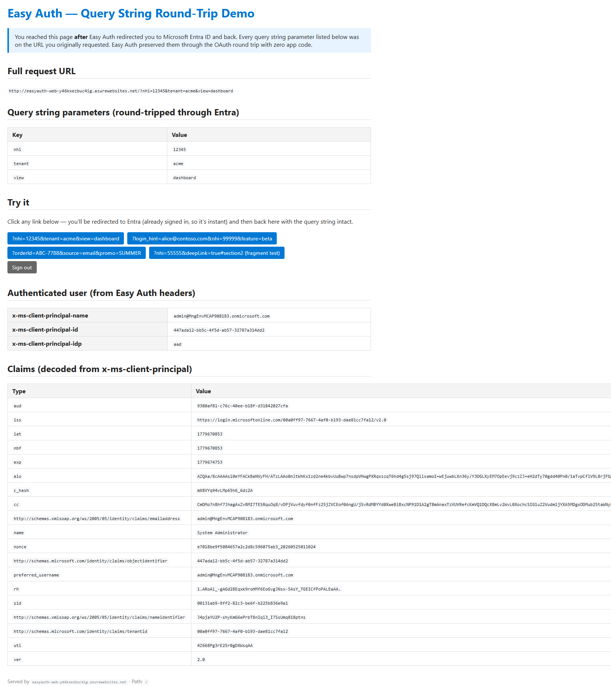
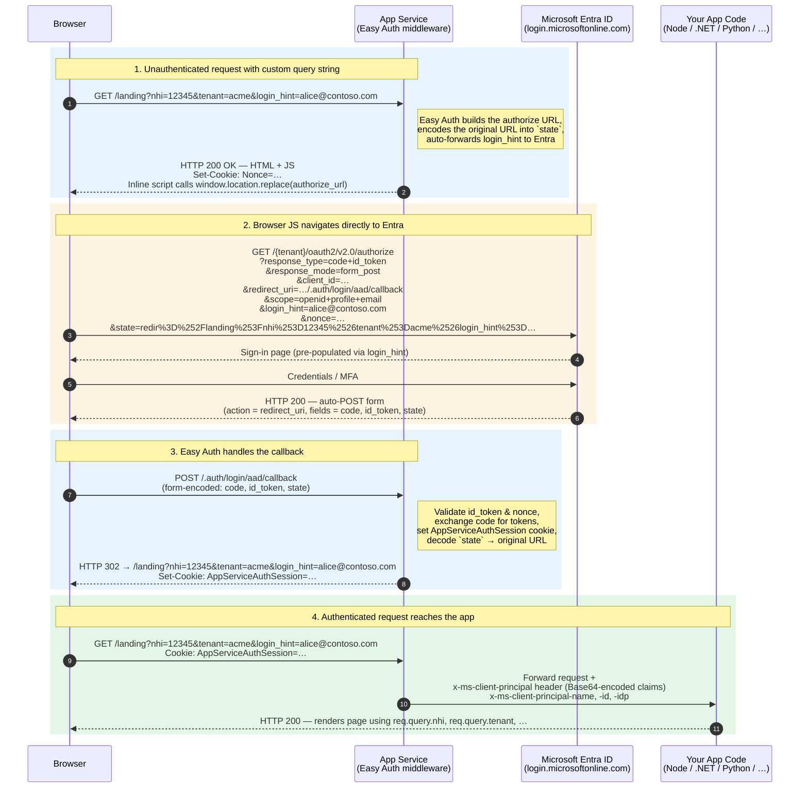

# App Service Easy Auth — Query String Round-Trip Demo

**Prove that Azure App Service's built-in authentication (Easy Auth) preserves arbitrary custom query string parameters across the full Microsoft Entra ID sign-in redirect — with zero authentication code in your app.**



> The screenshot above is the actual demo app after Easy Auth redirected the user to Microsoft Entra ID and back. Every key/value in the *Query string parameters* table was on the original URL the browser requested **before** sign-in — and Easy Auth delivered them back to the app untouched.

---

## The scenario

A web app receives an inbound request with custom business parameters in the query string:

```
GET /landing?login_hint=alice@contoso.com&nhi=12345&view=dashboard
```

The user isn't signed in yet, so the app must:

1. Send the user to Microsoft Entra ID to authenticate.
2. After Entra signs them in, **come back to the original URL with the exact same query string** — so the app knows what to render (`nhi=12345`, `view=dashboard`, etc.).

**Question:** Can App Service's Easy Auth do this without writing any auth-handling code in the app?

**Answer:** ✅ Yes — natively, and by default. This scenario proves it end-to-end.

---

## How it works



### How accurate is this diagram?

Every box and label was captured live against this deployment with `curl` and a browser User-Agent header. The exact authorize URL Easy Auth handed to the browser:

```
https://login.microsoftonline.com/<tenant-id>/oauth2/v2.0/authorize
  ?response_type=code+id_token
  &redirect_uri=https%3A%2F%2F<app>.azurewebsites.net%2F.auth%2Flogin%2Faad%2Fcallback
  &client_id=<client-id>
  &scope=openid+profile+email
  &response_mode=form_post
  &nonce=<nonce>
  &state=redir%3D%252Flanding%253Fnhi%253D12345%2526tenant%253Dacme
```

Two subtleties worth knowing:

- **Step 1 is an HTTP 200, not a 302.** Easy Auth returns a tiny HTML page containing an inline script that calls `window.location.replace(...)`, plus a `Nonce` cookie. The browser-side JS does the actual navigation. This is so the `Nonce` cookie can be set atomically with the redirect (used for CSRF protection on the callback).
- **`response_type=code id_token` + `response_mode=form_post`** is the OAuth 2.0 hybrid flow. Because we configured a client secret, Easy Auth uses hybrid flow (more secure than implicit). The callback in step 3 is therefore a **POST**, not a GET. Documented in [Confidential vs. public client](https://learn.microsoft.com/azure/app-service/overview-authentication-authorization#confidential-vs-public-client).

### Bonus behaviour observed

When the inbound query string contains a `login_hint` parameter, **Easy Auth also automatically forwards it to Entra's authorize endpoint** as a top-level `login_hint` query param — so the Entra sign-in page is pre-populated with the username. No `loginParameters` configuration required.

Both behaviours were validated live against this deployment (see [Validation](#validation) below).

---

## Official Microsoft documentation backing this

| Topic | Reference |
|---|---|
| Authentication flow & how unauthenticated requests are redirected | [Authentication and authorization in Azure App Service and Azure Functions › How it works › Authentication flow](https://learn.microsoft.com/azure/app-service/overview-authentication-authorization#authentication-flow) |
| `post_login_redirect_uri` / preserved return URL | [Customize sign-ins and sign-outs in Azure App Service authentication › Use multiple sign-in providers](https://learn.microsoft.com/azure/app-service/configure-authentication-customize-sign-in-out#use-multiple-sign-in-providers) |
| Preserving URL fragments (`#…`) — `WEBSITE_AUTH_PRESERVE_URL_FRAGMENT` | [Customize sign-ins and sign-outs › Preserve URL fragments](https://learn.microsoft.com/azure/app-service/configure-authentication-customize-sign-in-out#preserve-url-fragments) |
| `loginParameters` array (e.g. static `login_hint`, `domain_hint`) | [Customize sign-ins and sign-outs › Set the domain hint for sign-in accounts](https://learn.microsoft.com/azure/app-service/configure-authentication-customize-sign-in-out#set-the-domain-hint-for-sign-in-accounts) |
| `authsettingsV2` schema and `globalValidation` properties | [Microsoft.Web sites/config 'authsettingsV2' — Bicep/ARM reference](https://learn.microsoft.com/azure/templates/microsoft.web/sites/config-authsettingsv2) |
| Configure Microsoft Entra as the identity provider for Easy Auth | [Configure your App Service or Azure Functions app to use Microsoft Entra sign-in](https://learn.microsoft.com/azure/app-service/configure-authentication-provider-aad) |
| User identity claims exposed via `x-ms-client-principal` header | [Work with user identities in Azure App Service authentication](https://learn.microsoft.com/azure/app-service/configure-authentication-user-identities) |


> **From Microsoft Learn:**
>
> *"For client browsers, App Service can automatically direct all unauthenticated users to `/.auth/login/<provider>`."*
> — the original request URL (path + query string) is encoded into `post_login_redirect_url` so the user is sent back exactly where they came from after sign-in.
> — [overview-authentication-authorization › Authentication flow](https://learn.microsoft.com/azure/app-service/overview-authentication-authorization#authentication-flow)

---

## Validation

This deployment was traced live with `curl` and a browser User-Agent. The unauthenticated request:

```
GET /landing?nhi=12345&tenant=acme&view=dashboard&login_hint=alice@contoso.com
```

…produced an Easy Auth redirect to Entra's authorize endpoint containing this `state` parameter (double URL-decoded):

```
redir=/landing?nhi=12345&tenant=acme&view=dashboard&login_hint=alice@contoso.com
```

Parsed:

| Component | Value |
|---|---|
| Path | `/landing` |
| `nhi` | `12345` |
| `tenant` | `acme` |
| `view` | `dashboard` |
| `login_hint` | `alice@contoso.com` |

**All four query string parameters survived** the OAuth round trip. Additionally, the authorize URL contained `login_hint=alice%40contoso.com` as a top-level parameter — Easy Auth auto-forwarded it to Entra (the user landed on a pre-populated sign-in page).

---

## Prerequisites

- Azure CLI ≥ 2.55 (`az --version`)
- Permission to create an Entra app registration in your tenant
- Permission to create a resource group + App Service in your subscription
- `az login` completed

## Quick start

### PowerShell

```powershell
cd src/app-service-easy-auth
./deploy-infra.ps1
```

### Bash

```bash
cd src/app-service-easy-auth
./deploy-infra.sh
```

The script will:

1. Create resource group `rg-easyauth-demo` (override with `-ResourceGroupName` / `RG_NAME`)
2. Create an Entra app registration (`easyauth-demo-app`) + a fresh client secret
3. Deploy the Bicep (App Service Plan + Web App + Easy Auth v2 configured for Entra)
4. Patch the app registration's redirect URI with the deployed callback URL
5. Zip-deploy the tiny Node/Express demo app

End-to-end takes roughly 3–4 minutes.

### Region & SKU notes

Defaults are `eastus2` and `P3v3` — chosen because that was the only App Service quota available in the demo subscription used to build this. **For real use, override to a cheaper Basic tier:**

```powershell
./deploy-infra.ps1 -Location westus2 -Sku B1
```

The Bicep allows `B1`, `B2`, `S1`, `P1v3`, `P2v3`, `P3v3`.

---

## What gets deployed

| Resource | Purpose |
|---|---|
| App Service Plan (Linux) | Hosts the demo |
| App Service (Node 20 LTS) | Runs the Express app |
| `authsettingsV2` on the Web App | Easy Auth v2 with Entra as the only IdP, `requireAuthentication=true` |
| Entra app registration (out-of-band) | Single-tenant, web platform, `id_token` issuance enabled |
| Client secret | 1-year validity, stored as `MICROSOFT_PROVIDER_AUTHENTICATION_SECRET` app setting |

---

## Try it

After `deploy-infra.ps1` finishes, paste each URL into a fresh browser tab (the script prints them too):

1. **Custom business parameters:**
   `https://<app>.azurewebsites.net/?nhi=12345&tenant=acme&view=dashboard`
2. **With `login_hint` (round-tripped to the app **and** forwarded to Entra):**
   `https://<app>.azurewebsites.net/?login_hint=alice@contoso.com&nhi=99999&feature=beta`
3. **Deep-link path + query string:**
   `https://<app>.azurewebsites.net/landing?orderId=ABC-7788&source=email&promo=SUMMER`

For each URL, you'll be sent to Entra (instant after the first sign-in) and back to the original URL. The rendered page shows:

- The full URL the app received
- A **table of every query string key/value** that came through
- The authenticated user's claims (decoded from the `x-ms-client-principal` header)

---

## Key facts proven by the demo

| Behaviour | How |
|---|---|
| Query string survives the OAuth round trip with zero app code | Easy Auth encodes the full original URL (incl. query) into Entra's `state` parameter; on callback it redirects back to that URL. See [authentication flow](https://learn.microsoft.com/azure/app-service/overview-authentication-authorization#authentication-flow). |
| `login_hint` is auto-forwarded to Entra when present in the inbound query string | Confirmed by inspecting the authorize URL Easy Auth generates. Useful for pre-populating the Entra sign-in page from a deep link. |
| URL fragments (`#…`) need an opt-in | Set `WEBSITE_AUTH_PRESERVE_URL_FRAGMENT=true` (already set in this template — see [docs](https://learn.microsoft.com/azure/app-service/configure-authentication-customize-sign-in-out#preserve-url-fragments)). Query strings do **not** need this. |
| App receives the authenticated user via `x-ms-client-principal` header | No SDK or middleware required. See [Work with user identities](https://learn.microsoft.com/azure/app-service/configure-authentication-user-identities). |

---

## Customising

| Parameter | Default | Notes |
|---|---|---|
| `location` | `eastus2` | Any region supporting Linux App Service |
| `namePrefix` | `easyauth` | Used in resource names (3–10 chars) |
| `appServicePlanSku` | `B1` (Bicep) / `P3v3` (script) | `B1/B2/S1/P1v3/P2v3/P3v3` |
| `entraClientId` | (provided by script) | Bicep param — deploy script handles it |
| `entraTenantId` | `subscription().tenantId` | Override for cross-tenant scenarios |
| `entraClientSecret` | (generated by script) | `@secure()` param — never logged |

---

## Cleanup

```powershell
# Remove Azure resources
az group delete --name rg-easyauth-demo --yes --no-wait

# Remove the Entra app registration
az ad app delete --id $(az ad app list --display-name easyauth-demo-app --query '[0].appId' -o tsv)
```

## Troubleshooting

| Symptom | Fix |
|---|---|
| `AADSTS50011: Reply URL does not match` | The redirect-URI patch step may have failed. Re-run `deploy-infra.ps1`, or in the Azure Portal add `https://<app>.azurewebsites.net/.auth/login/aad/callback` under the app registration's **Authentication → Web → Redirect URIs**. |
| Page shows "Application Error" | Wait ~30 seconds — Oryx is running `npm install`. Tail logs: `az webapp log tail -g rg-easyauth-demo -n <webAppName>`. |
| Stuck in a redirect loop between Entra and the app | Confirm **ID tokens** are enabled in the app registration under *Authentication → Implicit grant and hybrid flows*. The script enables this automatically. |
| `InternalSubscriptionIsOverQuotaForSku` | Your subscription doesn't have App Service quota in that region/SKU. Open a quota request in the Azure Portal: *Help + Support → New support request → Service and subscription limits (quotas) → App Service*. |
| Need to start from scratch | `az group delete` + `az ad app delete` + re-run `deploy-infra.ps1` |
