# Azure Communication Services with Voice Live API

Real-time conversational AI over phone calls using Azure Communication Services Call Automation and Azure OpenAI Voice Live API. This scenario provides complete voice bot implementations that can answer phone calls and have natural conversations.

## 🎯 What This Does

- **Answers incoming phone calls** via Azure Communication Services
- **Streams audio in real-time** between caller and Azure OpenAI Voice Live API
- **Handles conversational AI** with natural voice interactions
- **Manages barge-in scenarios** when caller interrupts AI responses
- **Processes audio format conversion** (24kHz Voice Live ↔ 16kHz ACS)

## 🏗️ Architecture

```mermaid
graph TB
    subgraph "Phone Network"
        PSTN[📞 PSTN Number<br/>Caller dials in]
    end
    
    subgraph "Azure Communication Services"
        ACS[🔗 ACS Call Automation<br/>Event Grid Webhooks]
        MEDIA[🎵 Media Streaming<br/>WebSocket Audio]
    end
    
    subgraph "Application Server"
        API[⚡ Web Application<br/>Webhook Handler]
        WS[🔌 WebSocket Handler<br/>Audio Processing]
        HANDLER[⚡ Media Handler<br/>Audio Resampling]
    end
    
    subgraph "Azure OpenAI"
        VOICELIVE[🎤 Voice Live API<br/>Real-time Conversation]
    end
    
    PSTN --> ACS
    ACS --> API
    ACS --> MEDIA
    MEDIA --> WS
    WS --> HANDLER
    HANDLER --> VOICELIVE
    VOICELIVE --> HANDLER
    HANDLER --> MEDIA
```

## 🚀 Available Implementations

Choose your preferred technology stack:

| Implementation | Description | Status | Key Features |
|---------------|-------------|--------|--------------|
| [.NET](./dotnet/README.md) | ASP.NET Core implementation | ✅ Ready | C# 12, minimal APIs, high performance |
| [Python](./python/README.md) | FastAPI implementation | ✅ Ready | Python 3.9+, async/await, easy debugging |

Both implementations provide identical functionality and can handle the same Azure resources.

## 📋 Prerequisites

- **Azure Subscription** - [Get a free one](https://azure.microsoft.com/free/)
- **Azure Communication Services** resource with phone number
- **Azure OpenAI** resource with Voice Live API access
- **Public endpoint** for webhooks (ngrok, dev tunnels, or deployed app)

## 🛠️ Quick Start

1. **Choose your implementation** (.NET or Python)
2. **Follow the specific README** for setup instructions
3. **Configure your Azure resources** with the provided values
4. **Test with a phone call** to your ACS number

## 🔒 Security Notes

- Never commit real API keys or connection strings
- Use environment variables or Azure Key Vault for secrets
- Follow the `.gitignore` patterns to avoid accidental commits
- Use example configuration files as templates

## 💡 Key Features

### Real-time Audio Processing
- Bidirectional audio streaming between caller and AI
- Audio format conversion (16kHz ACS ↔ 24kHz Voice Live)
- Voice activity detection and barge-in handling

### Conversational AI
- Natural language conversations over phone
- Configurable system prompts
- Real-time response generation

### Production Ready
- Comprehensive error handling
- Structured logging
- Scalable WebSocket architecture
- Health check endpoints

## 🔧 Customization

Both implementations support:
- Custom system prompts for different use cases
- Configurable audio parameters
- Webhook URL customization
- Logging level adjustments

## 📞 Support

- Review the implementation-specific READMEs for detailed setup
- Check the troubleshooting sections for common issues
- Open issues for bugs or feature requests

---

**Ready to build voice AI? Pick your implementation and start calling! 📞🤖**
