# Azure Communication Services with Voice Live API - .NET Implementation

Real-time conversational AI over phone calls using Azure Communication Services Call Automation and Azure OpenAI Voice Live API. This .NET implementation provides a complete voice bot that can answer phone calls and have natural conversations.

## 🎯 What This Does

- **Answers incoming phone calls** via Azure Communication Services
- **Streams audio in real-time** between caller and Azure OpenAI Voice Live API
- **Handles conversational AI** with natural voice interactions
- **Manages barge-in scenarios** when caller interrupts AI responses
- **Processes audio format conversion** (24kHz Voice Live ↔ 16kHz ACS)

## 🏗️ Architecture

```mermaid
graph TB
    subgraph "Phone Network"
        PSTN[📞 PSTN Number<br/>+1-323-849-4874]
    end
    
    subgraph "Azure Communication Services"
        ACS[🔗 ACS Call Automation<br/>Event Grid Webhooks]
        MEDIA[🎵 Media Streaming<br/>WebSocket Audio]
    end
    
    subgraph ".NET Web App"
        API[⚡ ASP.NET Core<br/>localhost:49412]
        WS[🔌 WebSocket Handler<br/>Audio Processing]
        HANDLER[⚡ Media Handler<br/>Audio Resampling]
    end
    
    subgraph "Azure OpenAI"
        VOICE[🤖 Voice Live API<br/>gpt-4o Realtime]
    end
    
    subgraph "Dev Infrastructure"
        TUNNEL[🚇 Dev Tunnel<br/>Public HTTPS Endpoint]
    end
    
    PSTN -->|Incoming Call| ACS
    ACS -->|Webhook Events| TUNNEL
    TUNNEL -->|HTTPS| API
    ACS -->|WebSocket Audio| WS
    WS -->|PCM 16kHz| HANDLER
    HANDLER -->|PCM 24kHz| VOICE
    VOICE -->|AI Response| HANDLER
    HANDLER -->|PCM 16kHz| WS
    WS -->|Audio Stream| ACS
    ACS -->|Audio| PSTN
    
    style PSTN fill:#ff9999
    style ACS fill:#87CEEB
    style API fill:#512BD4
    style VOICE fill:#DDA0DD
    style TUNNEL fill:#F0E68C
```



## 🚀 Quick Start

### Prerequisites

- **.NET 9.0** or higher
- **Azure subscription** with the following resources:
  - Azure Communication Services resource with phone number
  - Azure OpenAI resource with Voice Live API access
- **Dev Tunnel CLI** for local development ([install here](https://learn.microsoft.com/azure/developer/dev-tunnels/get-started))

### 1. Clone and Setup

```bash
git clone https://github.com/Ricky-G/azure-scenario-hub.git
cd azure-scenario-hub/src/azure-communication-services-integrate-voice-live-api/dotnet
```

### 2. Restore Dependencies

```bash
dotnet restore
```

### 3. Configure Environment

Update `appsettings.json` with your Azure credentials:

```json
{
  "Logging": {
    "LogLevel": {
      "Default": "Information",
      "Microsoft.AspNetCore": "Warning"
    }
  },
  "AllowedHosts": "*",
  "BaseUrl": "https://your-tunnel-url.asse.devtunnels.ms",
  "ACSConnectionString": "endpoint=https://your-acs.communication.azure.com/;accesskey=your-key",
  "VoiceLiveAPIKey": "your-openai-key",
  "VoiceLiveEndpoint": "https://your-openai.cognitiveservices.azure.com/",
  "VoiceLiveModel": "gpt-4o",
  "SystemPrompt": "You are a helpful assistant"
}
```

### 4. Create Dev Tunnel

Set up a public HTTPS endpoint for your local development:

```bash
# Create a new tunnel (allow anonymous access for webhooks)
devtunnel create --allow-anonymous

# Forward port 49412 to the tunnel
devtunnel port create -p 49412

# Start the tunnel (keep this running in a separate terminal)
devtunnel host
```

**Important**: Copy the HTTPS URL from the tunnel output and update your `appsettings.json` file's `BaseUrl` field.

### 5. Run the Application

```bash
dotnet run --urls="http://localhost:49412"
```

You should see:
```
info: Microsoft.Hosting.Lifetime[14]
      Now listening on: http://localhost:49412
info: Microsoft.Hosting.Lifetime[0]
      Application started. Press Ctrl+C to shut down.
Azure Communication Services client initialized successfully
ACS Base URL: https://your-tunnel-url.asse.devtunnels.ms
Voice Live endpoint: https://your-openai.cognitiveservices.azure.com/
```

### 6. Test the Voice Bot

1. **Call your ACS phone number** from any phone
2. **Watch the console** - you'll see call events and audio processing
3. **Have a conversation** - speak naturally and the AI will respond

## 🛠️ How It Works

### Call Flow

1. **Incoming Call**: ACS receives PSTN call and sends webhook to your app
2. **Call Answer**: App answers call and starts media streaming
3. **WebSocket Setup**: Bidirectional audio stream established with ACS
4. **Voice Live Connection**: App connects to Azure OpenAI Voice Live API
5. **Audio Processing**: Real-time audio conversion and forwarding
6. **Conversation**: Natural voice interaction between caller and AI
7. **Call End**: Clean disconnection and resource cleanup

### Key Components

| Component | Purpose |
|-----------|---------|
| `Program.cs` | ASP.NET Core app with Event Grid webhooks and WebSocket endpoints |
| `AcsMediaStreamingHandler.cs` | Handles ACS media streaming and audio processing |
| `AzureVoiceLiveService.cs` | Manages Azure OpenAI Voice Live API connection |
| `AudioResampler.cs` | Converts audio between 16kHz (ACS) and 24kHz (Voice Live) |
| `StreamingData.cs` / `OutStreamingData.cs` | Data models for audio packets and API messages |
| `Helper.cs` | Utility functions for configuration and helpers |

### Audio Processing Pipeline

```
Caller Audio (PSTN) → ACS (16kHz PCM) → .NET App → Voice Live (24kHz PCM)
                                                          ↓
Caller Hears Response ← ACS (16kHz PCM) ← .NET App ← AI Response (24kHz PCM)
```

## 📝 Configuration Reference

### appsettings.json

| Setting | Description | Example |
|---------|-------------|---------|
| `ACSConnectionString` | Azure Communication Services connection string | `endpoint=https://...;accesskey=...` |
| `VoiceLiveAPIKey` | Azure OpenAI API key with Voice Live access | `abcd1234...` |
| `VoiceLiveEndpoint` | Azure OpenAI service endpoint | `https://your-aoai.cognitiveservices.azure.com/` |
| `BaseUrl` | Public HTTPS URL for webhooks (your dev tunnel) | `https://abc123.asse.devtunnels.ms` |
| `VoiceLiveModel` | OpenAI model to use | `gpt-4o` |
| `SystemPrompt` | AI personality and instructions | `You are a helpful assistant` |

### Audio Configuration

- **ACS Audio Format**: PCM 16kHz Mono (as required by ACS)
- **Voice Live Audio Format**: PCM 24kHz Mono (as expected by Voice Live API)
- **Real-time Processing**: Audio packets processed every ~20ms
- **Automatic Resampling**: High-quality conversion between formats

## 🔧 Troubleshooting

### Common Issues

**Call connects but no audio**
```bash
# Check console output for Voice Live connection
# Look for: "Voice Live connection established. Starting audio processing..."
```

**Webhook not receiving events**
```bash
# Verify tunnel is running and URL is correct
devtunnel show
# Check appsettings.json BaseUrl matches tunnel URL
```

**Audio quality issues**
```bash
# Verify audio resampling is working
# Look for: "Audio streaming active - XXX bytes sent to ACS"
```

**Build/restore issues**
```bash
# Clean and restore
dotnet clean
dotnet restore
dotnet build
```

### Debug Mode

Enable detailed logging in `appsettings.json`:
```json
{
  "Logging": {
    "LogLevel": {
      "Default": "Debug"
    }
  }
}
```

This will show detailed audio processing and WebSocket message logs.

## 🔍 Comparison with Python Version

| Feature | .NET Implementation | Python Implementation |
|---------|-------------------|----------------------|
| **Framework** | ASP.NET Core | FastAPI + uvicorn |
| **WebSocket** | System.Net.WebSockets | Native FastAPI WebSocket |
| **Audio Processing** | Custom AudioResampler | NumPy + SciPy |
| **Async Model** | Task/async | asyncio/await |
| **Configuration** | IConfiguration + appsettings.json | Pydantic Settings + .env |
| **Performance** | ~15ms audio latency | ~20ms audio latency |

Both implementations provide identical functionality and voice quality.

## 🏗️ Project Structure

```
dotnet/
├── Program.cs                      # Main application entry point
├── AcsMediaStreamingHandler.cs     # ACS WebSocket media handler
├── AzureVoiceLiveService.cs       # Voice Live API integration
├── AudioResampler.cs              # Audio format conversion
├── StreamingData.cs               # Incoming audio data models
├── OutStreamingData.cs            # Outgoing audio data models
├── Helper.cs                      # Configuration helpers
├── WebSocketConfiguration.cs      # WebSocket setup
├── appsettings.json              # Application configuration
├── CallAutomation_AzureAI_VoiceLive.csproj  # Project file
└── README.md                     # This file
```

## 🚀 Advanced Configuration

### Custom Audio Processing

```csharp
// In AzureVoiceLiveService.cs - customize audio resampling
var resampledAudio = AudioResampler.Resample24kTo16k(audioBytes);

// Adjust resampling quality or add filtering
var filteredAudio = AudioResampler.ApplyNoiseReduction(resampledAudio);
```

### Custom AI Prompts

```json
{
  "SystemPrompt": "You are a customer service representative for ACME Corp. Be helpful, professional, and concise. If asked about topics outside of customer service, politely redirect the conversation."
}
```

### Webhook Security

```csharp
// Add authentication to webhook endpoints
[HttpPost("api/incomingCall")]
[Authorize] // Add authentication if needed
public async Task<IActionResult> OnIncomingCallAsync([FromBody] CloudEvent[] cloudEvents)
```

## 📚 Next Steps

- **Customize the AI**: Modify `SystemPrompt` to change the assistant's personality
- **Add Features**: Implement call transfer, recording, or custom commands
- **Scale Up**: Deploy to Azure App Service or Container Apps for production
- **Monitor**: Add Application Insights for production telemetry
- **Security**: Implement authentication for webhook endpoints

## 🧪 Testing

### Unit Testing

```bash
# Run unit tests (if available)
dotnet test
```

### Manual Testing

```bash
# Test webhook endpoint
curl -X POST https://your-tunnel-url.asse.devtunnels.ms/api/incomingCall \
  -H "Content-Type: application/json" \
  -d '{"data": {}, "type": "Microsoft.Communication.IncomingCall"}'
```

## 📦 Dependencies

- **Azure.Communication.CallAutomation**: Azure Communication Services SDK
- **Azure.Messaging.EventGrid**: Event Grid webhook handling
- **System.Net.WebSockets**: WebSocket communication
- **System.Text.Json**: JSON serialization
- **Microsoft.Extensions.Configuration**: Configuration management

## 🤝 Contributing

This is a learning-focused scenario. Feel free to:
- Report issues or suggest improvements
- Submit PRs for new features or bug fixes
- Share your customizations and use cases

## 📄 License

This project is licensed under the MIT License - see the [LICENSE](../../../LICENSE) file for details.
