# Azure Communication Services with Voice Live API - Python Implementation (Agent Mode)

Real-time conversational AI over phone calls using Azure Communication Services Call Automation and Azure OpenAI Voice Live API in **Agent Mode**. This Python implementation provides a complete voice bot that can answer phone calls and have natural conversations with pre-configured AI agents using Azure Managed Identity for secure authentication.

## 🎯 What This Does

- **Answers incoming phone calls** via Azure Communication Services
- **Streams audio in real-time** between caller and Azure OpenAI Voice Live API
- **Uses Agent Mode** with pre-configured AI assistants in Azure AI Studio
- **Authenticates with Azure Managed Identity** (no API keys required)
- **Handles conversational AI** with natural voice interactions
- **Manages barge-in scenarios** when caller interrupts AI responses
- **Processes audio format conversion** (24kHz Voice Live ↔ 16kHz ACS)

## 🏗️ Architecture

```mermaid
graph TB
    subgraph "Phone Network"
        PSTN[📞 PSTN Number<br/>+1-323-849-4874]
    end
    
    subgraph "Azure Communication Services"
        ACS[🔗 ACS Call Automation<br/>Event Grid Webhooks]
        MEDIA[🎵 Media Streaming<br/>WebSocket Audio]
    end
    
    subgraph "Python FastAPI App"
        API[🐍 FastAPI Server<br/>localhost:49412]
        WS[🔌 WebSocket Handler<br/>Audio Processing]
        HANDLER[⚡ Media Handler<br/>Audio Resampling]
    end
    
    subgraph "Azure OpenAI"
        VOICE[🤖 Voice Live API<br/>Agent Mode<br/>gpt-4o Realtime]
        AGENT[👤 Pre-configured Agent<br/>Azure AI Studio]
    end
    
    subgraph "Dev Infrastructure"
        TUNNEL[🚇 Dev Tunnel<br/>Public HTTPS Endpoint]
    end
    
    PSTN -->|Incoming Call| ACS
    ACS -->|Webhook Events| TUNNEL
    TUNNEL -->|HTTPS| API
    ACS -->|WebSocket Audio| WS
    WS -->|PCM 16kHz| HANDLER
    HANDLER -->|PCM 24kHz| VOICE
    VOICE -->|Agent Processing| AGENT
    AGENT -->|AI Response| VOICE
    VOICE -->|AI Response| HANDLER
    HANDLER -->|PCM 16kHz| WS
    WS -->|Audio Stream| ACS
    ACS -->|Audio| PSTN
    
    style PSTN fill:#ff9999
    style ACS fill:#87CEEB
    style API fill:#90EE90
    style VOICE fill:#DDA0DD
    style TUNNEL fill:#F0E68C
```



## 🚀 Quick Start

### Prerequisites

- **Python 3.11+** with pip
- **Azure subscription** with the following resources:
  - Azure Communication Services resource with phone number
  - Azure OpenAI resource with Voice Live API access
  - Pre-configured AI agent in Azure AI Studio
  - Azure Managed Identity configured for the application
- **Dev Tunnel CLI** for local development

### 1. Clone and Setup

```bash
git clone https://github.com/Ricky-G/azure-scenario-hub.git
cd azure-scenario-hub/src/azure-communication-services-integrate-voice-live-api/python
```

### 2. Install Dependencies

```bash
pip install -r requirements.txt
```

### 3. Configure Environment

Copy the example environment file and fill in your Azure credentials:

```bash
# Create .env file with your Azure resources
cat > .env << EOF
# Server Configuration
HOST=localhost
PORT=49412
BASE_URL=https://your-tunnel-url.asse.devtunnels.ms

# Azure Communication Services Configuration
ACS_CONNECTION_STRING=endpoint=https://your-acs.communication.azure.com/;accesskey=your-key

# Azure OpenAI Voice Live API Configuration (Agent Mode)
AZURE_VOICE_LIVE_ENDPOINT=https://your-openai.cognitiveservices.azure.com/
VOICE_LIVE_MODEL=gpt-4o-realtime-preview

# Azure Agent Configuration
AGENT_ID=your_agent_id_here
AGENT_PROJECT_NAME=your_project_name

# Azure Token Scopes Configuration
AZURE_COGNITIVE_SERVICES_SCOPE=https://cognitiveservices.azure.com/.default
AZURE_AI_SCOPE=https://ai.azure.com/.default

# Logging Configuration
LOG_LEVEL=INFO
EOF
```

**Important Notes:**
- **No API keys required** - Uses Azure Managed Identity for authentication
- **Agent Mode** - Instructions are pre-configured in your Azure AI Studio agent
- **Agent ID** - Get this from your Azure AI Studio agent configuration

### 4. Create Dev Tunnel

Set up a public HTTPS endpoint for your local development:

```bash
# Create a new tunnel (allow anonymous access for webhooks)
devtunnel create --allow-anonymous

# Forward port 49412 to the tunnel
devtunnel port create -p 49412

# Start the tunnel (keep this running in a separate terminal)
devtunnel host
```

**Important**: Copy the HTTPS URL from the tunnel output and update your `.env` file's `BASE_URL` field.

### 5. Run the Application

```bash
python start.py
```

You should see:
```
2024-XX-XX XX:XX:XX,XXX - __main__ - INFO - Starting Azure Communication Services Voice Live API service...
2024-XX-XX XX:XX:XX,XXX - main - INFO - Azure Communication Services client initialized successfully
2024-XX-XX XX:XX:XX,XXX - __main__ - INFO - Starting server on localhost:49412
2024-XX-XX XX:XX:XX,XXX - __main__ - INFO - Base URL: https://your-tunnel-url.asse.devtunnels.ms
INFO:     Uvicorn running on http://localhost:49412 (Press CTRL+C to quit)
```

### 6. Test the Voice Bot

1. **Call your ACS phone number** from any phone
2. **Watch the logs** - you'll see call events and audio processing
3. **Have a conversation** - speak naturally and the AI will respond

## �️ How It Works

### Call Flow

1. **Incoming Call**: ACS receives PSTN call and sends webhook to your app
2. **Call Answer**: App answers call and starts media streaming
3. **WebSocket Setup**: Bidirectional audio stream established with ACS
4. **Managed Identity Auth**: App authenticates to Azure services using Managed Identity
5. **Voice Live Connection**: App connects to Azure OpenAI Voice Live API in Agent Mode
6. **Agent Processing**: Pre-configured agent in Azure AI Studio processes conversations
7. **Audio Processing**: Real-time audio conversion and forwarding
8. **Conversation**: Natural voice interaction between caller and AI agent
9. **Call End**: Clean disconnection and resource cleanup

### Key Components

| Component | Purpose |
|-----------|---------|
| `main.py` | FastAPI app with Event Grid webhooks and WebSocket endpoints |
| `acs_media_handler.py` | Handles ACS media streaming and audio processing |
| `azure_voice_live_service.py` | Manages Azure OpenAI Voice Live API connection in Agent Mode |
| `audio_resampler.py` | Converts audio between 16kHz (ACS) and 24kHz (Voice Live) |
| `models.py` | Data models for audio packets and API messages |
| `config.py` | Environment configuration and Azure Managed Identity token management |

### Audio Processing Pipeline

```
Caller Audio (PSTN) → ACS (16kHz PCM) → Python App → Voice Live Agent (24kHz PCM)
                                                             ↓
Caller Hears Response ← ACS (16kHz PCM) ← Python App ← AI Agent Response (24kHz PCM)
```

## � Configuration Reference

### Environment Variables

| Variable | Description | Example |
|----------|-------------|---------|
| `ACS_CONNECTION_STRING` | Azure Communication Services connection string | `endpoint=https://...;accesskey=...` |
| `AZURE_VOICE_LIVE_ENDPOINT` | Azure OpenAI service endpoint | `https://your-aoai.cognitiveservices.azure.com/` |
| `AGENT_ID` | Pre-configured AI agent ID from Azure AI Studio | `asst_abc123...` |
| `AGENT_PROJECT_NAME` | Project name where agent is configured | `my-voice-project` |
| `AZURE_COGNITIVE_SERVICES_SCOPE` | Token scope for Azure Cognitive Services | `https://cognitiveservices.azure.com/.default` |
| `AZURE_AI_SCOPE` | Token scope for Azure AI Services | `https://ai.azure.com/.default` |
| `BASE_URL` | Public HTTPS URL for webhooks (your dev tunnel) | `https://abc123.asse.devtunnels.ms` |
| `VOICE_LIVE_MODEL` | OpenAI model to use | `gpt-4o-realtime-preview` |

### Authentication

This implementation uses **Azure Managed Identity** for secure authentication:
- **No API keys in code** - All authentication handled by Azure Managed Identity
- **Token caching** - Automatic token refresh with 5-minute safety buffer
- **401 retry logic** - Automatic token refresh on authentication failures
- **Production ready** - Designed for high-concurrency B2C scenarios

### Audio Configuration

- **ACS Audio Format**: PCM 16kHz Mono (as required by ACS)
- **Voice Live Audio Format**: PCM 24kHz Mono (as expected by Voice Live API)
- **Real-time Processing**: Audio packets processed every ~20ms
- **Automatic Resampling**: Seamless conversion between formats

## � Troubleshooting

### Common Issues

**Voice Live connection fails**
```bash
# Check if Managed Identity is configured correctly
# Look for: "Connecting to Voice Live API using Azure Managed Identity..."
# Verify agent ID and project name are correct
```

**401 Authentication errors**
```bash
# Check Azure Managed Identity permissions
# Verify the identity has access to Cognitive Services and AI Services
# Look for token refresh messages in logs
```

**Webhook not receiving events**
```bash
# Verify tunnel is running and URL is correct
devtunnel show
# Check .env BASE_URL matches tunnel URL
```

**Audio quality issues**
```bash
# Verify audio resampling is working
# Look for: "Audio delta: XXX -> YYY bytes (24kHz->16kHz)"
```

**Dependencies issues**
```bash
# Reinstall audio processing libraries
pip install --force-reinstall numpy scipy
```

### Debug Mode

Enable detailed logging:
```bash
# In .env file
LOG_LEVEL=DEBUG
```

This will show detailed audio processing and WebSocket message logs.

## 🏗️ Python Application Architecture Deep Dive

### Application Structure Overview

This Python application uses an **async event-driven architecture** to handle multiple concurrent phone calls efficiently. Unlike traditional threaded applications, it uses Python's `asyncio` event loop to manage all connections on a single thread through cooperative multitasking.

```mermaid
graph TB
    subgraph "Application Entry Points"
        START[start.py<br/>🚀 Application Launcher]
        MAIN[main.py<br/>🐍 FastAPI Server]
    end
    
    subgraph "Request Handling (Per Call Instance)"
        HTTP[HTTP Endpoints<br/>📞 Call Events]
        WS[WebSocket Endpoint<br/>🔌 /ws]
        HANDLER[ACSMediaStreamingHandler<br/>⚡ Per-Call Instance]
        VOICE[AzureVoiceLiveService<br/>🤖 Per-Call Instance]
    end
    
    subgraph "Core Processing"
        MODELS[models.py<br/>📋 Data Structures]
        AUDIO[audio_resampler.py<br/>🎵 Format Conversion]
        HELPERS[helpers.py<br/>🛠️ Utility Functions]
    end
    
    subgraph "Configuration & Auth"
        CONFIG[config.py<br/>⚙️ Settings & Tokens]
        ENV[.env<br/>🔐 Environment Variables]
    end
    
    START --> MAIN
    MAIN --> HTTP
    MAIN --> WS
    WS --> HANDLER
    HANDLER --> VOICE
    HANDLER --> AUDIO
    VOICE --> MODELS
    CONFIG --> VOICE
    CONFIG --> HANDLER
    ENV --> CONFIG
    HELPERS --> HANDLER
    
    style START fill:#ff9999
    style MAIN fill:#87CEEB
    style HANDLER fill:#90EE90
    style VOICE fill:#DDA0DD
    style CONFIG fill:#F0E68C
```



### 🚀 Concurrency Model: Single Thread, Multiple Calls

**Key Concept**: Unlike C# where each request gets its own thread, Python handles **all concurrent calls on one thread** using an event loop:

```python
# When 10 calls arrive simultaneously:
Event Loop (Single Thread):
├── Call 1: ACSMediaStreamingHandler_1 → AzureVoiceLiveService_1
├── Call 2: ACSMediaStreamingHandler_2 → AzureVoiceLiveService_2  
├── Call 3: ACSMediaStreamingHandler_3 → AzureVoiceLiveService_3
├── ...
└── Call 10: ACSMediaStreamingHandler_10 → AzureVoiceLiveService_10

# Each call gets separate object instances but shares the same thread
# Cooperative multitasking at every 'await' statement
```

### 📁 File Structure & Responsibilities

#### **Core Application Files**

| File | Purpose | Instance Model | Key Responsibilities |
|------|---------|----------------|---------------------|
| **`start.py`** | Application launcher | Single instance | • Starts FastAPI server<br/>• Configures logging<br/>• Entry point for application |
| **`main.py`** | FastAPI server & routing | Single instance | • HTTP endpoints for webhooks<br/>• WebSocket endpoint `/ws`<br/>• Event Grid event handling<br/>• Creates per-call handlers |
| **`acs_media_handler.py`** | ACS media processing | **Per-call instance** | • Manages ACS WebSocket connection<br/>• Processes incoming audio<br/>• Creates Voice Live service<br/>• Handles call lifecycle |
| **`azure_voice_live_service.py`** | Azure OpenAI integration | **Per-call instance** | • Connects to Voice Live API<br/>• Manages AI conversation state<br/>• Handles authentication & retries<br/>• Processes AI responses |

#### **Supporting Infrastructure Files**

| File | Purpose | Instance Model | Key Responsibilities |
|------|---------|----------------|---------------------|
| **`config.py`** | Configuration & auth | Singleton | • Environment variables<br/>• Azure Managed Identity tokens<br/>• Token caching & refresh<br/>• Settings management |
| **`models.py`** | Data structures | Stateless classes | • Audio packet models<br/>• WebSocket message formats<br/>• JSON serialization<br/>• Type definitions |
| **`audio_resampler.py`** | Audio processing | Static methods | • 16kHz ↔ 24kHz conversion<br/>• Audio format handling<br/>• Numpy-based resampling<br/>• Audio quality optimization |
| **`helpers.py`** | Utility functions | Static methods | • ACS event parsing<br/>• URL generation<br/>• Data extraction helpers<br/>• Common utilities |

### 🔄 Per-Call Instance Creation Flow

Here's how object instances are created for each phone call:

```mermaid
sequenceDiagram
    participant Phone as 📞 Phone Call
    participant ACS as 🔗 Azure ACS
    participant Main as 🐍 main.py
    participant Handler as ⚡ ACSMediaStreamingHandler
    participant Voice as 🤖 AzureVoiceLiveService
    participant Config as ⚙️ config.py (Shared)
    
    Phone->>ACS: Incoming call
    ACS->>Main: POST /api/incomingCall
    Note over Main: Single FastAPI instance handles all calls
    
    ACS->>Main: WebSocket connection to /ws
    Main->>Handler: NEW ACSMediaStreamingHandler(websocket)
    Note over Handler: Fresh instance per call
    
    Handler->>Voice: NEW AzureVoiceLiveService(self)
    Note over Voice: Fresh instance per call
    
    Voice->>Config: settings.get_azure_tokens()
    Note over Config: Shared token cache across all calls
    
    Voice->>Voice: Connect to Voice Live API
    Handler->>Handler: Process audio streams
    
    Note over Handler,Voice: Each call has completely isolated state
    Note over Config: Only tokens are shared (for efficiency)
```



### 🎯 Key Classes Deep Dive

#### **ACSMediaStreamingHandler** (Per-Call Instance)
```python
class ACSMediaStreamingHandler:
    def __init__(self, websocket):
        # ISOLATED per call - each call gets its own:
        self.websocket = websocket              # ACS WebSocket connection
        self.voice_live_service = None          # Will hold Voice Live instance  
        self.running = False                    # Call state flag
        self.audio_buffer = bytearray()         # Audio processing buffer
        self.cleanup_started = False            # Cleanup coordination
```

**Responsibilities:**
- ✅ Manages ACS WebSocket connection for **one call**
- ✅ Creates and owns **one** `AzureVoiceLiveService` instance
- ✅ Processes audio packets from caller
- ✅ Forwards audio to Voice Live API
- ✅ Handles call cleanup and resource disposal

#### **AzureVoiceLiveService** (Per-Call Instance)
```python
class AzureVoiceLiveService:
    def __init__(self, media_handler):
        # ISOLATED per call - each call gets its own:
        self.media_handler = media_handler      # Reference to handler
        self.websocket = None                   # Voice Live WebSocket
        self.connection_ready = asyncio.Event() # Connection state
        self.running = False                    # Service state
        self.client_request_id = uuid.uuid4()   # Unique call tracking
```

**Responsibilities:**
- ✅ Manages Voice Live API connection for **one call**
- ✅ Handles Azure Managed Identity authentication
- ✅ Processes AI conversation state
- ✅ Manages audio streaming to/from AI
- ✅ Handles connection retries and error recovery

#### **AppSettings** (Singleton - Shared)
```python
class AppSettings:
    # SHARED across all calls:
    _cognitive_services_token = None    # Cached token
    _azure_ai_token = None             # Cached token  
    _token_expires_at = None           # Expiration time
    _azure_credential = None           # Managed Identity
```

**Responsibilities:**
- ✅ Loads environment configuration
- ✅ Manages Azure Managed Identity tokens
- ✅ Provides token caching for all calls
- ✅ Handles automatic token refresh

### 🔄 Call Lifecycle & Object Management

#### **Single Call Flow:**
```python
# 1. Phone call arrives
POST /api/incomingCall
    ↓
# 2. ACS establishes WebSocket  
@app.websocket("/ws")
async def websocket_endpoint(websocket):
    ↓
# 3. Create per-call handler (NEW INSTANCE)
media_handler = ACSMediaStreamingHandler(websocket)
    ↓
# 4. Handler creates Voice Live service (NEW INSTANCE)  
self.voice_live_service = AzureVoiceLiveService(self)
    ↓
# 5. Process call (isolated state)
await media_handler.process_websocket()
    ↓
# 6. Call ends - cleanup instances
await media_handler.close()  # Disposes both handler and voice service
```

#### **Multiple Concurrent Calls:**
```python
# Call 1: Creates handler_1 → voice_service_1 (isolated)
# Call 2: Creates handler_2 → voice_service_2 (isolated)  
# Call 3: Creates handler_3 → voice_service_3 (isolated)
# ...
# Call N: Creates handler_N → voice_service_N (isolated)

# All share:
# - Same FastAPI app instance
# - Same config/settings instance  
# - Same event loop thread
# - Same token cache (for efficiency)
```

### ⚡ Performance Characteristics

| Metric | Single Call | 10 Concurrent Calls | 100 Concurrent Calls |
|--------|-------------|---------------------|----------------------|
| **Memory Usage** | ~2MB | ~20MB | ~200MB |
| **Thread Count** | 1 | 1 | 1 |
| **Object Instances** | 2 (handler + voice) | 20 (10×2) | 200 (100×2) |
| **WebSocket Connections** | 2 (ACS + Voice Live) | 20 | 200 |
| **Token Cache** | Shared | Shared | Shared |

### 🛠️ Adding New Features

When extending the application, consider:

#### **Per-Call Features** (Add to handlers):
```python
# Add to ACSMediaStreamingHandler or AzureVoiceLiveService
# Each call will get its own instance
class ACSMediaStreamingHandler:
    def __init__(self, websocket):
        self.call_analytics = CallAnalytics()  # Per-call analytics
        self.custom_config = CustomConfig()    # Per-call configuration
```

#### **Shared Features** (Add to config or helpers):
```python
# Add to config.py or helpers.py
# Shared across all calls for efficiency
class AppSettings:
    def get_shared_cache(self):
        return self._shared_cache  # Shared across all calls
```

### 🔍 Debugging Tips

#### **Finding Issues:**
- **Per-call issues**: Check `ACSMediaStreamingHandler` or `AzureVoiceLiveService` logs with Request ID
- **Shared issues**: Check `config.py` token management or `main.py` routing
- **Concurrency issues**: Look for race conditions in shared state (should be minimal)

#### **Log Correlation:**
```python
# Each call gets unique Request ID for tracking:
client_request_id = "a1b2c3d4-..."

# All logs for that call will include:
"Request ID: a1b2c3d4-..."

# Makes debugging multi-call scenarios easy!
```

This architecture provides excellent isolation, performance, and scalability for handling multiple concurrent voice calls! 🚀

## 🤝 Contributing

This is a learning-focused scenario. Feel free to:
- Report issues or suggest improvements
- Submit PRs for new features or bug fixes
- Share your customizations and use cases

## 📄 License

This project is licensed under the MIT License - see the [LICENSE](../../../LICENSE) file for details.
