# Azure Communication Services with Voice Live API - Python Implementation

Real-time conversational AI over phone calls using Azure Communication Services Call Automation and Azure OpenAI Voice Live API. This Python implementation provides a complete voice bot that can answer phone calls and have natural conversations.

Real-time conversational AI over phone calls using Azure Communication Services Call Automation and Azure OpenAI Voice Live API. This Python implementation provides a complete voice bot that can answer phone calls and have natural conversations.

## 🎯 What This Does

- **Answers incoming phone calls** via Azure Communication Services
- **Streams audio in real-time** between caller and Azure OpenAI Voice Live API
- **Handles conversational AI** with natural voice interactions
- **Manages barge-in scenarios** when caller interrupts AI responses
- **Processes audio format conversion** (24kHz Voice Live ↔ 16kHz ACS)

## 🏗️ Architecture

```mermaid
graph TB
    subgraph "Phone Network"
        PSTN[📞 PSTN Number<br/>+1-323-849-4874]
    end
    
    subgraph "Azure Communication Services"
        ACS[🔗 ACS Call Automation<br/>Event Grid Webhooks]
        MEDIA[🎵 Media Streaming<br/>WebSocket Audio]
    end
    
    subgraph "Python FastAPI App"
        API[🐍 FastAPI Server<br/>localhost:49412]
        WS[🔌 WebSocket Handler<br/>Audio Processing]
        HANDLER[⚡ Media Handler<br/>Audio Resampling]
    end
    
    subgraph "Azure OpenAI"
        VOICE[🤖 Voice Live API<br/>gpt-4o Realtime]
    end
    
    subgraph "Dev Infrastructure"
        TUNNEL[🚇 Dev Tunnel<br/>Public HTTPS Endpoint]
    end
    
    PSTN -->|Incoming Call| ACS
    ACS -->|Webhook Events| TUNNEL
    TUNNEL -->|HTTPS| API
    ACS -->|WebSocket Audio| WS
    WS -->|PCM 16kHz| HANDLER
    HANDLER -->|PCM 24kHz| VOICE
    VOICE -->|AI Response| HANDLER
    HANDLER -->|PCM 16kHz| WS
    WS -->|Audio Stream| ACS
    ACS -->|Audio| PSTN
    
    style PSTN fill:#ff9999
    style ACS fill:#87CEEB
    style API fill:#90EE90
    style VOICE fill:#DDA0DD
    style TUNNEL fill:#F0E68C
```



## 🚀 Quick Start

### Prerequisites

- **Python 3.11+** with pip
- **Azure subscription** with the following resources:
  - Azure Communication Services resource with phone number
  - Azure OpenAI resource with Voice Live API access
- **Dev Tunnel CLI** for local development ([install here](https://learn.microsoft.com/en-us/azure/developer/dev-tunnels/get-started))

### 1. Clone and Setup

```bash
git clone https://github.com/Ricky-G/azure-scenario-hub.git
cd azure-scenario-hub/src/azure-communication-services-integrate-voice-live-api/python
```

### 2. Install Dependencies

```bash
pip install -r requirements.txt
```

### 3. Configure Environment

Copy the example environment file and fill in your Azure credentials:

```bash
# Create .env file with your Azure resources
cat > .env << EOF
# Server Configuration
HOST=localhost
PORT=49412
BASE_URL=https://your-tunnel-url.asse.devtunnels.ms

# Azure Communication Services Configuration
ACS_CONNECTION_STRING=endpoint=https://your-acs.communication.azure.com/;accesskey=your-key

# Azure OpenAI Voice Live API Configuration
AZURE_VOICE_LIVE_API_KEY=your-openai-key
AZURE_VOICE_LIVE_ENDPOINT=https://your-openai.cognitiveservices.azure.com/
VOICE_LIVE_MODEL=gpt-4o
SYSTEM_PROMPT=You are a helpful assistant

# Logging Configuration
LOG_LEVEL=INFO
EOF
```

### 4. Create Dev Tunnel

Set up a public HTTPS endpoint for your local development:

```bash
# Create a new tunnel (allow anonymous access for webhooks)
devtunnel create --allow-anonymous

# Forward port 49412 to the tunnel
devtunnel port create -p 49412

# Start the tunnel (keep this running in a separate terminal)
devtunnel host
```

**Important**: Copy the HTTPS URL from the tunnel output and update your `.env` file's `BASE_URL` field.

### 5. Run the Application

```bash
python start.py
```

You should see:
```
2024-XX-XX XX:XX:XX,XXX - __main__ - INFO - Starting Azure Communication Services Voice Live API service...
2024-XX-XX XX:XX:XX,XXX - main - INFO - Azure Communication Services client initialized successfully
2024-XX-XX XX:XX:XX,XXX - __main__ - INFO - Starting server on localhost:49412
2024-XX-XX XX:XX:XX,XXX - __main__ - INFO - Base URL: https://your-tunnel-url.asse.devtunnels.ms
INFO:     Uvicorn running on http://localhost:49412 (Press CTRL+C to quit)
```

### 6. Test the Voice Bot

1. **Call your ACS phone number** from any phone
2. **Watch the logs** - you'll see call events and audio processing
3. **Have a conversation** - speak naturally and the AI will respond

## �️ How It Works

### Call Flow

1. **Incoming Call**: ACS receives PSTN call and sends webhook to your app
2. **Call Answer**: App answers call and starts media streaming
3. **WebSocket Setup**: Bidirectional audio stream established with ACS
4. **Voice Live Connection**: App connects to Azure OpenAI Voice Live API
5. **Audio Processing**: Real-time audio conversion and forwarding
6. **Conversation**: Natural voice interaction between caller and AI
7. **Call End**: Clean disconnection and resource cleanup

### Key Components

| Component | Purpose |
|-----------|---------|
| `main.py` | FastAPI app with Event Grid webhooks and WebSocket endpoints |
| `acs_media_handler.py` | Handles ACS media streaming and audio processing |
| `azure_voice_live_service.py` | Manages Azure OpenAI Voice Live API connection |
| `audio_resampler.py` | Converts audio between 16kHz (ACS) and 24kHz (Voice Live) |
| `models.py` | Data models for audio packets and API messages |
| `config.py` | Environment configuration management |

### Audio Processing Pipeline

```
Caller Audio (PSTN) → ACS (16kHz PCM) → Python App → Voice Live (24kHz PCM)
                                                            ↓
Caller Hears Response ← ACS (16kHz PCM) ← Python App ← AI Response (24kHz PCM)
```

## � Configuration Reference

### Environment Variables

| Variable | Description | Example |
|----------|-------------|---------|
| `ACS_CONNECTION_STRING` | Azure Communication Services connection string | `endpoint=https://...;accesskey=...` |
| `AZURE_VOICE_LIVE_API_KEY` | Azure OpenAI API key with Voice Live access | `abcd1234...` |
| `AZURE_VOICE_LIVE_ENDPOINT` | Azure OpenAI service endpoint | `https://your-aoai.cognitiveservices.azure.com/` |
| `BASE_URL` | Public HTTPS URL for webhooks (your dev tunnel) | `https://abc123.asse.devtunnels.ms` |
| `VOICE_LIVE_MODEL` | OpenAI model to use | `gpt-4o` |
| `SYSTEM_PROMPT` | AI personality and instructions | `You are a helpful assistant` |

### Audio Configuration

- **ACS Audio Format**: PCM 16kHz Mono (as required by ACS)
- **Voice Live Audio Format**: PCM 24kHz Mono (as expected by Voice Live API)
- **Real-time Processing**: Audio packets processed every ~20ms
- **Automatic Resampling**: Seamless conversion between formats

## � Troubleshooting

### Common Issues

**Call connects but no audio**
```bash
# Check if Voice Live connection is established
# Look for: "Voice Live WebSocket connected successfully!"
```

**Webhook not receiving events**
```bash
# Verify tunnel is running and URL is correct
devtunnel show
# Check .env BASE_URL matches tunnel URL
```

**Audio quality issues**
```bash
# Verify audio resampling is working
# Look for: "Audio delta: XXX -> YYY bytes (24kHz->16kHz)"
```

**Dependencies issues**
```bash
# Reinstall audio processing libraries
pip install --force-reinstall numpy scipy
```

### Debug Mode

Enable detailed logging:
```bash
# In .env file
LOG_LEVEL=DEBUG
```

This will show detailed audio processing and WebSocket message logs.

## � Comparison with .NET Version

| Feature | Python Implementation | .NET Implementation |
|---------|----------------------|-------------------|
| **Framework** | FastAPI + uvicorn | ASP.NET Core |
| **WebSocket** | Native FastAPI WebSocket | System.Net.WebSockets |
| **Audio Processing** | NumPy + SciPy | Custom AudioResampler |
| **Async Model** | asyncio/await | Task/async |
| **Configuration** | Pydantic Settings + .env | IConfiguration + appsettings.json |
| **Performance** | ~20ms audio latency | ~15ms audio latency |

Both implementations provide identical functionality and voice quality.

## 📚 Next Steps

- **Customize the AI**: Modify `SYSTEM_PROMPT` to change the assistant's personality
- **Add Features**: Implement call transfer, recording, or custom commands
- **Scale Up**: Deploy to Azure Container Apps or App Service for production
- **Monitor**: Add Application Insights for production telemetry
- **Security**: Implement authentication for webhook endpoints

## 🤝 Contributing

This is a learning-focused scenario. Feel free to:
- Report issues or suggest improvements
- Submit PRs for new features or bug fixes
- Share your customizations and use cases

## 📄 License

This project is licensed under the MIT License - see the [LICENSE](../../../LICENSE) file for details.
