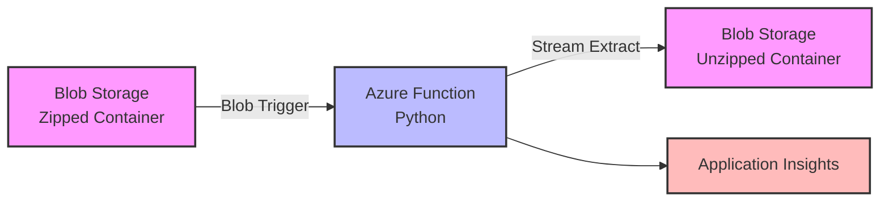

# Azure Function - Unzip Large Files Scenario

> **⚠️ Important Note**: This Python solution loads entire ZIP files into memory and is suitable for files under ~1GB on consumption plans. For larger files or true streaming capabilities, see the [.NET streaming solution blog post](https://clouddev.blog/Azure/Function-Apps/unzipping-and-shuffling-gbs-of-data-using-azure-functions/) which can handle multi-GB files with constant ~50MB memory usage.

This scenario demonstrates how to build an Azure Function that automatically processes password-protected ZIP files using Python. While not truly streaming like the .NET approach, it provides a simple solution for small to medium-sized ZIP files within consumption plan memory constraints.

## Architecture



## Components

| Component | Purpose |
|-----------|---------|
| **Storage Account** | Contains source and destination blob containers |
| **Zipped Container** | Source container where password-protected ZIP files are uploaded |
| **Unzipped Container** | Destination container where extracted files are stored |
| **Function App** | Consumption plan Python function that processes ZIP files |
| **Application Insights** | Monitoring and diagnostics for the function |

## Prerequisites

- Azure subscription
- Azure CLI (version 2.4.0 or later)
- Python 3.9 or later
- Azure Functions Core Tools v4
- PowerShell 7+ (for PowerShell scripts) or Bash

### For Test Data Generation:
- **Linux/macOS**: `zip` command (usually pre-installed)
- **Windows**: [7-Zip](https://www.7-zip.org/) or install via `winget install 7zip.7zip`

## Deployment

### Option 1: Deploy using Bicep (Recommended)

```bash
# Linux/macOS
./deploy-infra.sh

# Windows PowerShell
.\deploy-infra.ps1
```

### Option 2: Deploy using Terraform

```bash
cd terraform

# Copy and update the terraform.tfvars file
cp terraform.tfvars.example terraform.tfvars

# Update terraform.tfvars with a unique storage account name

# Deploy infrastructure
./deploy.sh  # or .\deploy.ps1 for PowerShell
```

### Deploy the Function Code

After infrastructure deployment:

```bash
# Linux/macOS
./deploy-function.sh

# Windows PowerShell
.\deploy-function.ps1
```

## Configuration

### Environment Variables

Copy the sample environment file and update with your settings:

```bash
cd function-unzip-large-zip-files
cp .env.sample .env
# Edit .env with your actual values
```

The `.env` file should contain:

```env
# Connection string for the Azure Storage Account (required)
STORAGE_CONNECTION_STRING=your_storage_connection_string_here

# Name of the blob container where password-protected ZIP files are uploaded (default: zipped)
SOURCE_CONTAINER_NAME=zipped

# Name of the blob container where extracted files will be stored (default: unzipped)
DESTINATION_CONTAINER_NAME=unzipped

# Password for the password-protected ZIP files (required)
ZIP_PASSWORD=password
```

## How It Works

### The Large File Challenge
Traditional file processing loads entire files into memory, which fails for large files in serverless environments where memory is limited to 1.5GB in consumption plans. Understanding the limitations of different approaches is crucial for choosing the right solution.

### Python Solution: Memory-Based Processing with Streaming Extraction

**⚠️ Important Limitation**: Unlike true streaming solutions, this Python implementation loads the entire ZIP file into memory before processing.

1. **Blob Trigger**: The function automatically triggers when a new file is uploaded to the "zipped" container

2. **ZIP File Loading**: The entire ZIP file is loaded into memory using BytesIO:
   ```python
   # Loads ENTIRE ZIP into memory - NOT streaming
   zip_data = myblob.read()  # Downloads full ZIP file
   zip_stream = BytesIO(zip_data)  # Wraps in memory stream
   ```
   **Memory Impact**: Uses ZIP file size + processing overhead

3. **Password Extraction**: Uses pyzipper library to handle AES-encrypted password-protected ZIP files from the in-memory stream

4. **Staged Block Upload**: Individual files are extracted and uploaded in 4MB chunks:
   ```python
   # Only the extraction/upload phase streams
   with zf.open(file_info) as source_file:
       while True:
           chunk = source_file.read(chunk_size)  # 4MB chunks
           if not chunk:
               break
           dest_blob_client.stage_block(block_id, chunk)
   ```
   **Memory for extraction**: Only 4MB chunks, but ZIP stays in memory throughout

5. **Folder Preservation**: Maintains the complete directory structure from the ZIP file

### Memory Usage Reality

| ZIP File Size | Memory Usage | Feasible on Consumption Plan? |
|---------------|--------------|-------------------------------|
| 100 MB | ~150 MB | ✅ Yes |
| 500 MB | ~550 MB | ✅ Yes |
| 1 GB | ~1.1 GB | ⚠️ Borderline (close to 1.5GB limit) |
| 2 GB | ~2.1 GB | ❌ No - exceeds consumption plan limit |

### Why Not True Streaming in Python?

Python ZIP libraries (including `pyzipper`) require **seekable streams** to read ZIP file headers and central directories. Azure Function's `InputStream` is **forward-only** and not seekable, forcing us to either:

1. **Load into memory** (current approach) - simple but memory-limited
2. **Download to temp file** - more complex, still limited by consumption plan

### Comparison with .NET Solution

For a comprehensive comparison, see the detailed analysis in [this blog post](https://clouddev.blog/Azure/Function-Apps/unzipping-and-shuffling-gbs-of-data-using-azure-functions/) which demonstrates true streaming in .NET.

**✅ .NET Advantages** (from the blog post):
```csharp
// .NET - True streaming, no memory limitations
using (ZipArchive archive = new ZipArchive(inputBlob))  // Direct stream
{
    foreach (ZipArchiveEntry entry in archive.Entries)
    {
        using (var stream = entry.Open())
        {
            await blob.UploadFromStreamAsync(stream);  // Stream directly
        }
    }
}
```

- **Memory usage**: ~50-100MB regardless of ZIP size
- **File size limit**: Can handle multi-GB files on consumption plan
- **True streaming**: Never loads full ZIP into memory

**❌ Python Limitations**:
- **Memory usage**: ZIP size + extraction buffers
- **File size limit**: ~1GB on consumption plan due to memory constraints
- **Pseudo-streaming**: Only extraction phase streams, ZIP loading does not

### When to Use This Python Solution

**✅ Good for**:
- ZIP files under 1GB
- Development/prototyping scenarios  
- Teams with Python expertise
- Simple deployment requirements

**❌ Consider .NET instead for**:
- ZIP files over 1GB
- Production workloads with large files
- Memory-constrained environments
- Maximum performance requirements

### Alternative Approaches for Large Files

1. **Premium Function Plan**: 3.5GB-14GB memory allows larger ZIP files
   - **Scale up**: Manually scale to higher SKU (EP2/EP3) when processing large files
   - **Scale down**: Return to lower SKU (EP1) or consumption plan when idle
   - **Cost optimization**: Only pay for higher memory when actually needed
   
2. **Azure Container Instances**: Custom memory allocation for very large files

3. **Migrate to .NET**: Use the proven streaming approach from the blog post
   - **Best option for large files**: Handles multi-GB files on consumption plan
   - **Constant memory usage**: ~50MB regardless of ZIP size
   
4. **Azure Data Factory**: Purpose-built for large-scale data processing

## Testing

### Generate Test Data

This scenario includes scripts to generate a 1GB password-protected ZIP file for testing:

```bash
# Linux/macOS
./generate-test-data.sh

# Windows PowerShell
.\generate-test-data.ps1
```

The script will:
- Create 10 files of 100MB each filled with random text-like data
- Compress them into a password-protected ZIP file (~1GB total)
- Use password: "password"
- Output: `test-data-1gb.zip`

### Manual Testing

1. If you prefer to create your own password-protected ZIP file:
   ```bash
   # Using 7-Zip
   7z a -p"password" test.zip yourfiles/*
   
   # Using zip (Linux/macOS)
   zip -P password test.zip yourfiles/*
   ```

2. Upload the ZIP file to the "zipped" container:
   ```bash
   az storage blob upload \
     --account-name <storage-account-name> \
     --container-name zipped \
     --name test.zip \
     --file test.zip
   ```

3. Monitor the function execution:
   ```bash
   az webapp log tail \
     --name <function-app-name> \
     --resource-group rg-function-unzip-large-files
   ```

4. Verify extracted files in the "unzipped" container:
   ```bash
   az storage blob list \
     --account-name <storage-account-name> \
     --container-name unzipped \
     --output table
   ```

## Project Structure

```
azure-function-unzip-large-files/
├── bicep/                           # Bicep deployment files
│   ├── main.bicep                  # Main infrastructure template
│   ├── main.parameters.json        # Parameter file
│   ├── deploy.sh                   # Bash deployment script
│   └── deploy.ps1                  # PowerShell deployment script
├── terraform/                       # Terraform deployment files
│   ├── main.tf                     # Provider and resource group
│   ├── containers.tf               # Blob containers
│   ├── function-app.tf             # Function app resources
│   ├── variables.tf                # Input variables
│   ├── outputs.tf                  # Output values
│   └── deploy.sh/ps1               # Deployment scripts
├── function-unzip-large-zip-files/  # Function code
│   ├── __init__.py                 # Main function logic
│   ├── function.json               # Function bindings
│   ├── requirements.txt            # Python dependencies
│   ├── host.json                   # Function app settings
│   ├── local.settings.json         # Local development settings
│   └── .env                        # Environment configuration
├── deploy-infra.sh/ps1             # Infrastructure deployment
├── deploy-function.sh/ps1          # Function deployment
└── generate-test-data.sh/ps1       # Generate test ZIP files
```

## Security Considerations

⚠️ **IMPORTANT SECURITY NOTICE** ⚠️

This scenario includes sample passwords for demonstration purposes only. Before deploying to any environment:

1. **Change all default passwords** - Never use "password" or any default values in production
2. **Use strong passwords** - Minimum 16 characters with mixed case, numbers, and special characters
3. **Secure password storage**:
   - **Development**: Store in `.env` file (never commit to git)
   - **Production**: Use Azure Key Vault or Azure App Configuration
4. **Enable Managed Identity** - Avoid connection strings with keys when possible
5. **Never log passwords** - Ensure passwords are not written to logs or console output

### Additional Security Best Practices:
- **Never commit** the `.env` file or `local.settings.json` with real credentials
- Use Azure Key Vault for production scenarios to store the ZIP password
- Enable managed identities for the Function App in production
- Restrict storage account access using private endpoints if needed
- Monitor failed extraction attempts in Application Insights
- Implement password rotation policies
- Use different passwords for different environments

## Performance Notes

### Benchmarks (Python Solution)

| File Size | Processing Time | Memory Usage | Consumption Plan | Status |
|-----------|----------------|--------------|------------------|---------|
| 100 MB | ~30 seconds | ~150 MB | ✅ Works well | Recommended |
| 500 MB | ~2 minutes | ~550 MB | ✅ Works | Good |
| 1 GB | ~5 minutes | ~1.1 GB | ⚠️ Borderline | Risky |
| 2 GB | N/A | ~2.1 GB | ❌ Fails | Exceeds memory limit |

**Note**: Unlike the .NET solution which maintains constant ~50MB memory usage regardless of ZIP size, Python memory usage scales with ZIP file size.

### Key Differences from .NET Approach
- **Memory Scaling**: Python uses ZIP size + buffers, .NET uses constant ~50MB
- **File Size Limits**: Python limited to ~1GB, .NET can handle multi-GB files
- **True Streaming**: Only .NET achieves true streaming from blob to extraction
- **Consumption Plan**: .NET approach much more suitable for large files

### Key Characteristics of Python Solution
- **Memory Usage**: Scales with ZIP file size (ZIP size + extraction buffers)
- **4MB Chunk Size**: Optimal for extraction and upload phases
- **Staged Block Upload**: Leverages Azure's native blob assembly for large files
- **BytesIO Approach**: Simple in-memory processing, no temp files
- **Sequential Processing**: Processes one file at a time to minimize memory peaks
- **Consumption Plan Suitable**: For ZIP files under ~1GB only

### Scaling Considerations
- **Consumption Plan**: Handles ZIP files up to ~1GB (due to 1.5GB memory limit)
- **Premium Plan**: Can handle larger ZIP files with more memory (3.5GB-14GB)
  - **Dynamic scaling**: Scale up to EP2/EP3 for large file processing, scale down to EP1 or consumption when idle
  - **Cost efficiency**: Only pay for higher memory tiers when actually processing large files
- **For Multi-GB Files**: Consider the .NET solution (handles large files on consumption plan) or Azure Data Factory
- **Multiple Instances**: Function scales automatically for concurrent small-medium ZIP files

## Monitoring

View function logs and metrics:

```bash
# Real-time logs
az webapp log tail \
  --name <function-app-name> \
  --resource-group rg-function-unzip-large-files

# Application Insights
az monitor app-insights component show \
  --app <app-insights-name> \
  --resource-group rg-function-unzip-large-files
```

## Cleanup

Remove all resources:

```bash
az group delete --name rg-function-unzip-large-files --yes --no-wait
```

## Troubleshooting

### Function not triggering
- Verify the storage connection string is correct
- Check that the container names match your configuration
- Ensure the Function App is running

### Out of memory errors
- Reduce chunk size in the function code
- Consider using a Premium plan for more memory
- Check the size of individual files within the ZIP

### Password errors
- Verify the ZIP_PASSWORD environment variable is set correctly
- Ensure the ZIP file uses compatible encryption (AES)
- Test with a known working password-protected ZIP file

## Related Resources

- [Azure Functions Python Developer Guide](https://docs.microsoft.com/azure/azure-functions/functions-reference-python)
- [Azure Blob Storage Documentation](https://docs.microsoft.com/azure/storage/blobs/)
- [Streaming Large Files in Azure Functions](https://docs.microsoft.com/azure/azure-functions/functions-best-practices#scalability-best-practices)