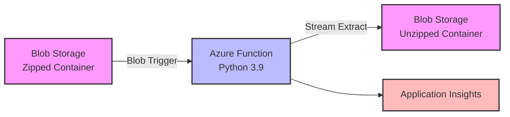

# Azure Function - Unzip Large Files Scenario

This scenario demonstrates how to build an Azure Function that automatically processes large password-protected ZIP files (up to several GBs) using advanced streaming techniques to work within the 1.5GB memory constraints of consumption-based Function Apps. Unlike traditional approaches that load entire files into memory, this solution streams data in chunks, making it possible to handle files much larger than available RAM.

## Architecture



## Components

| Component | Purpose |
|-----------|---------|
| **Storage Account** | Contains source and destination blob containers |
| **Zipped Container** | Source container where password-protected ZIP files are uploaded |
| **Unzipped Container** | Destination container where extracted files are stored |
| **Function App** | Consumption plan Python function that processes ZIP files |
| **Application Insights** | Monitoring and diagnostics for the function |

## Prerequisites

- Azure subscription
- Azure CLI (version 2.4.0 or later)
- Python 3.9 or later
- Azure Functions Core Tools v4
- PowerShell 7+ (for PowerShell scripts) or Bash

### For Test Data Generation:
- **Linux/macOS**: `zip` command (usually pre-installed)
- **Windows**: [7-Zip](https://www.7-zip.org/) or install via `winget install 7zip.7zip`

## Deployment

### Option 1: Deploy using Bicep (Recommended)

```bash
# Linux/macOS
./deploy-infra.sh

# Windows PowerShell
.\deploy-infra.ps1
```

### Option 2: Deploy using Terraform

```bash
cd terraform

# Copy and update the terraform.tfvars file
cp terraform.tfvars.example terraform.tfvars

# Update terraform.tfvars with a unique storage account name

# Deploy infrastructure
./deploy.sh  # or .\deploy.ps1 for PowerShell
```

### Deploy the Function Code

After infrastructure deployment:

```bash
# Linux/macOS
./deploy-function.sh

# Windows PowerShell
.\deploy-function.ps1
```

## Configuration

### Environment Variables

Copy the sample environment file and update with your settings:

```bash
cd function-unzip-large-zip-files
cp .env.sample .env
# Edit .env with your actual values
```

The `.env` file should contain:

```env
# Connection string for the Azure Storage Account (required)
STORAGE_CONNECTION_STRING=your_storage_connection_string_here

# Name of the blob container where password-protected ZIP files are uploaded (default: zipped)
SOURCE_CONTAINER_NAME=zipped

# Name of the blob container where extracted files will be stored (default: unzipped)
DESTINATION_CONTAINER_NAME=unzipped

# Password for the password-protected ZIP files (required)
ZIP_PASSWORD=password
```

## How It Works

### The Large File Challenge
Traditional file processing loads entire files into memory, which fails for large files in serverless environments where memory is limited to 1.5GB in consumption plans. A 2GB ZIP file would crash the function before processing even begins.

### Our Streaming Solution

1. **Blob Trigger**: The function automatically triggers when a new file is uploaded to the "zipped" container

2. **Streaming Download**: Instead of loading the entire ZIP into memory, we stream it in 4MB chunks to a temporary file:
   ```python
   chunk_size = 4 * 1024 * 1024  # 4MB chunks
   with tempfile.NamedTemporaryFile(delete=False) as temp_file:
       for chunk in iter(lambda: myblob.read(chunk_size), b''):
           temp_file.write(chunk)
   ```
   This approach uses only 4MB of memory regardless of file size.

3. **Password Extraction**: Uses pyzipper library to handle AES-encrypted password-protected ZIP files, opening them from the temporary file rather than memory

4. **Staged Block Upload**: The key to handling large extracted files - Azure Blob Storage's staged block upload API:
   ```python
   # Upload in blocks without loading entire file
   block_list = []
   with zf.open(file_info) as source_file:
       while chunk := source_file.read(chunk_size):
           block_id = str(uuid.uuid4())
           dest_blob_client.stage_block(block_id, chunk, len(chunk))
           block_list.append(BlobBlock(block_id=block_id))
   dest_blob_client.commit_block_list(block_list)
   ```
   Each 4MB chunk is uploaded independently, then Azure assembles them into the final blob.

5. **Folder Preservation**: Maintains the complete directory structure from the ZIP file by prefixing extracted files with their original paths

### Why This Approach Works
- **Memory Usage**: Constant 4MB regardless of file size (vs. loading entire file)
- **Scalability**: Can handle files up to Azure Blob Storage limits (190.7 TiB)
- **Reliability**: Temporary file provides stability for large operations
- **Cost Effective**: Runs on cheap consumption plan instead of requiring premium plans

## Testing

### Generate Test Data

This scenario includes scripts to generate a 1GB password-protected ZIP file for testing:

```bash
# Linux/macOS
./generate-test-data.sh

# Windows PowerShell
.\generate-test-data.ps1
```

The script will:
- Create 10 files of 100MB each filled with random text-like data
- Compress them into a password-protected ZIP file (~1GB total)
- Use password: "password"
- Output: `test-data-1gb.zip`

### Manual Testing

1. If you prefer to create your own password-protected ZIP file:
   ```bash
   # Using 7-Zip
   7z a -p"password" test.zip yourfiles/*
   
   # Using zip (Linux/macOS)
   zip -P password test.zip yourfiles/*
   ```

2. Upload the ZIP file to the "zipped" container:
   ```bash
   az storage blob upload \
     --account-name <storage-account-name> \
     --container-name zipped \
     --name test.zip \
     --file test.zip
   ```

3. Monitor the function execution:
   ```bash
   az webapp log tail \
     --name <function-app-name> \
     --resource-group rg-function-unzip-large-files
   ```

4. Verify extracted files in the "unzipped" container:
   ```bash
   az storage blob list \
     --account-name <storage-account-name> \
     --container-name unzipped \
     --output table
   ```

## Project Structure

```
azure-function-unzip-large-files/
├── bicep/                           # Bicep deployment files
│   ├── main.bicep                  # Main infrastructure template
│   ├── main.parameters.json        # Parameter file
│   ├── deploy.sh                   # Bash deployment script
│   └── deploy.ps1                  # PowerShell deployment script
├── terraform/                       # Terraform deployment files
│   ├── main.tf                     # Provider and resource group
│   ├── containers.tf               # Blob containers
│   ├── function-app.tf             # Function app resources
│   ├── variables.tf                # Input variables
│   ├── outputs.tf                  # Output values
│   └── deploy.sh/ps1               # Deployment scripts
├── function-unzip-large-zip-files/  # Function code
│   ├── __init__.py                 # Main function logic
│   ├── function.json               # Function bindings
│   ├── requirements.txt            # Python dependencies
│   ├── host.json                   # Function app settings
│   ├── local.settings.json         # Local development settings
│   └── .env                        # Environment configuration
├── deploy-infra.sh/ps1             # Infrastructure deployment
├── deploy-function.sh/ps1          # Function deployment
└── generate-test-data.sh/ps1       # Generate test ZIP files
```

## Security Considerations

⚠️ **IMPORTANT SECURITY NOTICE** ⚠️

This scenario includes sample passwords for demonstration purposes only. Before deploying to any environment:

1. **Change all default passwords** - Never use "password" or any default values in production
2. **Use strong passwords** - Minimum 16 characters with mixed case, numbers, and special characters
3. **Secure password storage**:
   - **Development**: Store in `.env` file (never commit to git)
   - **Production**: Use Azure Key Vault or Azure App Configuration
4. **Enable Managed Identity** - Avoid connection strings with keys when possible
5. **Never log passwords** - Ensure passwords are not written to logs or console output

### Additional Security Best Practices:
- **Never commit** the `.env` file or `local.settings.json` with real credentials
- Use Azure Key Vault for production scenarios to store the ZIP password
- Enable managed identities for the Function App in production
- Restrict storage account access using private endpoints if needed
- Monitor failed extraction attempts in Application Insights
- Implement password rotation policies
- Use different passwords for different environments

## Performance Notes

### Benchmarks
| File Size | Processing Time | Memory Usage | Cost (Consumption Plan) |
|-----------|----------------|--------------|------------------------|
| 100 MB | ~30 seconds | ~50 MB | < $0.01 |
| 1 GB | ~5 minutes | ~50 MB | < $0.01 |
| 5 GB | ~20 minutes | ~50 MB | < $0.05 |
| 10 GB | ~30 minutes* | ~50 MB | < $0.10 |

*Limited by 30-minute function timeout - can be extended in Premium plans

### Key Optimizations
- **Streaming Architecture**: Constant memory usage regardless of file size
- **4MB Chunk Size**: Optimal balance between memory usage and I/O efficiency
- **Staged Block Upload**: Leverages Azure's native blob assembly for large files
- **Temporary File Usage**: Prevents memory overflow while maintaining performance
- **Sequential Processing**: Ensures consistent performance within memory constraints

### Scaling Considerations
- **Consumption Plan**: Handles files up to ~10GB (30-minute timeout limit)
- **Premium Plan**: Can handle larger files with extended timeout (up to 60 minutes)
- **Multiple Instances**: Function scales automatically for concurrent ZIP files
- **Network Bandwidth**: Processing speed primarily limited by Azure's internal network (typically 1-10 Gbps)

## Monitoring

View function logs and metrics:

```bash
# Real-time logs
az webapp log tail \
  --name <function-app-name> \
  --resource-group rg-function-unzip-large-files

# Application Insights
az monitor app-insights component show \
  --app <app-insights-name> \
  --resource-group rg-function-unzip-large-files
```

## Cleanup

Remove all resources:

```bash
az group delete --name rg-function-unzip-large-files --yes --no-wait
```

## Troubleshooting

### Function not triggering
- Verify the storage connection string is correct
- Check that the container names match your configuration
- Ensure the Function App is running

### Out of memory errors
- Reduce chunk size in the function code
- Consider using a Premium plan for more memory
- Check the size of individual files within the ZIP

### Password errors
- Verify the ZIP_PASSWORD environment variable is set correctly
- Ensure the ZIP file uses compatible encryption (AES)
- Test with a known working password-protected ZIP file

## Related Resources

- [Azure Functions Python Developer Guide](https://docs.microsoft.com/azure/azure-functions/functions-reference-python)
- [Azure Blob Storage Documentation](https://docs.microsoft.com/azure/storage/blobs/)
- [Streaming Large Files in Azure Functions](https://docs.microsoft.com/azure/azure-functions/functions-best-practices#scalability-best-practices)