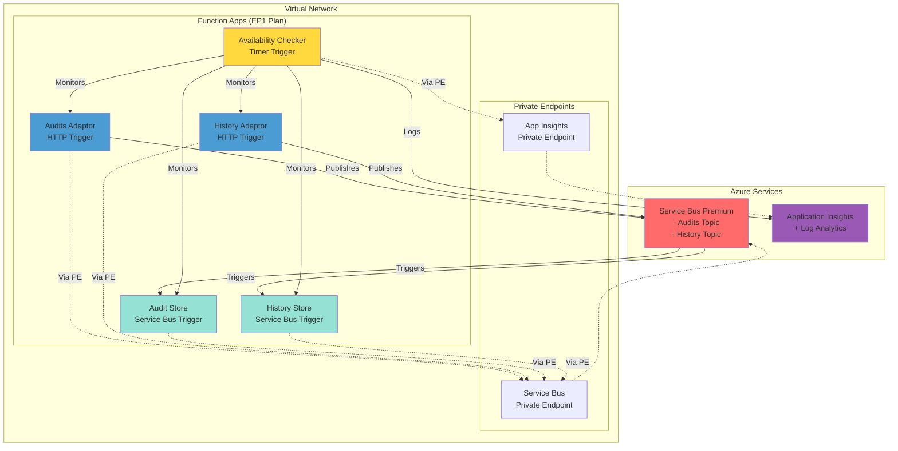

# Azure Integration Services Load Test Scenario

This scenario demonstrates a microservices architecture using Azure Function Apps (.NET 9) communicating via Service Bus Premium with all traffic routed through private endpoints.

## Architecture



## Components

### Function Apps (.NET 9)
Each function is deployed as an independent Azure Function App on the shared EP1 App Service Plan:

- **audits-adaptor** - HTTP endpoint that publishes audit messages to Service Bus
- **audit-store** - Subscribes to audit topic and processes messages
- **history-adaptor** - HTTP endpoint that publishes history messages to Service Bus
- **history-store** - Subscribes to history topic and processes messages
- **availability-checker** - Timer-triggered function that monitors all functions and logs to App Insights

Each function app includes:
- Health endpoint (`/api/health`) for monitoring
- Custom telemetry service for Application Insights integration
- Start/end event tracking for all function executions

### Infrastructure
- **App Service Plan** - EP1 (Elastic Premium) hosting all functions
- **Service Bus Premium** - Namespace with private endpoints only
  - `audits` topic with subscription
  - `history` topic with subscription
- **Application Insights** - With private endpoint for secure monitoring
- **Virtual Network** - Isolates all traffic with private endpoints

## Quick Start Deployment

### Prerequisites
- [Azure CLI](https://docs.microsoft.com/en-us/cli/azure/install-azure-cli) installed
- [.NET 9 SDK](https://dotnet.microsoft.com/download/dotnet/9.0) installed
- [Azure Functions Core Tools v4](https://docs.microsoft.com/en-us/azure/azure-functions/functions-run-local) installed
- Azure subscription with appropriate permissions

### Complete Deployment (2 Steps)

#### Step 1: Deploy Infrastructure

```bash
# Login to Azure
az login

# Set variables (choose based on your shell)
# For Bash/Linux/macOS:
export RESOURCE_GROUP="rg-ais-loadtest"
export LOCATION="eastus2"

# For PowerShell:
# $env:RESOURCE_GROUP="rg-ais-loadtest"
# $env:LOCATION="eastus2"

# Create resource group
az group create --name $RESOURCE_GROUP --location $LOCATION  # Bash
# az group create --name $env:RESOURCE_GROUP --location $env:LOCATION  # PowerShell

# Deploy infrastructure (takes ~10-15 minutes)
# For Bash:
az deployment group create \
  --resource-group $RESOURCE_GROUP \
  --template-file bicep/main.bicep \
  --parameters location=$LOCATION

# For PowerShell:
# az deployment group create `
#   --resource-group $env:RESOURCE_GROUP `
#   --template-file bicep/main.bicep `
#   --parameters location=$env:LOCATION

echo "Infrastructure deployment complete!"
```

#### Step 2: Deploy All Functions

**Option 1: Automated Deployment (Recommended)**

For Bash/Linux/macOS:
```bash
# Make the script executable
chmod +x deploy-functions.sh

# Run the deployment script
./deploy-functions.sh
```

For PowerShell:
```powershell
# Run the PowerShell deployment script
.\deploy-functions.ps1
```

**Option 2: Manual Deployment**

If you prefer to deploy manually or need more control:

```bash
# Get function app names from deployment
AUDITS_ADAPTOR=$(az deployment group show -g $RESOURCE_GROUP -n main --query 'properties.outputs.auditsAdaptorFunctionName.value' -o tsv)
AUDIT_STORE=$(az deployment group show -g $RESOURCE_GROUP -n main --query 'properties.outputs.auditStoreFunctionName.value' -o tsv)
HISTORY_ADAPTOR=$(az deployment group show -g $RESOURCE_GROUP -n main --query 'properties.outputs.historyAdaptorFunctionName.value' -o tsv)
HISTORY_STORE=$(az deployment group show -g $RESOURCE_GROUP -n main --query 'properties.outputs.historyStoreFunctionName.value' -o tsv)
AVAILABILITY_CHECKER=$(az deployment group show -g $RESOURCE_GROUP -n main --query 'properties.outputs.availabilityCheckerFunctionName.value' -o tsv)

# Build and deploy each function
# Audits Adaptor
cd functions/audits-adaptor
dotnet build -c Release
func azure functionapp publish $AUDITS_ADAPTOR --dotnet-isolated
cd ../..

# Audit Store
cd functions/audit-store
dotnet build -c Release
func azure functionapp publish $AUDIT_STORE --dotnet-isolated
cd ../..

# History Adaptor
cd functions/history-adaptor
dotnet build -c Release
func azure functionapp publish $HISTORY_ADAPTOR --dotnet-isolated
cd ../..

# History Store
cd functions/history-store
dotnet build -c Release
func azure functionapp publish $HISTORY_STORE --dotnet-isolated
cd ../..

# Availability Checker
cd functions/availability-checker
dotnet build -c Release
func azure functionapp publish $AVAILABILITY_CHECKER --dotnet-isolated
cd ../..
```

### Complete Deployment Script

For a fully automated deployment:

**Bash/Linux/macOS:**
```bash
# Make scripts executable
chmod +x deploy-all.sh deploy-functions.sh test-deployment.sh

# Run complete deployment (infrastructure + all functions)
./deploy-all.sh

# Test the deployment
./test-deployment.sh
```

**PowerShell:**
```powershell
# Set environment variables
$env:RESOURCE_GROUP="rg-ais-loadtest"
$env:LOCATION="eastus2"

# Run complete deployment
.\deploy-all.ps1

# Test the deployment
.\test-deployment.ps1
```

### PowerShell Commands

For PowerShell users, here are the equivalent commands:

```powershell
# Set variables
$env:RESOURCE_GROUP="rg-ais-loadtest"
$env:LOCATION="eastus2"

# Deploy infrastructure
az group create --name $env:RESOURCE_GROUP --location $env:LOCATION
az deployment group create `
  --resource-group $env:RESOURCE_GROUP `
  --template-file bicep/main.bicep `
  --parameters location=$env:LOCATION

# Get function names
$AUDITS_ADAPTOR = az deployment group show -g $env:RESOURCE_GROUP -n main --query 'properties.outputs.auditsAdaptorFunctionName.value' -o tsv
$AUDIT_STORE = az deployment group show -g $env:RESOURCE_GROUP -n main --query 'properties.outputs.auditStoreFunctionName.value' -o tsv
$HISTORY_ADAPTOR = az deployment group show -g $env:RESOURCE_GROUP -n main --query 'properties.outputs.historyAdaptorFunctionName.value' -o tsv
$HISTORY_STORE = az deployment group show -g $env:RESOURCE_GROUP -n main --query 'properties.outputs.historyStoreFunctionName.value' -o tsv
$AVAILABILITY_CHECKER = az deployment group show -g $env:RESOURCE_GROUP -n main --query 'properties.outputs.availabilityCheckerFunctionName.value' -o tsv

# Deploy functions
cd functions\audits-adaptor
dotnet build -c Release
func azure functionapp publish $AUDITS_ADAPTOR --dotnet-isolated
cd ..\..\functions\audit-store
dotnet build -c Release
func azure functionapp publish $AUDIT_STORE --dotnet-isolated
# Continue for other functions...
```

## Testing

### 1. Test Audit Flow

```bash
# Send audit message
curl -X POST https://$auditsAdaptor.azurewebsites.net/api/audits \
  -H "Content-Type: application/json" \
  -d '{
    "action": "user.login",
    "user": "testuser@example.com",
    "details": "User logged in successfully"
  }'
```

### 2. Test History Flow

```bash
# Send history message
curl -X POST https://$historyAdaptor.azurewebsites.net/api/history \
  -H "Content-Type: application/json" \
  -d '{
    "eventType": "order.created",
    "entityId": "order-12345",
    "entityType": "order",
    "operation": "create",
    "changes": {
      "after": {
        "status": "pending",
        "total": 99.99
      }
    }
  }'
```

### 3. Check Health Endpoints

```bash
# Check each function's health
curl https://$auditsAdaptor.azurewebsites.net/api/health
curl https://$auditStore.azurewebsites.net/api/health
curl https://$historyAdaptor.azurewebsites.net/api/health
curl https://$historyStore.azurewebsites.net/api/health
```

### 4. Monitor in Azure Portal

1. Navigate to your Application Insights resource
2. Check **Live Metrics** to see real-time activity
3. View **Logs** to query custom events and metrics
4. The availability checker runs every 5 minutes and logs results

## Load Testing

This architecture is designed for load testing scenarios:

1. **Concurrent HTTP Requests** - Send parallel requests to adaptor functions
2. **Service Bus Throughput** - Monitor message processing rates
3. **Function Scaling** - Observe auto-scaling behavior under load
4. **Private Endpoint Performance** - Validate no public internet traffic

### Sample Load Test Script

```bash
# Generate load on audit endpoint
for i in {1..100}; do
  curl -X POST https://$auditsAdaptor.azurewebsites.net/api/audits \
    -H "Content-Type: application/json" \
    -d "{\"action\":\"test-$i\",\"user\":\"loadtest\"}" &
done
wait
```

## Monitoring

Key metrics to monitor in Application Insights:

- **Function Execution Count** - Number of invocations per function
- **Function Execution Duration** - Performance metrics
- **Service Bus Message Count** - Messages published/consumed
- **Availability Test Results** - From availability checker
- **Custom Events** - Function start/end tracking, message processing events

### Custom Telemetry Events

All functions now include comprehensive telemetry tracking:

1. **Function Start/End Events**
   - `{FunctionName}.Started` - Logged when function begins execution
   - `{FunctionName}.Completed` - Logged when function completes (with duration)

2. **Message Processing Events**
   - `AuditMessageSent` - When audit message is published
   - `AuditMessageReceived` - When audit message is processed
   - `HistoryMessageSent` - When history message is published
   - `HistoryMessageReceived` - When history message is processed
   - `AuditMessageDeadLettered` / `HistoryMessageDeadLettered` - When messages fail processing

3. **Availability Events**
   - `EndpointAvailabilityCheck` - Individual endpoint health results
   - `AvailabilityCheckCompleted` - Summary of all endpoint checks
   - `HealthCheckPerformed` - When health endpoint is called

### Sample KQL Queries

```kusto
// Function execution summary
customEvents
| where name endswith ".Completed"
| extend FunctionName = tostring(customDimensions.FunctionName)
| extend DurationMs = todouble(customMeasurements.DurationMs)
| summarize 
    Count = count(),
    AvgDuration = avg(DurationMs),
    P95Duration = percentile(DurationMs, 95),
    MaxDuration = max(DurationMs)
    by FunctionName, bin(timestamp, 5m)
| order by timestamp desc

// Message processing rate
customEvents
| where name in ("AuditMessageReceived", "HistoryMessageReceived")
| summarize MessageCount = sum(todouble(customMeasurements.MessageCount))
    by bin(timestamp, 1m), name
| render timechart

// Endpoint availability over time
customEvents
| where name == "EndpointAvailabilityCheck"
| extend Endpoint = tostring(customDimensions.Endpoint)
| extend IsHealthy = tobool(customDimensions.IsHealthy)
| summarize Availability = avg(iff(IsHealthy, 1.0, 0.0)) * 100
    by Endpoint, bin(timestamp, 5m)
| render timechart

// Failed message processing
customEvents
| where name endswith "MessageDeadLettered"
| project timestamp, MessageId = customDimensions.MessageId, 
    Reason = customDimensions.Reason, Error = customDimensions.Error
| order by timestamp desc
```

## Project Structure

```
azure-integration-services-load-test/
├── bicep/
│   ├── main.bicep              # Infrastructure definition
│   └── main.parameters.json    # Parameter file
├── functions/
│   ├── audits-adaptor/         # Audits HTTP adapter function
│   │   ├── AuditsAdaptor.csproj
│   │   ├── Program.cs
│   │   ├── Functions/
│   │   ├── Models/
│   │   └── Services/
│   ├── audit-store/            # Audit message processor function
│   │   ├── AuditStore.csproj
│   │   ├── Program.cs
│   │   ├── Functions/
│   │   ├── Models/
│   │   └── Services/
│   ├── history-adaptor/        # History HTTP adapter function
│   │   ├── HistoryAdaptor.csproj
│   │   ├── Program.cs
│   │   ├── Functions/
│   │   ├── Models/
│   │   └── Services/
│   ├── history-store/          # History message processor function
│   │   ├── HistoryStore.csproj
│   │   ├── Program.cs
│   │   ├── Functions/
│   │   ├── Models/
│   │   └── Services/
│   └── availability-checker/   # Availability monitoring function
│       ├── AvailabilityChecker.csproj
│       ├── Program.cs
│       ├── Functions/
│       ├── Models/
│       └── Services/
└── README.md                   # This file
```

## Security Features

- ✅ All traffic via private endpoints (no public internet)
- ✅ Service Bus with public access disabled
- ✅ Application Insights with private endpoint
- ✅ VNet integration for all functions
- ✅ Managed Identity for authentication
- ✅ Network isolation via subnets
- ✅ Independent deployment and scaling per function

## Development

### Local Development

Each function can be developed and tested independently:

```bash
# Navigate to a specific function
cd functions/audits-adaptor

# Copy the example settings
cp local.settings.json.example local.settings.json
# Edit local.settings.json with your connection strings

# Run the function locally
func start
```

### Building Functions

```bash
# Build a specific function
cd functions/audits-adaptor
dotnet build

# Build all functions
for func in functions/*/; do
  echo "Building $func"
  (cd "$func" && dotnet build)
done
```

## Verification

After deployment, verify everything is working:

```bash
# Test the health endpoints
for app in $AUDITS_ADAPTOR $AUDIT_STORE $HISTORY_ADAPTOR $HISTORY_STORE $AVAILABILITY_CHECKER; do
  echo "Testing $app..."
  curl -s https://$app.azurewebsites.net/api/health | jq '.status'
done
```

## Cleanup

```bash
# Delete all resources
az group delete --name $RESOURCE_GROUP --yes --no-wait
```

## Troubleshooting

### Function Not Triggered
- Check Service Bus connection string in Function App settings
- Verify private endpoint DNS resolution
- Check subscription configuration in Service Bus

### Network Connectivity Issues
- Ensure VNet integration is enabled
- Verify private DNS zones are linked to VNet
- Check NSG rules if any are applied

### Application Insights Not Receiving Data
- Verify private endpoint for Azure Monitor
- Check DNS resolution for monitor endpoints
- Ensure connection string is correct