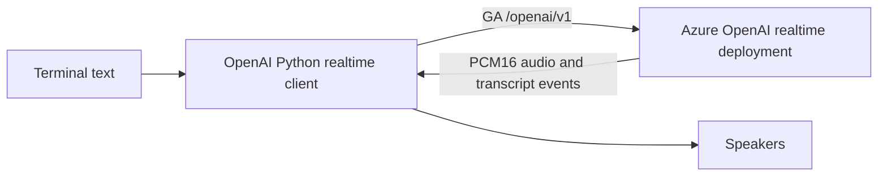

# Azure OpenAI Realtime Text to Speech

A runnable Python client that sends terminal text to a GA Azure OpenAI realtime model, streams the model's native PCM audio to your speakers, and prints the matching transcript.

> This is an application demo, not an infrastructure deployment. It sends text to Azure and incurs model usage charges.

## Architecture



## Prerequisites

- Python 3.10 or later
- Speakers or headphones
- An Azure OpenAI or Microsoft Foundry resource
- A global deployment of a supported realtime model such as `gpt-realtime`, `gpt-realtime-1.5`, or `gpt-realtime-2`
- For keyless authentication, Azure CLI and the `Cognitive Services OpenAI User` role on the resource

## Quick Start

```powershell
cd src/azure-openai-realtime-text-to-speech
python -m venv .venv
.\.venv\Scripts\Activate.ps1
pip install -r requirements.txt
Copy-Item .env.example .env
az login
python app.py
```

Set the endpoint and your deployment name in `.env`. Leave `AZURE_OPENAI_API_KEY` unset to use `DefaultAzureCredential`; set it only when you need the API-key fallback.

On Linux or macOS, activate with `source .venv/bin/activate` and copy the template with `cp .env.example .env`.

## Configuration

| Setting | Required | Description |
|---|---:|---|
| `AZURE_OPENAI_ENDPOINT` | Yes | Resource endpoint, for example `https://my-resource.openai.azure.com` |
| `AZURE_OPENAI_DEPLOYMENT_NAME` | Yes | Name of a supported realtime model deployment |
| `AZURE_OPENAI_VOICE` | No | Realtime voice name; defaults to `alloy` |
| `AZURE_OPENAI_API_KEY` | No | Resource key fallback; omit to use Entra ID |

## What It Demonstrates

- The GA Azure OpenAI `/openai/v1` realtime endpoint
- Recommended Microsoft Entra ID authentication with an API-key fallback
- Text input with native model-generated audio output
- Asynchronous transcript events and direct 24 kHz PCM speaker playback

This differs from the [Azure Speech SSML example](../azure-speech-ssml-voice-consistency/README.md): that scenario emphasizes precise prosody control, while this one demonstrates a realtime model's native voice response.

## Estimated Cost

Realtime audio is billed in audio and text tokens according to the deployed model. Review [Azure OpenAI pricing](https://azure.microsoft.com/pricing/details/cognitive-services/openai-service/) before running extended sessions.

## Cleanup

Exit with `q`, deactivate the virtual environment, and remove `.venv`. Delete the model deployment or resource separately if it was created only for this exercise.

## Troubleshooting

- `401 Unauthorized`: run `az login`, verify the `Cognitive Services OpenAI User` role, or set a valid resource key.
- `404 Not Found`: use the resource root endpoint and a supported realtime deployment. Do not include a date-based API version.
- No audio: verify the operating system's default output device and allow the terminal to access audio devices.
- Unsupported voice: set `AZURE_OPENAI_VOICE` to a voice supported by your deployed model.

## Related Documentation

- [Use the GPT Realtime API for speech and audio](https://learn.microsoft.com/azure/ai-foundry/openai/how-to/realtime-audio)
- [Azure OpenAI Realtime API via WebSockets](https://learn.microsoft.com/azure/ai-foundry/openai/how-to/realtime-audio-websockets)
- [Authenticate Azure AI services](https://learn.microsoft.com/azure/ai-services/authentication)

This scenario was modernized and moved from the archived `Ricky-G/ai-scenario-hub` repository.