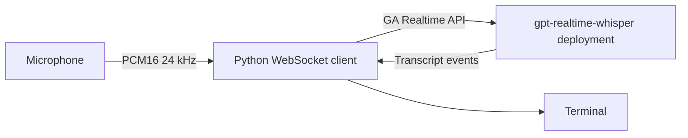

# Azure OpenAI Realtime Transcription

A runnable Python microphone client for the GA Azure OpenAI Realtime transcription API and a deployed `gpt-realtime-whisper` model.

> This is an application demo, not an infrastructure deployment. It sends live microphone audio to Azure and incurs usage charges.

## Architecture



## Prerequisites

- Python 3.10 or later
- A microphone and local microphone permission
- An Azure OpenAI or Microsoft Foundry resource
- A global deployment of `gpt-realtime-whisper`
- For keyless authentication, Azure CLI and the `Cognitive Services OpenAI User` role on the resource

## Quick Start

```powershell
cd src/azure-openai-realtime-transcription
python -m venv .venv
.\.venv\Scripts\Activate.ps1
pip install -r requirements.txt
Copy-Item .env.example .env
az login
python app.py
```

Set the endpoint and your deployment name in `.env`. Leave `AZURE_OPENAI_API_KEY` unset to use `DefaultAzureCredential`; set it only when you need the API-key fallback.

On Linux or macOS, activate with `source .venv/bin/activate` and copy the template with `cp .env.example .env`.

## Configuration

| Setting | Required | Description |
|---|---:|---|
| `AZURE_OPENAI_ENDPOINT` | Yes | Resource endpoint, for example `https://my-resource.openai.azure.com` |
| `AZURE_OPENAI_DEPLOYMENT_NAME` | Yes | Name of your `gpt-realtime-whisper` deployment |
| `AZURE_OPENAI_API_KEY` | No | Resource key fallback; omit to use Entra ID |
| `TRANSCRIPTION_LANGUAGE` | No | ISO-639-1 language hint such as `en` |
| `TRANSCRIPTION_DELAY` | No | `minimal`, `low`, `medium`, `high`, or `xhigh` |

## What It Demonstrates

- The GA `/openai/v1/realtime?intent=transcription` endpoint
- Recommended Microsoft Entra ID authentication with an API-key fallback
- 24 kHz mono PCM microphone streaming
- Periodic input-buffer commits and asynchronous transcript handling

## Estimated Cost

Realtime transcription models are billed according to the deployed model's current pricing. Review [Azure OpenAI pricing](https://azure.microsoft.com/pricing/details/cognitive-services/openai-service/) before leaving a session running.

## Cleanup

Stop the client with `Ctrl+C`, deactivate the virtual environment, and remove `.venv`. Delete the model deployment or resource separately if it was created only for this exercise.

## Troubleshooting

- `401 Unauthorized`: run `az login`, verify the `Cognitive Services OpenAI User` role, or set a valid resource key.
- `404 Not Found`: use the resource root endpoint and a `gpt-realtime-whisper` deployment. Do not add a date-based API version.
- No microphone input: grant terminal microphone permission and check the operating system's default input device.
- Choppy transcripts: reduce other microphone consumers and keep `TRANSCRIPTION_DELAY=medium` while testing.

## Related Documentation

- [Azure OpenAI Realtime API via WebSockets](https://learn.microsoft.com/azure/ai-foundry/openai/how-to/realtime-audio-websockets)
- [Azure OpenAI model availability](https://learn.microsoft.com/azure/ai-foundry/foundry-models/concepts/models-sold-directly-by-azure)
- [Authenticate Azure AI services](https://learn.microsoft.com/azure/ai-services/authentication)

This scenario was modernized and moved from the archived `Ricky-G/ai-scenario-hub` repository.