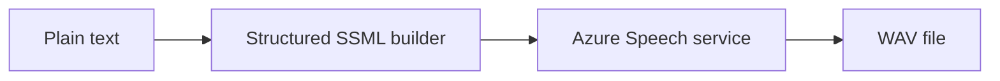

# Azure Speech SSML Voice Consistency

A runnable Python example that applies one reusable SSML profile to every Azure Speech synthesis request so voice, rate, pitch, and volume remain consistent.

> This is an application demo, not an infrastructure deployment. It is intended for learning and experimentation rather than production use.

## Architecture



The sample creates SSML with Python's XML API instead of string interpolation. Plain-text input and voice profile values are escaped before they are sent to Azure Speech.

## Prerequisites

- Python 3.10 or later
- An Azure subscription
- An Azure Speech resource and access key

## Quick Start

```powershell
cd src/azure-speech-ssml-voice-consistency
python -m venv .venv
.\.venv\Scripts\Activate.ps1
pip install -r requirements.txt
Copy-Item .env.example .env
```

Set your resource key and region in `.env`, then run:

```powershell
python app.py "Welcome to the Azure Scenario Hub." --output welcome.wav
```

On Linux or macOS, activate the environment with `source .venv/bin/activate` and copy the environment template with `cp .env.example .env`.

## Configuration

| Setting | Required | Description |
|---|---:|---|
| `AZURE_SPEECH_KEY` | Yes | Access key for the Azure Speech resource |
| `AZURE_SPEECH_REGION` | Yes | Azure region containing the Speech resource, such as `eastus` |

The default profile uses `en-US-AvaMultilingualNeural`, rate `0.9`, pitch `+5%`, and volume `soft`. Change the constructor arguments in `SsmlVoiceProfile` to define another reusable profile.

## What It Demonstrates

- Safe construction of SSML from plain-text input
- Consistent voice and prosody settings across requests
- Azure Speech SDK synthesis to a WAV file
- Actionable cancellation and service error details

## Estimated Cost

Azure Speech text-to-speech is billed by synthesized characters. This example sends a short phrase, but pricing varies by voice type and region. Review the current [Azure AI Speech pricing](https://azure.microsoft.com/pricing/details/cognitive-services/speech-services/) before running larger workloads.

## Cleanup

Delete generated WAV files and the local virtual environment:

```powershell
Remove-Item *.wav -ErrorAction SilentlyContinue
Remove-Item .venv -Recurse -Force
```

Delete the Azure Speech resource separately if you created it only for this exercise.

## Troubleshooting

- `Environment variable ... is required`: create `.env` from `.env.example` and provide both values.
- Authentication failure: confirm the key belongs to a Speech resource in `AZURE_SPEECH_REGION`.
- No WAV output: inspect the cancellation details printed by the raised exception and verify that the selected voice is available in the resource region.

## Related Documentation

- [Speech Synthesis Markup Language overview](https://learn.microsoft.com/azure/ai-services/speech-service/speech-synthesis-markup)
- [Voice and sound with SSML](https://learn.microsoft.com/azure/ai-services/speech-service/speech-synthesis-markup-voice)
- [Azure Speech SDK for Python](https://learn.microsoft.com/azure/ai-services/speech-service/quickstarts/setup-platform)

This scenario was modernized and moved from the archived `Ricky-G/ai-scenario-hub` repository.