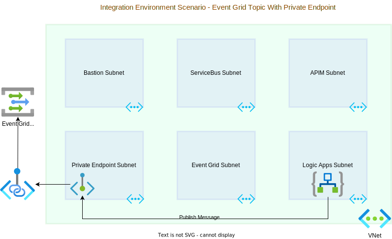

# Azure Event Grid with Private Endpoints Scenario

This repository demonstrates how to configure an Azure Event Grid within a Virtual Network (VNet) and expose it exclusively via a private endpoint. It shows how to create a private Event Grid topic and a private endpoint for the topic, also how to create an Azure Logic App that publishes events to the private Event Grid topic.

This scenario illustrates a typical integration environment contained within a VNet, divided into six logical subnets:

- Bastion Subnet
- Service Bus Subnet
- APIM Subnet
- Private Endpoint Subnet
- LogicApps Subnet
- Event Grid Subnet
 
However, of these, only the LogicApps Subnet is actively utilized. A Logic App residing in this subnet publishes messages to an Event Grid topic, which is hosted within the Private Endpoint Subnet.



## Prerequisites

Ensure you have the following before beginning:

- An active Azure subscription.
- Azure CLI installed on your machine.
- Familiarity with Azure Event Grid, Logic Apps, and VNets.

## Getting Started

1. Clone this repository to your local machine.
2. Navigate to the `src/az-event-grid-private-endpoints/bicep` directory.
3. Open the `main.bicep` file and customize the parameter values to fit your specific needs. The `main.bicep` file contains the Bicep code that defines the infrastructure resources that will be created. The resources include a virtual network, a Bastion host, a storage account, a Log Analytics workspace, an Event Grid topic, and a Private Endpoint for the Event Grid topic. You can customize the parameter values to specify the names and locations of these resources.
4. Deploy the infrastructure using the `az deployment sub create` command. For example:

   ```shellscript
   az deployment sub create --location eastus --name 'private-eventgrid-endpoint-deployment' --template-file main.bicep --parameters `
     location='eastus' `
     vnetName='myVNet' `
     bastionHostName='PrivateEventGridBastionHost' `
     eventGridTopicName='PrivateEventGridTopic12' `
     privateEndpointName='PrivateEventGridTopic12PrivateEndpoint' `
     storageAccountName='logicappstorageaccount15' `
     logAnalyticsWorkspaceName='LogAnalyticsWorkspace' `
     logicAppFileShareName='logicappsfileshare' `
     resourceGroupName='rg-private-event-grids-test'
    ```

This command deploys the core infrastructure using the `main.bicep` file and sets all possible parameters to the specified values. The resources will be created in the specified resource group (`rg-private-event-grids-test`) and location (`eastus`). You can customize these values to fit your specific needs. Once the deployment is complete, you can proceed to set up the Event Grid, Private Endpoint, and Logic App using the instructions in the `event-grid-setup.md`, `private-endpoint-setup.md`, and `logic-app-setup.md` files.

I need to write anothe paragraph here
this repo is for testing purposes only and 

## TODO
The Terraform code for this repository is still a work in progress.

## Contributing

This repository is open to contributions. Feel free to submit a pull request or open an issue if you find any bugs or have any suggestions.

## License

This repository is licensed under the MIT License. See the LICENSE file for more information.