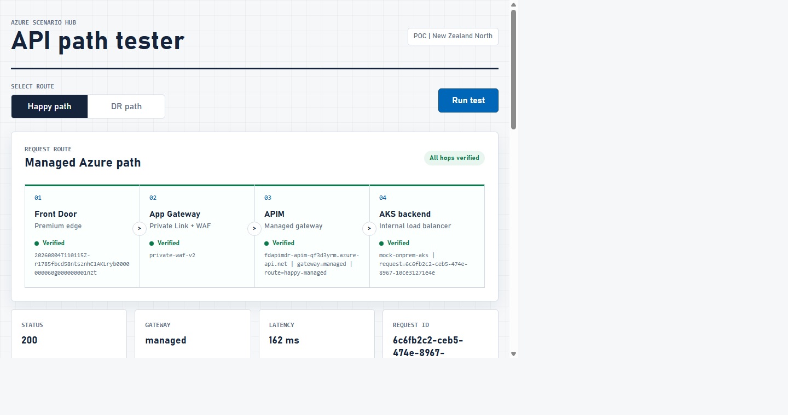
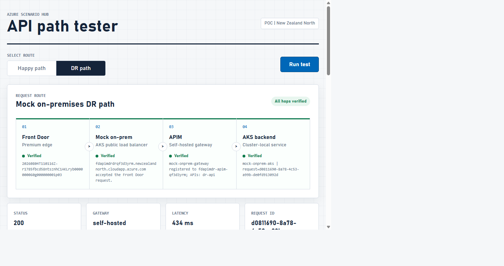
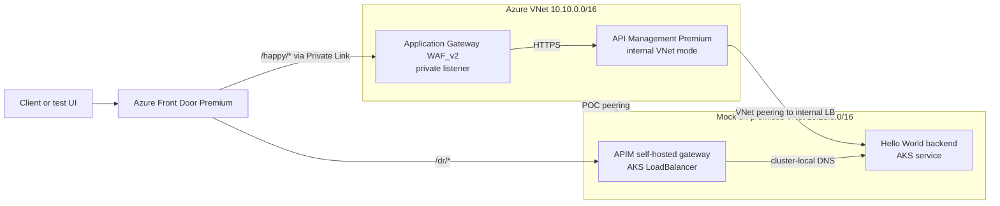

# Front Door to Private Application Gateway and APIM with Self-Hosted Gateway DR

This deployable proof of concept validates two Azure Front Door routes: a managed Azure path through Private Link, Application Gateway WAF_v2, and internal API Management, and a mock on-premises DR path through an APIM self-hosted gateway on AKS.

> This scenario is for learning and validation, not production use. For production infrastructure, start with [Azure Verified Modules](https://aka.ms/avm) and complete the security, identity, reliability, compliance, capacity, and operational work listed below.

**Status:** Azure-validated | **IaC:** Bicep | **Region tested:** New Zealand North | **Last live validation:** August 9, 2026

> **Open the visual evidence report -> [report/index.html](report/index.html)**, or view the [GitHub Pages version](https://clouddev.blog/azure-scenario-hub/reports/front-door-private-appgw-apim-self-hosted-dr/). It brings the architecture, both four-hop route proofs, captured screenshots, engineering findings, recovery evidence, and production boundaries into one reviewable page.

## What This Proves

| Capability | Demonstrated result |
|---|---|
| Private Azure ingress | Front Door Premium reaches the Application Gateway private listener through Private Link |
| Internal API management | Application Gateway forwards to APIM Premium in internal VNet mode |
| Shared private backend | Managed APIM reaches the AKS Hello World service through an internal load balancer |
| Hybrid DR ingress | Front Door routes `/dr/*` to an AKS-hosted APIM self-hosted gateway |
| Central API governance | `mock-onprem-gateway` is registered to the same APIM instance and associated with `dr-api` |
| Request-level evidence | One generated request ID is echoed by the final AKS pod, while each intermediate hop supplies distinct proof |
| Policy-aware recovery | Stopped Application Gateway and AKS resources can be restored to the tested baseline with one command |

## Live Evidence Screens

### Happy path

[](report/index.html)

### DR path

[](report/index.html)

Every green node is backed by request or control-plane evidence. The screenshots are captured from the deployed App Service tester after all automated assertions pass.

## Architecture



### Validated routes

| Route | Request path | Expected evidence |
|---|---|---|
| Happy | Front Door -> Private Link -> App Gateway WAF_v2 -> managed APIM -> AKS internal load balancer | HTTP 200, `X-Scenario-Route: happy-managed`, `X-APIM-Gateway: managed`, `X-AppGateway-Hop: private-waf-v2` |
| DR | Front Door -> AKS public load balancer -> APIM self-hosted gateway -> cluster-local backend | HTTP 200, `X-Scenario-Route: dr-self-hosted`, `X-APIM-Gateway: self-hosted` |

Both routes were deployed and captured in New Zealand North on August 4, 2026, then revalidated end to end on August 9, 2026.

AKS represents an on-premises OpenShift/Kubernetes environment, and VNet peering stands in for VPN or ExpressRoute. The one-node cluster, single APIM region, and gateway token keep this a routing proof rather than a production resilience design.

## Important Application Gateway Detail

Application Gateway v2 normally requires a public IP frontend. Its enhanced private-only mode removes that requirement, but Microsoft currently documents Application Gateway Private Link as unsupported on a private-only gateway. Because Front Door uses Application Gateway Private Link in this scenario, the template creates the required Standard public IP frontend **without a listener or routing rule**. The only application listener is attached to the static private frontend IP.

The validation script asserts that no listener uses the platform-required public frontend. Application traffic enters Application Gateway only through Front Door Private Link.

## Prerequisites

- An Azure subscription with permission to create resources and role assignments. `Owner`, or `Contributor` plus `User Access Administrator`, is sufficient for the disposable resource group.
- Azure CLI with Bicep support.
- PowerShell 7 or Bash.
- `kubectl` and Helm 3.
- Bash users also need `jq`, `zip`, and `curl`.
- Quota for one `Standard_D2s_v5` AKS node in the target region.
- Availability of APIM Premium, Front Door Premium, Application Gateway WAF_v2, AKS, and Linux App Service in the target subscription and region.

Verify the tools:

```powershell
az version
az bicep version
kubectl version --client
helm version
az account show --output table
```

## Quick Start

PowerShell:

```powershell
cd src/front-door-private-appgw-apim-self-hosted-dr
./deploy-infra.ps1
```

Bash:

```bash
cd src/front-door-private-appgw-apim-self-hosted-dr
bash ./deploy-infra.sh
```

Deployment can take 45-90 minutes, primarily because of APIM Premium and Application Gateway provisioning. The script:

1. Compiles Bicep and runs Azure `what-if`.
2. Deploys the Azure resources.
3. Approves the Front Door private endpoint connection on Application Gateway.
4. Validates and deploys the AKS Hello World workload.
5. Generates a 29-day APIM gateway token and installs official Helm chart `1.15.1` / gateway `2.11.1`.
6. Publishes the browser path tester to App Service.
7. Runs infrastructure and end-to-end assertions.

The generated gateway token is written only to temporary deployment files, which are deleted after Helm completes. It is not stored in `.demo-state.json`.

## Operating the Scenario

Cost-management policy or lab automation may stop Application Gateway and AKS while leaving configuration intact. A stopped origin causes Front Door 503/504 responses even though Bicep, Private Link, APIM registration, and load-balancer configuration remain valid.

Restore the tested baseline:

```powershell
./restore-baseline.ps1
```

```bash
bash ./restore-baseline.sh
```

The recovery scripts start only stopped resources, wait for Application Gateway `Running` and AKS `Running/Succeeded`, and leave an already-running baseline unchanged.

After recovery, validate the full scenario:

```powershell
./test-paths.ps1
```

Stopping resources is an acceptable lab cost-control strategy. Always run baseline recovery before capturing evidence or presenting the scenario.

## What It Deploys

| Resource | Configuration | Purpose |
|---|---|---|
| Azure Front Door Premium | Two origin groups, path routes, managed WAF | Global entry point and independent happy/DR origin health |
| Application Gateway WAF_v2 | Private listener, OWASP 3.2 prevention | Private happy-path ingress and request inspection |
| API Management Premium | Internal VNet mode, managed + self-hosted gateways | Central API control plane and managed gateway |
| APIM self-hosted gateway | Official Helm chart on AKS | First application hop on the DR origin |
| AKS | Azure CNI Overlay, one POC node | Hosts self-hosted gateway and shared backend |
| Static public IP | Front Door-restricted by subnet NSG | Stable DR origin address |
| Internal load balancer | Static `10.20.1.20` | Managed APIM path to the shared AKS backend |
| Two virtual networks | Azure `10.10.0.0/16`, mock on-prem `10.20.0.0/16` | Model trust and routing boundaries |
| VNet peering | Bidirectional | POC substitute for VPN or ExpressRoute |
| App Service B1 | Node 20, system-assigned identity | Hosts tester and verifies APIM registration through ARM |
| Log Analytics | 30-day retention | Receives Front Door, Application Gateway, APIM, and AKS diagnostics |

The backend uses pinned image `nginxinc/nginx-unprivileged:1.27.4-alpine`, runs as non-root with a read-only root filesystem, and is exposed through both a cluster-local service and an internal load balancer.

## Configuration

| Parameter | Default | Notes |
|---|---|---|
| `ResourceGroupName` | `rg-front-door-private-appgw-apim-dr` | Disposable scenario resource group |
| `Location` | `newzealandnorth` | Regional workload location |
| `NamePrefix` | `fdapimdr` | 3-10 characters |
| `ApimSku` | `Premium` | `Developer` is available only for lower-cost template development |
| `FrontDoorPrivateLinkLocation` | `australiaeast` | Nearest supported Front Door Private Link region to New Zealand North |
| `KubernetesVersion` | `1.34` | Must be supported in the target region |
| `NodeVmSize` | `Standard_D2s_v5` | Single POC system node |

Example override:

```powershell
./deploy-infra.ps1 `
  -ResourceGroupName rg-my-hybrid-api-poc `
  -Location australiaeast `
  -FrontDoorPrivateLinkLocation australiaeast
```

## Evidence and Validation

The deployment prints three URLs:

- Hosted test UI
- `/happy/hello` Front Door URL
- `/dr/hello` Front Door URL

Rerun all assertions at any time:

```powershell
./test-paths.ps1
```

```bash
bash ./test-paths.sh
```

The assertions check operational state, internal APIM mode, Front Door Private Link approval, Kubernetes readiness, Front Door-restricted DR ingress, self-hosted gateway registration, `dr-api` association, and one request ID echoed through both paths.

### How the hop proof works

The browser calls the App Service test server, which makes the Front Door request server-side and returns structured evidence even when an upstream returns an error. Each successful graph node is backed by a distinct signal:

| Hop | Proof |
|---|---|
| Front Door | Azure-generated `x-azure-ref` response header |
| Happy App Gateway | Application Gateway overwrites `X-AppGateway-Hop: private-waf-v2` |
| Managed APIM | APIM returns its gateway type, route, and gateway FQDN |
| DR AKS ingress | A response marked `self-hosted` arrived through the Front Door origin FQDN |
| DR self-hosted gateway | Data-plane headers identify `self-hosted`; App Service managed identity also reads ARM to prove `mock-onprem-gateway` is registered and `dr-api` is associated |
| AKS backend | Nginx returns `X-Backend-Service` and echoes the generated request ID in both header and JSON body |

The complete correlated evidence object remains visible below the graph as JSON.

### Tested baseline

| Component | Validated value |
|---|---|
| Azure region | New Zealand North |
| Front Door Private Link region | Australia East |
| AKS | Kubernetes 1.34, `Standard_D2s_v5` |
| APIM self-hosted gateway chart | `1.15.1` |
| APIM self-hosted gateway runtime | `2.11.1` |
| Backend | `nginxinc/nginx-unprivileged:1.27.4-alpine` |
| Web tester | Node.js 20 on App Service B1 |

## Security Posture

- Front Door WAF uses Microsoft Default Rule Set 2.1 and Bot Manager 1.1 in prevention mode.
- Application Gateway WAF uses OWASP 3.2 in prevention mode.
- The Application Gateway data listener is private and is reached through Front Door Private Link.
- The platform-required Application Gateway public frontend has no listener or routing rule.
- APIM is injected in internal VNet mode.
- The AKS DR subnet allows inbound port 80 only from `AzureFrontDoor.Backend` plus Azure Load Balancer probes.
- The Hello World pod runs as non-root, drops Linux capabilities, and uses a read-only root filesystem.
- App Service uses managed identity with Reader scoped only to the APIM service for gateway-registration proof.
- Secrets and generated gateway tokens are excluded from tracked state.

## Key Vault

This POC does not require a certificate or application secret, so it deliberately does not deploy an unused Key Vault. If a future version introduces Key Vault-backed certificates, named values, or backend secrets:

1. Disable public network access on the vault.
2. Add a `vault` private endpoint and `privatelink.vaultcore.azure.net` private DNS zone.
3. Use managed identity and least-privilege Key Vault RBAC.
4. Ensure Application Gateway, APIM, or the consuming workload resolves and reaches the private endpoint.

## Estimated Cost

Expect approximately **USD $5-8 per hour** while the complete POC is running, depending on region and traffic. APIM Premium is the dominant cost, followed by Front Door Premium and Application Gateway WAF_v2. A continuously running deployment can exceed **USD $3,000 per month**.

Review current prices with the [Azure Pricing Calculator](https://azure.microsoft.com/pricing/calculator/) and clean up promptly.

## Cleanup

PowerShell:

```powershell
./cleanup.ps1
```

Bash:

```bash
bash ./cleanup.sh
```

Both scripts delete the entire scenario resource group. Deletion is asynchronous and APIM cleanup can take an extended period.

## Known Limitations

- This is path selection, not automatic failover. The UI and Front Door routes deliberately exercise `/happy/*` and `/dr/*` independently.
- The mock on-premises cluster is Azure AKS, not a physically separate data center.
- The DR listener uses HTTP for a transparent POC; production requires TLS and origin certificate validation.
- The self-hosted gateway token expires within 30 days and is renewed by rerunning deployment automation.
- One-node AKS and single-region APIM are not resilient production topologies.
- Start/stop preserves cost in a lab but introduces recovery time and temporary Front Door 503/504 responses.

## Troubleshooting

### Both routes return 503 or 504

Check the origin power state first:

```powershell
az network application-gateway show -g rg-front-door-private-appgw-apim-dr -n fdapimdr-appgw --query operationalState -o tsv
az aks show -g rg-front-door-private-appgw-apim-dr -n fdapimdr-aks --query powerState.code -o tsv
```

If either result is `Stopped`, restore the baseline:

```powershell
./restore-baseline.ps1
./test-paths.ps1
```

During the August 4 validation regression, both billable origins were found in `Stopped` state while their configuration remained intact. This is consistent with lab cost-control or policy automation, although no specific caller was identified in the available Activity Log window.

### Front Door returns 503 or 504 on the happy route

- Confirm the Application Gateway private endpoint connection is `Approved`.
- Check Application Gateway backend health for the APIM private IP.
- Confirm the APIM status probe host is `<service>.azure-api.net`.
- Allow several minutes for Front Door Private Link propagation after approval.

### Front Door returns 504 on the DR route

- Run `kubectl get pods,svc -n apim-gateway -o wide`.
- Confirm the `apim-self-hosted-gateway` service has the reserved public IP.
- Confirm `snet-aks` is attached to `${namePrefix}-aks-nsg` and contains `Allow-AzureFrontDoor-To-SelfHostedGateway` with source `AzureFrontDoor.Backend` and destination port `80`.
- Review `kubectl logs -n apim-gateway deployment/apim-self-hosted-gateway` for configuration-sync errors.

The validated deployment originally regressed when a delayed default-deny NSG was attached to the AKS subnet. The AKS NIC NSG allowed the load balancer, but the subnet NSG blocked Front Door before requests reached the self-hosted gateway. The network module now owns the subnet NSG explicitly and allows only Azure Front Door plus Azure Load Balancer probes.

### Self-hosted gateway does not load the API

- Confirm the `dr-api` association exists on APIM gateway resource `mock-onprem-gateway`.
- Confirm the pod host alias maps `<apim-name>.configuration.azure-api.net` to APIM's private IP.
- Gateway access tokens expire within 30 days. Rerun deployment automation to issue and install a new token.

### Application Gateway creation requires a public IP

Do not enable the enhanced private-only Application Gateway mode for this design. Microsoft currently lists Application Gateway Private Link as unsupported with private-only gateways. This template instead creates a public frontend with no listener.

## Production Work Required

- Replace VNet peering with redundant VPN or ExpressRoute circuits and tested route propagation.
- Use at least two AKS nodes across availability zones and enable self-hosted gateway high availability.
- Replace the 29-day gateway token with APIM self-hosted gateway workload identity.
- Add TLS from Front Door to the DR origin and use a managed/custom certificate.
- Restrict the DR load balancer to Azure Front Door origin traffic and add DDoS controls appropriate to the threat model.
- Add private AKS API access, network policies, image admission controls, patching, backups, and workload identity.
- Add multi-region Front Door Private Link origins and regional APIM/AKS capacity for real disaster recovery.
- Define RTO/RPO, automate failover/failback, and test loss of Azure control-plane connectivity.
- Add alerting, dashboards, log retention, synthetic probes, certificate/token rotation, and incident runbooks.
- Complete identity, data classification, compliance, penetration testing, capacity, and cost reviews.

## References

- [Secure Azure Front Door origins with Private Link](https://learn.microsoft.com/azure/frontdoor/private-link)
- [Connect Front Door to Application Gateway with Private Link](https://learn.microsoft.com/azure/frontdoor/how-to-enable-private-link-application-gateway)
- [Deploy API Management in an internal virtual network](https://learn.microsoft.com/azure/api-management/api-management-using-with-internal-vnet)
- [Deploy the APIM self-hosted gateway to Kubernetes](https://learn.microsoft.com/azure/api-management/how-to-deploy-self-hosted-gateway-kubernetes-helm)
- [APIM self-hosted gateway authentication options](https://learn.microsoft.com/azure/api-management/self-hosted-gateway-authentication-options)
- [Azure Verified Modules](https://aka.ms/avm)