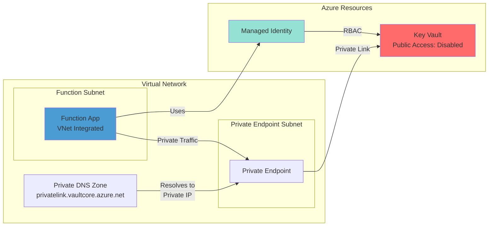

# Azure Function App with Key Vault Private Endpoint

This scenario demonstrates secure access from an Azure Function App to Key Vault using private endpoints, eliminating all public internet exposure.

## Architecture



## Components

- **Function App** - Node.js function with VNet integration (EP1 plan)
- **Key Vault** - Stores secrets with public access disabled
- **Private Endpoint** - Enables private connectivity to Key Vault
- **Managed Identity** - Passwordless authentication
- **Virtual Network** - Isolated network with dedicated subnets
- **Private DNS Zone** - Resolves Key Vault URLs to private IPs

## Deployment

### Prerequisites
- Azure CLI installed
- Azure subscription with appropriate permissions
- For Terraform: Terraform >= 1.0

Choose your preferred Infrastructure as Code tool:

### Option A: Deploy with Bicep

#### 1. Deploy Infrastructure

```bash
# Login to Azure
az login

# Set variables
resourceGroup="rg-func-keyvault-demo"
location="eastus2"

# Create resource group
az group create --name $resourceGroup --location $location

# Deploy infrastructure
az deployment group create \
  --resource-group $resourceGroup \
  --template-file bicep/main.bicep \
  --parameters location=$location
```

#### 2. Deploy Function App

```bash
# Install dependencies
npm install

# Get function app name from deployment
functionAppName=$(az deployment group show \
  --resource-group $resourceGroup \
  --name main \
  --query 'properties.outputs.functionAppName.value' -o tsv)

# Deploy function code
func azure functionapp publish $functionAppName --node
```

### Option B: Deploy with Terraform

#### 1. Deploy Infrastructure

```bash
# Navigate to terraform directory
cd terraform

# Initialize Terraform
terraform init

# Deploy infrastructure
terraform apply -auto-approve
```

#### 2. Deploy Function App

```bash
# Navigate back to root directory
cd ..

# Install dependencies
npm install

# Get function app name from Terraform
functionAppName=$(terraform -chdir=terraform output -raw function_app_name)

# Deploy function code
func azure functionapp publish $functionAppName --node
```

### 3. Test the Function

```bash
# Test the endpoint
curl https://$functionAppName.azurewebsites.net/api/function-app-keyvault-demo
```

Expected response:
```json
{
  "message": "Successfully retrieved secret from Key Vault via private endpoint!",
  "secretName": "demo-secret",
  "privateEndpointAccess": true,
  "managedIdentityUsed": true
}
```

## Project Structure

```
├── bicep/
│   ├── main.bicep              # Infrastructure definition
│   └── main.parameters.json    # Parameter file
├── terraform/                  # Terraform alternative
│   ├── main.tf               # Provider and core config
│   ├── network.tf            # VNet and DNS resources
│   ├── identity.tf           # Managed identity
│   ├── keyvault.tf           # Key Vault and private endpoint
│   ├── functionapp.tf        # Function App resources
│   ├── monitoring.tf         # Application Insights
│   ├── variables.tf          # Input variables
│   └── outputs.tf            # Output values
├── function-app-keyvault-demo/ # Function code
│   ├── function.json          # HTTP trigger binding
│   └── index.js              # Function implementation
├── host.json                  # Function runtime config
└── package.json              # Node.js dependencies
```

## Cleanup

### For Bicep deployment:
```bash
# Delete all resources
az group delete --name $resourceGroup --yes --no-wait
```

### For Terraform deployment:
```bash
# Destroy all resources
cd terraform
terraform destroy -auto-approve
```