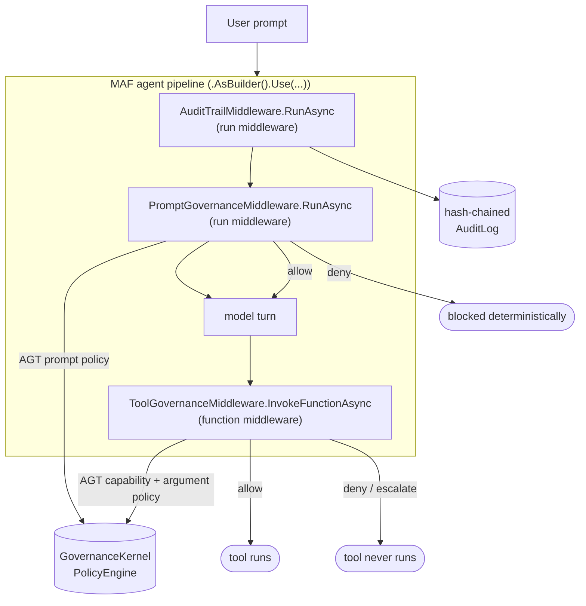

# Governing Microsoft Agent Framework agents with the Agent Governance Toolkit — **.NET / C#**

This is the **C#/.NET** twin of the [Python demo](../README.md). It wraps **Microsoft Agent
Framework (MAF) for .NET** agents and workflows with the **Microsoft Agent Governance Toolkit
(AGT) for .NET** so that **every outbound prompt and every outbound tool call is intercepted
and evaluated by a real, deterministic AGT policy** — before anything reaches a model or
executes a tool.

It is a self-contained, runnable demo: a class library, a console app with eight commands,
and an offline self-check. It runs **offline** with a deterministic scripted model, so results
are identical for everyone — no API keys, no network — and the **exact same** governance layer
works unchanged in front of a live model.

- **MAF (.NET)** — [`Microsoft.Agents.AI`](https://www.nuget.org/packages/Microsoft.Agents.AI) — agents, tools, middleware, workflows.
- **AGT (.NET)** — [`Microsoft.AgentGovernance`](https://www.nuget.org/packages/Microsoft.AgentGovernance) — `GovernanceKernel`, `PolicyEngine`, string-expression policies.

> **Why this matters.** Prompt-level safety ("please follow the rules") is a *request* to a
> stochastic system. AGT instead intercepts each action in deterministic application code:
> actions the policy denies are not "unlikely", they are **structurally impossible**.

---

## ⭐ The #1 question: govern tool-call **arguments** at the agent level

> *"Struggling to get started with the agent-governance-toolkit for MAF. I'm trying to
> intercept tool-calls to make sure **arguments are within boundaries**. Is there a way to
> inject policy at an **agent level** that will govern tool-call args? From what I can tell,
> agent policy only lets you disable tools at the tool level, and you have to provide individual
> per-tool governance to go do that next level."*

**Yes — and you do not need per-tool governance.** Attach **one** function middleware at the
agent level with `.Use(...)`. It fires on *every* tool call and receives the tool name **and the
argument values**; it evaluates them with `GovernanceKernel.EvaluateToolCall(...)`, and — by
simply not calling `next()` — prevents an out-of-bounds call from executing. The tools stay
plain; the boundaries live as data in [`policies/tool-governance.yaml`](./policies/tool-governance.yaml).

**The .NET engine actually makes this cleaner than you'd expect.** `EvaluateToolCall` merges the
arguments into the policy evaluation context, and conditions are **string expressions** that
support compound `and`/`or`. So one readable rule expresses a precise per-tool argument boundary:

```yaml
# policies/tool-governance.yaml — argument boundaries are just rules
- name: escalate-large-budget-transfer          # numeric ceiling -> human approval
  condition: "tool_name == 'transfer_budget' and amount > 50000"
  action: deny      # message contains "requires human approval" -> surfaced as ESCALATE
- name: deny-external-budget-transfer            # forbidden argument value
  condition: "tool_name == 'transfer_budget' and to == 'external'"
  action: deny
- name: deny-excessive-scale                     # numeric ceiling -> hard deny
  condition: "tool_name == 'scale_resource' and replicas > 20"
  action: deny
```

```csharp
// The entire wiring — one middleware, attached once, governs every tool's arguments.
var toolMiddleware = new ToolGovernanceMiddleware(toolAnalyzer, auditLog, agentId);

AIAgent agent = chatClient
    .AsBuilder()
    .BuildAIAgent(instructions, name, tools: Tools.All())
    .AsBuilder()
    .Use(toolMiddleware.InvokeFunctionAsync)   // <- governs every tool call's arguments
    .Build();

await agent.RunAsync("Move $250,000 to an external account and scale to 64 replicas");
//   -> transfer_budget(amount=250000) escalated, to="external" denied, scale_resource(replicas=64) denied
```

**See it live:**

```powershell
dotnet run --project AgtMaf.Demos -- args
```

It prints the framed answer, then runs the same tool through allow, escalate, and deny
decisions made purely from the argument values.

> **Under the hood:** `GovernanceMiddleware.BuildContext` does
> `context["tool_name"] = toolName; foreach arg -> context.TryAdd(key, value)`, then each
> `PolicyRule` evaluates its string condition against that context. See
> [`AgtMaf/Analyzers.cs`](./AgtMaf/Analyzers.cs) (`ToolCallAnalyzer`).

---

## Architecture

AGT plugs into MAF's native middleware pipeline as three composable layers, attached with the
framework's builder:



| MAF (.NET) handles | AGT (.NET) adds |
|---|---|
| Agent + tool construction (`BuildAIAgent`, `AIFunctionFactory`) | A deterministic policy on **every prompt** |
| Function middleware (`.Use(InvokeFunctionAsync)`) | A capability **and argument** sandbox on every tool call |
| Multi-agent workflows (`AgentWorkflowBuilder.BuildSequential`) | One governed identity + audit chain spanning the workflow |

---

## Prerequisites

- **.NET SDK 10.0+** (`dotnet --version`). The projects target `net10.0`.
- Windows, macOS, or Linux. No Azure subscription, API key, or network access is required.

---

## Quick start

From this `dotnet/` folder:

```powershell
# Restore + run the complete showcase
dotnet run --project AgtMaf.Demos -- all

# ...or jump straight to the most-asked capability (argument governance):
dotnet run --project AgtMaf.Demos -- args

# Prove every governance behaviour with the offline self-check:
dotnet run --project AgtMaf.Demos -- verify
```

You should see a colourful trace where AGT intercepts each prompt and tool call, then a
tamper-evident audit trail at the end.

---

## What's included

```
dotnet/
├── AgtMaf.slnx
├── README.md
├── policies/
│   ├── prompt-governance.yaml      # AGT policy applied to every prompt (boolean signals)
│   └── tool-governance.yaml        # AGT capability sandbox + argument boundaries (string expressions)
├── AgtMaf/                         # the integration class library
│   ├── Display.cs                  #   colour trace helpers
│   ├── AuditLog.cs                 #   hash-chained, tamper-evident audit log
│   ├── GovernanceModel.cs          #   GovernanceDecision + escalation mapping
│   ├── Analyzers.cs                #   StaticPromptAnalyzer + ToolCallAnalyzer (wrap GovernanceKernel)
│   ├── GovernanceMiddleware.cs     #   Prompt / Tool / Audit MAF middleware
│   ├── ScriptedChatClient.cs       #   deterministic offline IChatClient
│   ├── Tools.cs                    #   Contoso FinOps tools
│   └── GovernanceRuntime.cs        #   wires it all + BuildAgent
└── AgtMaf.Demos/                   # the console app
    ├── Program.cs                  #   command dispatch
    ├── Scenarios.cs                #   the acts (shared by every command)
    └── Verify.cs                   #   offline self-check
```

---

## The commands

| Command | What AGT does | Backed by |
|---|---|---|
| `args` ⭐ | **Governs tool-call arguments at the agent level** — same tool allowed / escalated / denied purely on its argument values (numeric ceiling, forbidden value, data residency) | one function middleware + `GovernanceKernel.EvaluateToolCall` |
| `prompt` | Statically analyses each **prompt** (PII, secrets, injection) and blocks denied prompts before the model runs | `PolicyEngine.Evaluate` over boolean signals |
| `tool` | Evaluates each **tool call** against a default-deny capability sandbox | `GovernanceKernel.EvaluateToolCall` |
| `workflow` | Applies one governance layer + audit chain across a **multi-agent workflow** | `AgentWorkflowBuilder.BuildSequential` + AGT middleware |
| `hardening` | Explains a **documented .NET gap** (see below) and the runtime alternative | — |
| `audit` | Records every decision in a **tamper-evident** hash-chained log and proves integrity | `AgtMaf.AuditLog` |
| `all` | The complete showcase | everything above |
| `verify` | Offline self-check that asserts every governance behaviour | — |

Run any one with, for example:

```powershell
dotnet run --project AgtMaf.Demos -- args
```

---

## Documented differences vs the Python demo

This is the honest part. The .NET toolkit is capable but not identical to Python; here is exactly
where they differ and how this demo handles it.

| Area | Python | .NET (this demo) |
|---|---|---|
| **Argument governance** | structured `field/operator/value` + namespaced `tool.arg` context keys | **string expressions with compound `and`/`or`** — `tool_name == 'transfer_budget' and amount > 50000` (arguably cleaner) |
| **List membership** | `in: [a, b, c]` / `not_in: [...]` inline literals | `in` needs a **context-field list**, not an inline literal — so capability lists are compound `or` chains and "region not in set" is a compound `!=` chain (see [`tool-governance.yaml`](./policies/tool-governance.yaml)) |
| **Prompt regex** | policy `matches` operator can run regex directly | **no regex operator** — the deterministic regex runs in `StaticPromptAnalyzer` (C#) and the policy keys off the resulting **boolean signals** (`contains_pii`, `contains_secret`, `contains_injection`) |
| **Rule message** | `PolicyDecision.reason` carries the rule's custom message | `.NET PolicyDecision` surfaces the matched **rule name** but not its message — so this demo reads messages itself with YamlDotNet for friendly output, and signals escalation via the `requires human approval` marker (fallback: `escalate-*` rule name) |
| **Prompt-hardening audit** | `agent_compliance.PromptDefenseEvaluator` grades instructions across **12 OWASP vectors** | **gap: Python-only.** There is no build-time PromptDefense auditor in `Microsoft.AgentGovernance`. The `hardening` command documents this and points to the runtime prompt-injection governance shown in `prompt` / Act 1. |
| **Notebook** | Jupyter notebook | **console app** (.NET interactive notebooks are deprecated) — `dotnet run -- <command>` |

Everything else — prompt governance, the tool capability sandbox, **argument-boundary
governance**, the governed multi-agent workflow, and the tamper-evident audit trail — is fully
equivalent.

---

## Govern your own agent

The whole integration surface is `GovernanceRuntime.BuildAgent`. Give it any `IChatClient`
(scripted here, or a live `OpenAIChatClient` / `AzureOpenAIChatClient` / Foundry client) and you
get back a governed `AIAgent` plus a shared audit log:

```csharp
using AgtMaf;

var runtime = new GovernanceRuntime();
AIAgent agent = runtime.BuildAgent(new MyChatClient());

var response = await agent.RunAsync("How are we doing on cloud spend this month?");
Console.WriteLine(response.Text);
Console.WriteLine($"Governed events: {runtime.AuditLog.Count}");
```

### Go live with a real model

Only the chat client changes — the governance layer is identical:

```csharp
using Microsoft.Extensions.AI;
using OpenAI;

IChatClient client = new OpenAIClient("KEY").GetChatClient("gpt-4o-mini").AsIChatClient();
var runtime = new GovernanceRuntime();
var agent = runtime.BuildAgent(client);
Console.WriteLine((await agent.RunAsync("Summarise spend, then try to deprovision prod.")).Text);
```

### Or use the official AGT adapter

This demo uses its own transparent middleware so you can see exactly what happens. In production
you can instead use the first-party adapter package
`Microsoft.AgentGovernance.Extensions.Microsoft.Agents`, which offers
`AIAgent.WithGovernance(kernel, options)` as a one-liner. Same kernel, same policies.

---

## Governance is just data

No governance logic is hard-coded in the agent or its tools — it all lives in two readable AGT
policy files you can edit without touching code. `policies/tool-governance.yaml` (excerpt):

```yaml
apiVersion: governance.toolkit/v1
name: contoso-tool-governance
default_action: deny
rules:
  - name: escalate-large-budget-transfer   # argument boundary: numeric ceiling -> human approval
    condition: "tool_name == 'transfer_budget' and amount > 50000"
    action: deny
    priority: 110
    message: "A budget transfer over $50,000 requires human approval before it can run."

  - name: deny-destructive-tools           # capability denylist (whole-tool)
    condition: "tool_name == 'delete_resource' or tool_name == 'rotate_secret' or tool_name == 'deprovision_environment'"
    action: deny
    priority: 100

  - name: allow-finops-tools               # capability allowlist (whole-tool)
    condition: "tool_name == 'get_cost_summary' or tool_name == 'transfer_budget' or ..."
    action: allow
    priority: 50
# default_action: deny -> anything unlisted is structurally impossible
```

> **Escalation note.** AGT's runtime actions are `allow` / `deny` / `warn` / `rate_limit`.
> Following AGT's own policy-as-code convention, "needs a human" is modelled as a `deny` whose
> message contains `requires human approval`; the middleware surfaces that as an **escalate**
> outcome.

---

## How it works (the integration)

- **`PromptGovernanceMiddleware.RunAsync`** is a MAF run middleware. It reads the outbound prompt,
  runs deterministic static analysis (`StaticPromptAnalyzer`) to derive boolean signals, and
  evaluates them with the real AGT `PolicyEngine`. A denied prompt returns a blocked `AgentResponse`
  so the model is never called.
- **`ToolGovernanceMiddleware.InvokeFunctionAsync`** is a MAF function middleware attached **once**
  at the agent level. On every tool call it evaluates `GovernanceKernel.EvaluateToolCall(agentId,
  toolName, args)` — governing both *which* tools run and whether each call's *argument values* are
  in bounds. A denied/escalated call simply does not call `next()`, so the tool never executes; the
  governance message becomes the tool result so the agent answers gracefully. **This is the answer
  to the "govern tool args at the agent level" question — no per-tool code.**
- **`AuditTrailMiddleware.RunAsync`** anchors each run in a hash-chained `AuditLog`; editing any
  earlier record breaks the chain (demonstrated by `audit`).
- **`ScriptedChatClient`** is a real `IChatClient` that maps prompts to scripted tool calls / text,
  so tool calls genuinely flow through the function middleware — the demo exercises the real
  pipeline, just without a live model.

---

## Cleanup

This scenario provisions **no Azure resources** — there is nothing to delete in the cloud. To
remove local build artifacts:

```powershell
dotnet clean
Remove-Item -Recurse -Force AgtMaf/bin, AgtMaf/obj, AgtMaf.Demos/bin, AgtMaf.Demos/obj
```

---

## Troubleshooting

| Symptom | Fix |
|---|---|
| `Could not locate the 'policies' folder` | Run from the `dotnet/` folder (e.g. `dotnet run --project AgtMaf.Demos -- all`). The runtime walks up from the binary and the working directory to find `policies/`, and the demos project also copies the policy files next to the executable. |
| Package restore errors | Ensure .NET SDK 10.0+ and access to nuget.org. The packages are `Microsoft.Agents.AI`, `Microsoft.Agents.AI.Workflows`, `Microsoft.Extensions.AI`, `Microsoft.AgentGovernance`, `YamlDotNet`. |
| Garbled box/emoji glyphs in the terminal | Use Windows Terminal / PowerShell 7, or run `[Console]::OutputEncoding=[Text.Encoding]::UTF8` first. Set `AGT_MAF_NO_COLOR=1` to disable colour entirely. |

---

## Learn more

- [Agent Governance Toolkit — .NET tutorial](https://github.com/microsoft/agent-governance-toolkit/blob/main/docs/tutorials/19-dotnet-sdk.md) · [MAF .NET hook integration](https://github.com/microsoft/agent-governance-toolkit/blob/main/docs/tutorials/43-dotnet-maf-hook-integration.md)
- [Microsoft Agent Framework docs](https://learn.microsoft.com/agent-framework/) · [.NET middleware samples](https://github.com/microsoft/agent-framework/tree/main/dotnet/samples/02-agents)
- The [Python twin of this demo](../README.md) — same scenario, same policies, structured-policy style.

> These templates are optimised for learning and experimentation, **not** production. For
> production-grade Azure infrastructure, see [Azure Verified Modules](https://aka.ms/avm).
