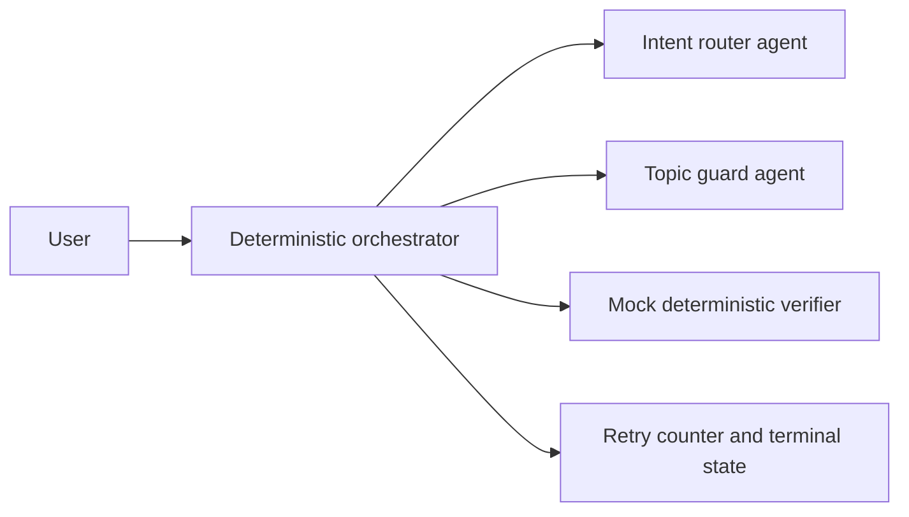

# Semantic Kernel Agent Retry Limit

A runnable Python example showing how an orchestrator can enforce deterministic retry limits around specialized Semantic Kernel `ChatCompletionAgent` decisions.

> The arithmetic questions are deliberately simple placeholders. Do not use knowledge questions or an LLM as an authentication mechanism in a real application.

## Architecture



The language model classifies intent and topic changes. Ordinary application code owns answer verification, attempt counting, state transitions, and session termination.

## Prerequisites

- Python 3.10 or later
- An Azure OpenAI resource with a deployed chat-completion model
- For keyless authentication, Azure CLI and the `Cognitive Services OpenAI User` role on the resource

## Quick Start

```powershell
cd src/semantic-kernel-agent-retry-limit
python -m venv .venv
.\.venv\Scripts\Activate.ps1
pip install -r requirements.txt
Copy-Item .env.example .env
az login
python app.py
```

Set the resource endpoint, deployment name, and API version in `.env`. Leave `AZURE_OPENAI_API_KEY` unset to use `DefaultAzureCredential`; set it only when you need the API-key fallback.

## Configuration

| Setting | Required | Description |
|---|---:|---|
| `AZURE_OPENAI_ENDPOINT` | Yes | Azure OpenAI resource endpoint |
| `AZURE_OPENAI_DEPLOYMENT_NAME` | Yes | Chat-completion deployment used by both agents |
| `AZURE_OPENAI_API_VERSION` | Yes | API version supported by the selected resource and deployment |
| `AZURE_OPENAI_API_KEY` | No | Resource key fallback; omit to use Entra ID |

## What It Demonstrates

- Current Semantic Kernel `ChatCompletionAgent` construction
- Specialized intent-routing and topic-guard agents
- A deterministic state machine around probabilistic classifications
- Per-step retry counters, reset behavior, and a terminal state
- Unit testing the orchestration without an Azure connection

Run the offline retry tests with:

```powershell
python -m unittest -v test_app.py
```

## Estimated Cost

Each user turn can call one Azure OpenAI chat deployment. Cost depends on the selected model and token usage. Review [Azure OpenAI pricing](https://azure.microsoft.com/pricing/details/cognitive-services/openai-service/) before testing at scale.

## Cleanup

Exit the demo, deactivate the virtual environment, and remove `.venv`. Delete the model deployment or resource separately if it was created only for this exercise.

## Troubleshooting

- `401 Unauthorized`: run `az login`, verify the `Cognitive Services OpenAI User` role, or set a valid resource key.
- Deployment or API-version errors: confirm all three required Azure OpenAI settings match the same resource.
- Unexpected classification: inspect the two narrow agent instructions before changing the deterministic retry policy.

## Related Documentation

- [Semantic Kernel ChatCompletionAgent](https://learn.microsoft.com/semantic-kernel/frameworks/agent/agent-types/chat-completion-agent)
- [Semantic Kernel agent orchestration](https://learn.microsoft.com/semantic-kernel/frameworks/agent/agent-orchestration/)
- [Azure OpenAI authentication](https://learn.microsoft.com/azure/ai-services/openai/how-to/managed-identity)

This scenario was modernized and moved from the archived `Ricky-G/ai-scenario-hub` repository.