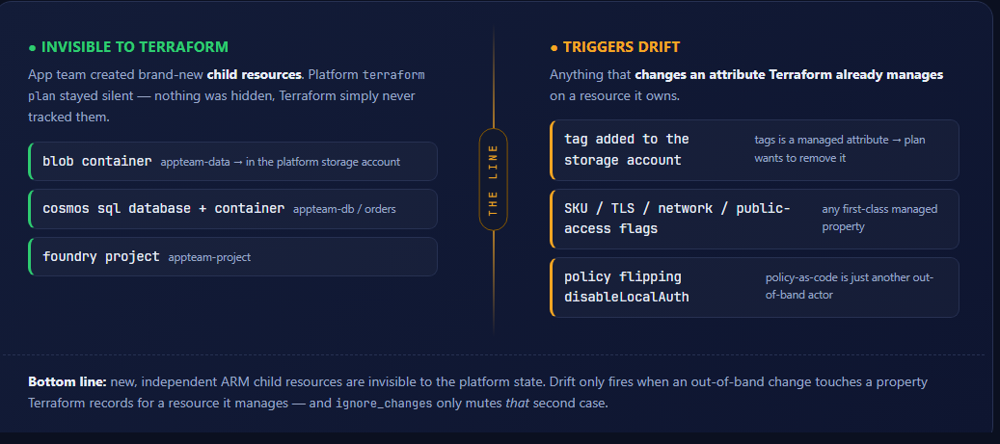
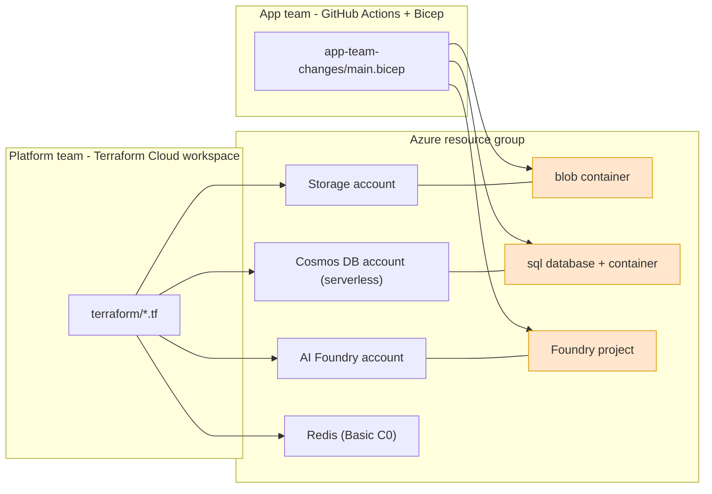
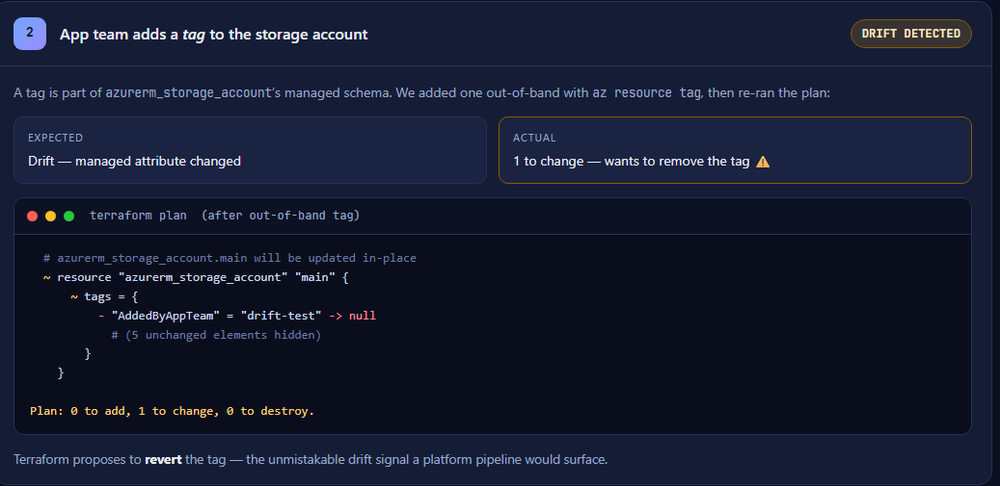
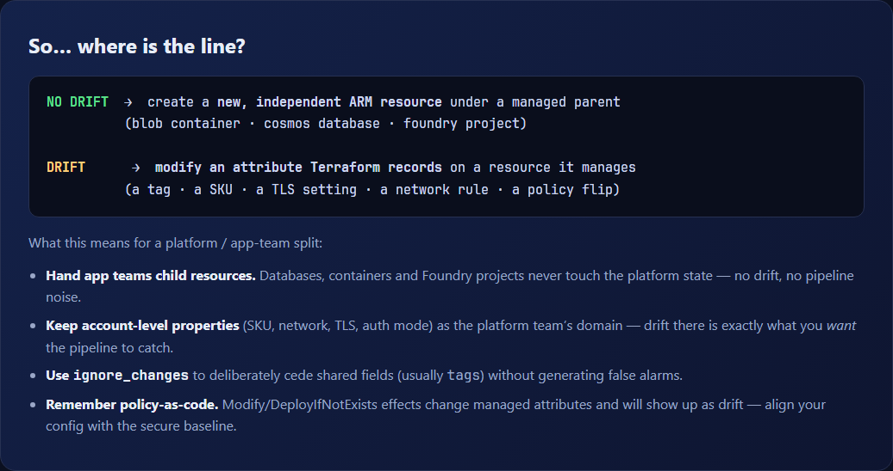

# Terraform Drift Detection: Shared Platform vs. App Team

Prove exactly **where Terraform drift detection triggers** when a platform team owns shared landing-zone resources (in a Terraform Cloud workspace) and an app team adds their own child resources out-of-band via a separate Bicep pipeline.

> ✅ **Verified end-to-end on Azure.** We deployed this start-to-finish and measured every run.
> **Open the visual results report → [report/index.html](report/index.html)** (open it in a browser).
> Headline: adding a blob container, a Cosmos database/container, and a Foundry project produced **zero drift**;
> adding a single **tag** to the storage account produced drift on the very next `terraform plan`.
> Raw plan/CLI captures are in [results/](results/).

[](report/index.html)

> 📊 **[Open the full interactive report → report/index.html](report/index.html)** — a styled walkthrough of all four runs, the live evidence, and the conclusion. (Download/clone and open it in a browser.)

## The question this scenario answers

A platform team deploys core AI landing-zone resources — **Azure AI Foundry, Cosmos DB, Storage, Redis** — and manages them from **Terraform** (Terraform Cloud workspace + their pipeline). An app team wants to add **their own Foundry projects, Cosmos databases/containers, and blob containers** using **GitHub Actions + Bicep**.

> Will the app team's additions show up as **drift** in the platform team's Terraform workspace? And where exactly is the line where drift *does* start to appear?

This scenario deploys the platform base with Terraform, simulates the app team's out-of-band changes with Bicep, and then runs Terraform's drift detection so you can see the answer firsthand.

## In plain English

Think of Terraform as keeping a checklist of **only the things it personally created**. In this scenario that checklist has three accounts: the **storage account**, the **Cosmos account**, and the **Foundry account**.

- ✅ **The app team adds new things *inside* those accounts** — a blob container, a Cosmos database, a Foundry project → **no drift**. Those items were never on Terraform's checklist, so it doesn't even look at them. *Nothing is being hidden or suppressed — Terraform is genuinely blind to them because they are separate Azure resources that aren't in its state.*
- ⚠️ **The app team edits a setting on one of the three accounts** — e.g. adds a **tag** to the storage account → **drift**. That account *is* on the checklist, so Terraform notices reality no longer matches and offers to undo the change.
- 🔧 **`ignore_changes` is an optional mute button for that tag case only.** It tells Terraform “I'm OK with people editing the tags, stop reporting it.” It has nothing to do with the container / database / project — those were already invisible.

> **The most common mix-up:** the “no drift” for the container, database, and project is **not** because of `ignore_changes`. It is because those are separate child resources that Terraform never tracked. `ignore_changes` is only used in the final step to silence the *tag* drift.

## Architecture



See [docs/drift-boundary.md](docs/drift-boundary.md) for the mechanics behind the result.

## Verified results (we deployed this for real)

We ran the full sequence against a live subscription (`eastus2`, Terraform 1.15.6, azurerm 3.117.1, azapi 2.10.0). Open **[report/index.html](report/index.html)** for the styled write-up; the raw `terraform plan` and `az` captures are in [results/](results/).

| Run | App-team action | ARM resource added/changed | Drift on `terraform plan`? |
|---|---|---|---|
| 1 | Add blob **container** (`appteam-data`) | `storageAccounts/blobServices/containers` (new) | ❌ **No** |
| 1 | Add Cosmos **database + container** (`appteam-db` / `orders`) | `databaseAccounts/sqlDatabases[/containers]` (new) | ❌ **No** |
| 1 | Add Foundry **project** (`appteam-project`) | `accounts/projects` (new) | ❌ **No** |
| 2 | Add a **tag** to the storage account | modifies `tags` (managed attribute) | ✅ **Yes** — plan wants to remove it |
| 3 | Platform adds `ignore_changes = [tags]` | — | ❌ **No** — drift suppressed |

Here is the real `terraform plan` output the moment the app team added a tag (Run 2) — the one change that *does* register as drift:

[](report/index.html)

After all of the above, `terraform state list` still shows only the **5 platform resources** (RG, storage account, Cosmos account, Foundry account, random suffix) — none of the app-team children — which is exactly why Run 1 saw nothing.

**The line:** creating *new, independent child resources* is invisible to Terraform; modifying an *attribute Terraform already manages* (tags, SKU, TLS, network rules — or an Azure **Policy** flipping a property) is what triggers drift.

[](report/index.html)

> **Bonus real-world finding.** This subscription enforces keyless auth via policy. Right after `apply`, a policy flipped `disableLocalAuth → true` on Foundry and `local_authentication_disabled → true` on Cosmos, which showed up as drift on the first plan — *the same rule*: policy-as-code is just another out-of-band actor changing a managed attribute. The config now sets both explicitly (the secure default) for a clean baseline.

## Prerequisites

- **Azure CLI** ≥ 2.60 (`az version`) and logged in (`az login`)
- **Terraform** ≥ 1.5 (`terraform version`)
- Azure subscription with permission to create the resources above (Contributor on the target subscription/resource group)
- The Foundry account uses the `Microsoft.CognitiveServices/accounts` **AIServices** kind with project management — ensure the `Microsoft.CognitiveServices` resource provider is registered:
  ```bash
  az provider register --namespace Microsoft.CognitiveServices
  ```
- The storage account uses **Azure AD for data-plane auth** (`shared_access_key_enabled = false`, `storage_use_azuread = true`) so it works under the common "deny shared key" policy. The identity running Terraform needs the **Storage Blob Data Contributor** role on the resource group (or subscription) so the provider's post-create blob check succeeds:
  ```bash
  az role assignment create --assignee <your-object-id> \
    --role "Storage Blob Data Contributor" \
    --scope /subscriptions/<sub-id>/resourceGroups/<rg>
  ```

## Quick start

### 1. Platform team: deploy the base (Terraform)

```bash
cd src/terraform-drift-detection-shared-platform/terraform
cp terraform.tfvars.example terraform.tfvars   # optional: edit region / deploy_redis
terraform init
terraform apply
```

> Tip: set `deploy_redis = false` in `terraform.tfvars` to skip Redis (saves ~15-20 min of provisioning and ~$16/mo).

### 2. Establish a clean baseline

```bash
# from src/terraform-drift-detection-shared-platform/scripts
./check-drift.sh          # or ./check-drift.ps1
```
Expected: **No changes. Your infrastructure matches the configuration.**

### 3. App team: add child resources (Bicep, out-of-band)

```bash
# from src/terraform-drift-detection-shared-platform/app-team-changes
./deploy-app-changes.sh   # or ./deploy-app-changes.ps1
```
This deploys a blob container, a Cosmos database + container, and a Foundry project into the platform-owned resources.

### 4. Check for drift — the headline test

```bash
# from scripts
./check-drift.sh
```
Expected: **still No changes.** The app team's child resources are invisible to the platform Terraform state. ✅ This is the core finding.

### 5. Cross the line — trigger real drift

```bash
# from scripts
./trigger-drift.sh        # adds an out-of-band tag to the storage account
./check-drift.sh
```
Expected: Terraform now reports drift on the storage account's `tags` attribute — because tags are a managed attribute, not a separate resource. ✅ This is "the line."

### 6. (Optional) Suppress that drift with `ignore_changes`

Add the following to `terraform/storage.tf`, then re-run `check-drift`:

```hcl
resource "azurerm_storage_account" "main" {
  # ...
  lifecycle {
    ignore_changes = [tags]
  }
}
```
Drift disappears — the platform team has intentionally ceded `tags` to the app team. (`check-drift` runs a full `terraform plan`, so `ignore_changes` is honored — the same way Terraform Cloud drift detection behaves.)

## Parameters

### Terraform variables (`terraform/variables.tf`)

| Name | Type | Default | Description |
|---|---|---|---|
| `location` | string | `eastus2` | Azure region for all resources |
| `resource_group_name` | string | `""` | Explicit RG name; empty auto-generates a unique name |
| `deploy_redis` | bool | `true` | Deploy Redis Basic C0 (toggle off to save time/cost) |

### App-team Bicep parameters (`app-team-changes/main.bicep`)

| Name | Type | Default | Description |
|---|---|---|---|
| `storageAccountName` | string | — | Existing platform storage account |
| `cosmosAccountName` | string | — | Existing platform Cosmos DB account |
| `foundryAccountName` | string | — | Existing platform AI Foundry account |
| `location` | string | RG location | Region for the new Foundry project |
| `containerName` | string | `appteam-data` | Blob container to add |
| `cosmosDatabaseName` | string | `appteam-db` | Cosmos SQL database to add |
| `cosmosContainerName` | string | `orders` | Cosmos SQL container to add |
| `foundryProjectName` | string | `appteam-project` | Foundry project to add |

> The deploy scripts read the first three parameters automatically from `terraform output`, so you normally don't pass any of these by hand.

## What gets deployed

**Platform (Terraform):**
- Resource group
- Storage account — Standard / LRS / StorageV2, **shared-key auth disabled (Azure AD only)**, public blob access disabled
- Cosmos DB account — SQL API, **serverless**, single region, **local (key) auth disabled**
- Azure AI Foundry account — `Microsoft.CognitiveServices/accounts` (AIServices) with `allowProjectManagement = true`, **local auth disabled (Entra-only)**
- Azure Cache for Redis — Basic C0 (optional)

**App team (Bicep, out-of-band):**
- Blob container in the storage account
- Cosmos SQL database + container
- Foundry project

## Post-deployment steps

None required. After `terraform apply`, everything needed by the helper scripts is exposed via `terraform output`.

## Estimated cost

| Resource | Config | Rough idle cost |
|---|---|---|
| Storage account | Standard LRS | < $1/mo |
| Cosmos DB | Serverless | ~$0 idle (pay per request) |
| AI Foundry (AIServices) | S0 | ~$0 idle (pay per token) |
| Redis | Basic C0 | ~$16/mo (optional) |

This is a learning scenario — tear it down when finished.

## Cleanup

The most reliable teardown is to delete the whole resource group — it cascades to every resource, including the app team's out-of-band children:

```bash
# get the name from: terraform output -raw resource_group_name
az group delete --name <rg-name> --yes --no-wait
```

> If the Foundry (Cognitive Services) account was soft-deleted, purge it so the name is freed:
> `az cognitiveservices account purge --location <region> --resource-group <rg-name> --name <foundry-name>`

### Teardown gotcha — a capstone to the whole scenario

Running `terraform destroy` here **can fail** with a `409 CannotDeleteResource` on the Foundry account:

> Cannot delete resource while nested resources exist. Some existing nested resource IDs include: `.../accounts/<foundry>/projects/appteam-project`.

That is the exact same boundary, seen from the teardown side: the app team's **Foundry project** is a *separate child resource that Terraform never tracked*, so Terraform tries to delete the parent account while the project still lives inside it — and Azure refuses. (Blob containers and Cosmos databases don't block their parents, because deleting those accounts cascades their children.) Deleting the **resource group** (above) sidesteps this entirely; alternatively, remove the project first and then re-run `terraform destroy`.

## Security notes

This scenario is built to be safe to publish and run:

- **No secrets are committed.** `terraform.tfstate` (which contains live keys/connection strings), `*.tfvars`, and the `.terraform/` provider cache are all excluded by [`terraform/.gitignore`](terraform/.gitignore). For team use, move state to a remote backend (Terraform Cloud or an `azurerm` backend) rather than committing it.
- **Keyless by default.** Storage uses Azure AD only (`shared_access_key_enabled = false`, `storage_use_azuread = true`); Cosmos and Foundry have local/key auth disabled. The scenario needs no connection strings or account keys.
- **No public blob access** (`allow_nested_items_to_be_public = false`) and **TLS 1.2 minimum** across resources.
- The captured outputs in [results/](results/) have had subscription, tenant, and principal IDs redacted.
- Least-privilege note: the only extra grant required is **Storage Blob Data Contributor** (scoped to the resource group) for the identity running Terraform — see Prerequisites.

## Troubleshooting

| Symptom | Cause / Fix |
|---|---|
| `terraform apply` fails on the Foundry resource with an API version error | The preview API version in `terraform/foundry.tf` may have been retired. Bump `Microsoft.CognitiveServices/accounts@2025-04-01-preview` to a current version that supports project management (and match it in `app-team-changes/main.bicep`). |
| `terraform apply` fails on storage with `KeyBasedAuthenticationNotPermitted` (403) | The subscription enforces a "deny shared key" policy. This scenario already sets `shared_access_key_enabled = false` + `storage_use_azuread = true`; make sure the identity running Terraform has **Storage Blob Data Contributor** on the RG/subscription (see Prerequisites), then re-apply. |
| First `terraform plan` shows `disableLocalAuth` / `local_authentication_disabled` flipping `true -> false` | A security policy disabled local auth out-of-band. The config sets both to `true` to match the secure baseline; if your subscription has no such policy this is already clean. |
| Foundry project deploy fails with "project management not enabled" | The account needs `allowProjectManagement = true` and a `customSubDomainName` (both set in `foundry.tf`). Re-run `terraform apply` first. |
| `check-drift` shows drift immediately after `apply` | Re-run `terraform apply` once to settle any provider-normalized values, then re-baseline. |
| Redis apply is slow | Basic C0 provisioning takes ~15-20 minutes. Set `deploy_redis = false` to skip it. |
| `az deployment group create` can't find the resource group | Run `terraform apply` first; the deploy scripts read the RG name from `terraform output`. |
| `MissingSubscriptionRegistration` for `Microsoft.CognitiveServices` | Run `az provider register --namespace Microsoft.CognitiveServices` and retry. |

## How this maps to Terraform Cloud

The platform team would run this same configuration in a **Terraform Cloud workspace** with **drift detection / health assessments** enabled. Those assessments compare your **real infrastructure against the committed configuration** and report resources that differ — the same comparison `terraform plan` performs. That's why `scripts/check-drift` runs a full `terraform plan` (not `-refresh-only`): a full plan honors `lifecycle { ignore_changes }`, exactly as TFC drift detection does, so the local results faithfully reproduce what the platform team's TFC workspace would (and would not) flag.
