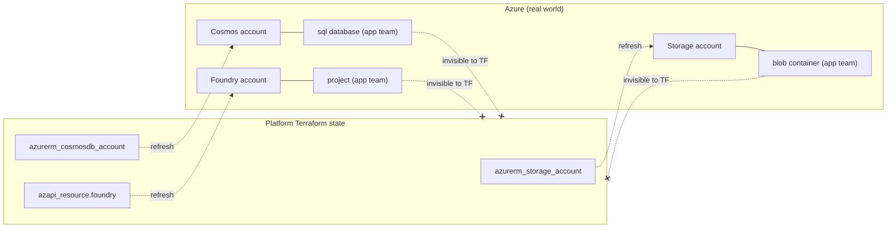
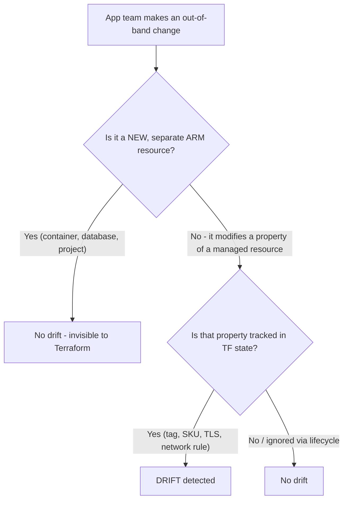

# The drift boundary: where Terraform does and doesn't detect out-of-band changes

This document explains the *mechanics* behind the scenario so you can reason
about your own resources, not just the four in this demo.

## How Terraform "drift detection" actually works

Terraform Cloud's drift detection (and `terraform plan` locally) does three things:

1. **Refreshes** each **resource address that exists in state** by calling the
   provider's **Read** to fetch the *current* real-world attributes.
2. Compares those refreshed attributes against the **committed configuration**.
3. Reports any resource whose real state no longer matches the configuration
   (honoring `lifecycle { ignore_changes }`).

> We use a full `terraform plan` rather than `terraform plan -refresh-only`
> because TFC drift detection asks "does reality match the *configuration*?" — a
> full plan answers exactly that and respects `ignore_changes`. A refresh-only
> plan only compares state to reality and would *not* honor `ignore_changes`.

The critical consequence:

> Terraform can only detect drift on **(a) resources that are in its state** and
> **(b) the specific attributes those resources' provider schemas expose.**

Anything outside that set is simply invisible to Terraform.

## Why child resources don't cause drift

A blob container, a Cosmos SQL database, and a Foundry project are each a
**separate Azure (ARM) resource** with their own resource ID:

| App-team resource | ARM type |
|---|---|
| Blob container | `Microsoft.Storage/storageAccounts/blobServices/containers` |
| Cosmos database | `Microsoft.DocumentDB/databaseAccounts/sqlDatabases` |
| Foundry project | `Microsoft.CognitiveServices/accounts/projects` |

None of these are in the platform Terraform state, and none of them are
*attributes* of the parent resource that Terraform manages
(`azurerm_storage_account`, `azurerm_cosmosdb_account`, `azapi_resource.foundry`).

When Terraform refreshes the parent, the parent's own attributes are unchanged,
so there is nothing to report. **No drift.**



## Where the line is

Drift appears the moment an out-of-band change touches an **attribute that the
platform Terraform manages on a resource it owns**. Common examples:

- **Tags** — if Terraform sets `tags = { ... }` exhaustively, any added/removed
  tag is drift. (This is what `scripts/trigger-drift` demonstrates.)
- **SKU / tier** — e.g. someone scales the Redis SKU or storage replication.
- **Network rules, TLS version, public access flags** — any first-class property
  on the managed resource.



## The escape hatch: `ignore_changes`

Platform teams that *expect* app teams to touch certain fields (tags being the
classic case) suppress that noise explicitly:

```hcl
resource "azurerm_storage_account" "main" {
  # ...
  lifecycle {
    ignore_changes = [tags]
  }
}
```

With that block in place, even the `trigger-drift` tag change stops being
reported. This is the deliberate "we don't own tags" boundary.

## Takeaways for a platform/app team split

- Hand app teams **child resources** (databases, containers, projects) and the
  platform Terraform workspace stays quiet — no drift, no pipeline noise.
- Keep **account/parent-level properties** (SKU, network, TLS, and optionally
  tags) as the platform team's exclusive domain — changes there are exactly what
  drift detection is *supposed* to catch.
- Use `ignore_changes` to intentionally cede specific fields (often `tags`) to
  app teams without generating false drift alarms.
